# N32WB031 测评合集

> 本文围绕国民技术 N32WB031 BLE SoC 及 N32WB031-STB 评估板，从开箱、环境搭建到 LED 点灯、按键串口、BLE 透传、HID 蓝牙遥控器、OTA 空中升级，提供一套完整的开发测评教程。
>
> 工程源码、SDK、文档资料仓库：[github.com/318973613/n32wb031-tutorial](https://github.com/318973613/n32wb031-tutorial)

---

## 前言

### 为什么写这篇文档

BLE（低功耗蓝牙）开发的入门门槛一直不低。芯片 datasheet 动辄几百页，SDK 例程十几个却各自独立，官方文档侧重 API 说明而非"怎么从零跑起来"。对于第一次接触 BLE SoC 的开发者来说，真正缺的不是参考资料的数量，而是一条清晰的路径：**从拿到板子到做出一个能用的蓝牙产品，中间到底要经过哪些步骤，踩哪些坑。**

这篇文档就是这条路径。

### 覆盖了什么

全文共八章，按照由浅入深的顺序组织：

| 章节 | 主题 | 核心能力 |
|------|------|----------|
| 第一章 | 开箱与开发板介绍 | 认识硬件资源和芯片规格 |
| 第二章 | 开发环境搭建 | Keil 安装、SDK 配置、串口日志 |
| 第三章 | LED 点灯 | GPIO 输出、寄存器结构、延时函数 |
| 第四章 | 按键与串口 | GPIO 输入、中断检测、USART 通信 |
| 第五章 | BLE 透传 | GAP/GATT 协议栈、RDTSS 自定义服务 |
| 第六章 | OLED 显示 | SSD1306 驱动、软件 I2C、多端联动 |
| 第七章 | HID 蓝牙拍照遥控器 | HID 协议、Consumer Control、系统蓝牙配对 |
| 第八章 | BLE OTA 空中升级 | A/B 分区、Bootloader、CRC 校验、无线固件更新 |

每章都包含：原理讲解、关键代码分析、Mermaid 流程图、截图位预留，以及实际测试中可能遇到的问题与解决方案。

### 适合谁读

- **嵌入式初学者**：有一定 C 语言基础，想从零上手 BLE 开发
- **BLE 入门者**：了解 BLE 概念但没跑过完整工程，想看到从广播到 OTA 的全链路
- **N32WB031 用户**：拿到评估板不知道从哪里开始，需要一份"照着做就能跑通"的指南
- **测评/选型工程师**：需要快速了解 N32WB031 的开发体验和能力边界

### 怎么用这篇文档

**推荐按顺序阅读**，因为后面的章节会复用前面工程的代码和概念。如果你赶时间：

- 只想点亮 LED → 直接看第三章
- 想做蓝牙透传 → 看第五章
- 想做蓝牙遥控器 → 看第七章
- 想了解 OTA 升级 → 看第八章

每章的工程代码都在 `template/` 目录下，可以直接用 Keil 打开编译。

### 关于 N32WB031

N32WB031 是国民技术（NSING Technologies）推出的超低功耗蓝牙 5.1 SoC，基于 ARM Cortex-M0 内核，最高 64MHz 主频。它的定位不是"最强 BLE 芯片"，而是在功耗、成本、易用性之间取得平衡，适合遥控器、标签、传感器、无线开关等电池供电场景。

选择这颗芯片做测评的原因很简单：**国产 BLE SoC 正在快速成长，值得被更多人看到。**

### 开发环境

本文所有工程基于：

- **芯片**：N32WB031（Cortex-M0, 64MHz, 64KB SRAM, 256/512KB Flash）
- **开发板**：N32WB031-STB V1.3
- **IDE**：Keil MDK-ARM v5
- **SDK**：N32WB031 SDK（需从国民技术官网单独下载）
- **调试**：板载 USB-C，集供电、SWD 调试、串口于一体
- **手机测试**：nRF Connect（Android/iOS）

### 全文导航

下图展示了八章内容的递进关系。建议首次阅读时按顺序推进，每一步都在前一步的基础上叠加新能力。

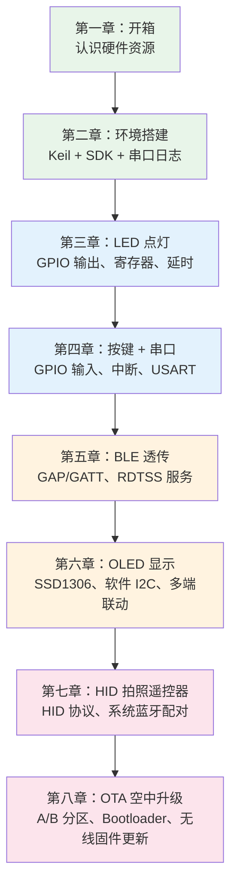
```mermaid
graph TD
    C1["第一章：开箱<br/>认识硬件资源"] --> C2["第二章：环境搭建<br/>Keil + SDK + 串口日志"]
    C2 --> C3["第三章：LED 点灯<br/>GPIO 输出、寄存器、延时"]
    C3 --> C4["第四章：按键 + 串口<br/>GPIO 输入、中断、USART"]
    C4 --> C5["第五章：BLE 透传<br/>GAP/GATT、RDTSS 服务"]
    C5 --> C6["第六章：OLED 显示<br/>SSD1306、软件 I2C、多端联动"]
    C6 --> C7["第七章：HID 拍照遥控器<br/>HID 协议、系统蓝牙配对"]
    C7 --> C8["第八章：OTA 空中升级<br/>A/B 分区、Bootloader、无线固件更新"]

    style C1 fill:#e8f5e9
    style C2 fill:#e8f5e9
    style C3 fill:#e3f2fd
    style C4 fill:#e3f2fd
    style C5 fill:#fff3e0
    style C6 fill:#fff3e0
    style C7 fill:#fce4ec
    style C8 fill:#fce4ec
```

**难度阶梯：**

| 阶段 | 章节 | 核心主题 | 关键词 |
|------|------|----------|--------|
| 基础 | 1-2 | 硬件认知 + 环境 | 开箱、Keil、SDK、串口 |
| 入门 | 3-4 | GPIO 外设 | 点灯、按键、中断、USART |
| 进阶 | 5-6 | BLE + 显示 | 广播、GATT、透传、OLED |
| 实战 | 7-8 | 产品级能力 | HID 输入、系统配对、OTA 升级 |

---

## 第一章：开箱与开发板介绍

在正式编写代码之前，有必要先对开发板的定位、芯片规格和板载资源建立清晰认知。本章对 N32WB031-STB 的硬件基础做一次性梳理。

### 1.1 开发板定位

N32WB031-STB（V1.3）是国民技术面向 N32WB031 系列 BLE SoC 推出的最小系统评估板。其设计目标不是实现复杂的人机交互展示，而是以最短路径完成芯片评估、基础验证和原型开发。硬件资源配置上强调实用性，将供电、调试、下载、串口、按键和指示灯等常用能力集中在小尺寸板卡上，同时将主要 GPIO 引出，便于外接传感器、屏幕、执行器和测试仪表。

该板适合作为 N32WB031 入门平台，主要原因：

- **低门槛**：USB-C 一线式供电、下载、调试和串口通信，无需额外硬件链路
- **快速验证**：开箱即可进入 SDK 示例、蓝牙广播、串口日志、低功耗和外设实验
- **便于迁移**：保留最小系统关键电路结构，适合从评估阶段过渡到自研硬件设计

### 1.2 开发板总览

N32WB031-STB（V1.3）以 N32WB031 超低功耗蓝牙 5.1 SoC 为核心，适用于初学者入门、蓝牙无线性能验证、低功耗参数评估、外设驱动联调及小型原型方案验证。

核心特点：

- 以 BLE 5.1 + 低功耗为核心能力
- 板载资源精简，保留调试和验证所需的关键接口
- 所有关键 GPIO 引出，扩展自由度高
- 适用于官方例程运行、射频测试、休眠唤醒验证和整机功耗评估

开发板正面实物如下，可见 USB-C 接口、主控区域、排针引出、板载按键和指示灯位置：

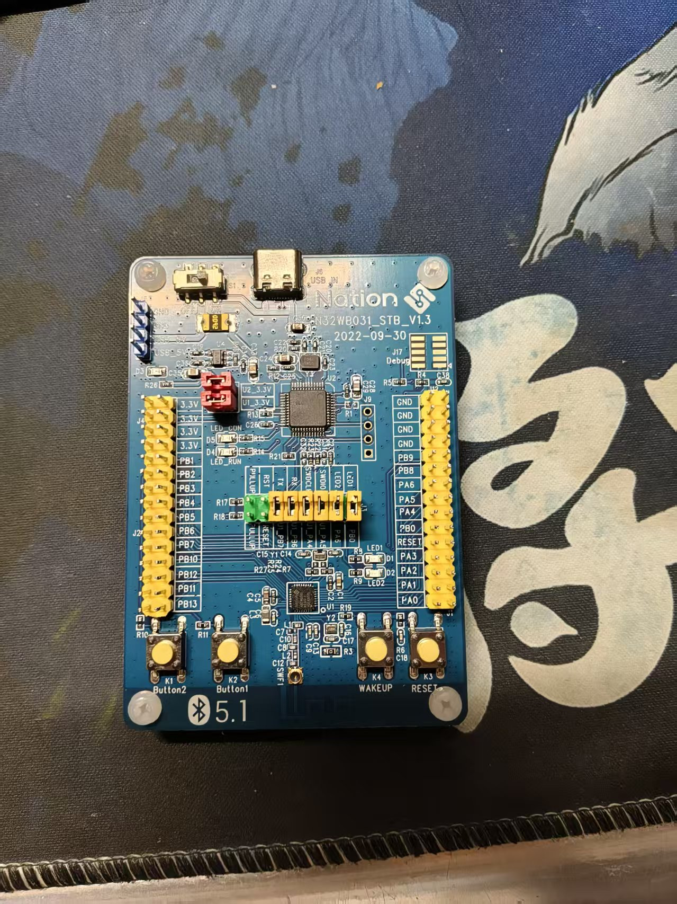

### 1.3 主控芯片核心规格

| 参数 | 规格 |
|------|------|
| 内核 | 32 位 Arm Cortex-M0，最高主频 64MHz |
| SRAM | 48KB + 16KB，合计 64KB |
| Flash | 256KB / 512KB |
| 无线 | 集成 BLE 5.1 射频收发器 |
| 速率模式 | 1Mbps、2Mbps、125Kbps (S8)、500Kbps (S2) |
| 协议特性 | 多角色、多连接、数据长度扩展、RSSI、AoA/AoD、SIG Mesh |
| 发射功率 | 最高 +6dBm |
| 接收灵敏度 | 最高 -96dBm（@1Mbps） |

N32WB031 的产品定位并非单纯追求主频，而是面向无线低功耗终端场景，在系统功耗、BLE 能力、片上资源和外设组合之间取得平衡。

### 1.4 低功耗与无线特性

对于电池供电类设备（遥控器、标签、传感器、无线开关、便携式配件），低功耗和无线性能直接决定产品可用性。

典型低功耗指标：

| 模式 | 电流 |
|------|------|
| 接收 | 3.8mA |
| 发射（0dBm） | 4.2mA |
| Sleep（48KB RAM 保持） | 1.4uA |
| 掉电模式 | 130nA |

无线能力：

- BLE 5.1
- 长距离模式
- 多连接与主从并发
- RSSI 评估
- 定位相关特性（AoA/AoD）
- Mesh 组网能力

### 1.5 开发板硬件资源

- **供电与接口**：USB-C，同时承担供电、调试和串口通信
- **时钟资源**：32MHz HSE + 32.768kHz LSE
- **基础交互**：板载用户 LED、按键
- **调试与复用**：SWD 调试、串口复用及相关跳线配置
- **IO 扩展**：主要 GPIO 通过排针引出，便于连接外部模块

开发板还保留了电源选择、SWD/串口切换、低速晶振与功能复用、LED 使能等配置，实际使用时需结合板上丝印和硬件使用指南确认。

开发板背面实物如下，可见丝印说明、引脚引出及 PB8/PB9、LSE 相关配置区域：

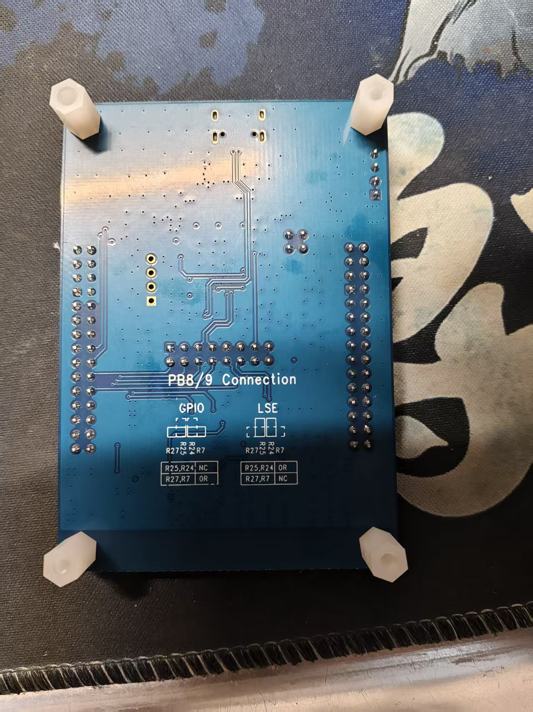

### 1.6 片上外设能力

N32WB031 的片上外设覆盖了大多数低功耗蓝牙终端设计需求：

- **模拟能力**：10 位 1.33Msps ADC，支持可配置高精度采样路径
- **音频前端**：模拟 MIC 输入、PGA 增益、MIC BIAS
- **按键扫描**：硬件 KEYSCAN
- **红外能力**：硬件 IRC
- **定时器**：高级定时器、通用定时器、基本定时器
- **通信接口**：USART、LPUART、SPI、I2S、I2C
- **系统外设**：RTC、DMA、CRC、WWDG、IWDG

适用项目类型：

- **无线人机交互类**：键盘、遥控器、语音配件
- **低功耗感知类**：传感器节点、电子价签、资产标签

### 1.7 典型应用场景

- 蓝牙无线键盘、遥控器、语音遥控器
- 智能家居无线节点和 Mesh 设备
- 数传模块、电子价签、标签类终端
- 低功耗 IoT 原型验证
- 射频、功耗和认证前评估

### 1.8 开发支持资源

- Keil MDK 开发环境支持
- J-Link / NSLink 调试支持
- 官方 SDK（N32WB03x SDK V2.0.0）
- BLE、透传、低功耗、外设、升级等示例工程
- 数据手册、硬件使用指南、SDK 使用指南、硬件设计指南等文档

N32WB031-STB 的核心优势在于将 BLE 5.1、超低功耗、必要外设和评估链路整合在一块开发板上，适合作为环境搭建、示例运行、功耗测评和无线验证的起点。

### 1.9 芯片架构总览

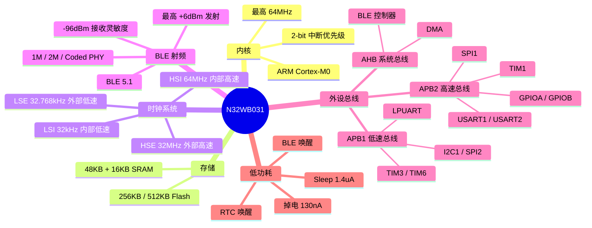
```mermaid
mindmap
  root((N32WB031))
    内核
      ARM Cortex-M0
      最高 64MHz
      2-bit 中断优先级
    存储
      256KB / 512KB Flash
      48KB + 16KB SRAM
    时钟系统
      HSE 32MHz 外部高速
      HSI 64MHz 内部高速
      LSE 32.768kHz 外部低速
      LSI 32kHz 内部低速
    BLE 射频
      BLE 5.1
      1M / 2M / Coded PHY
      最高 +6dBm 发射
      -96dBm 接收灵敏度
    外设总线
      APB2 高速总线
        GPIOA / GPIOB
        USART1 / USART2
        SPI1
        TIM1
      APB1 低速总线
        LPUART
        I2C1 / SPI2
        TIM3 / TIM6
      AHB 系统总线
        DMA
        BLE 控制器
    低功耗
      Sleep 1.4uA
      掉电 130nA
      RTC 唤醒
      BLE 唤醒
```

### 1.10 时钟树

N32WB031 的时钟系统是外设配置的基础。理解时钟树有助于后续理解 GPIO、USART、BLE 等外设的初始化逻辑。

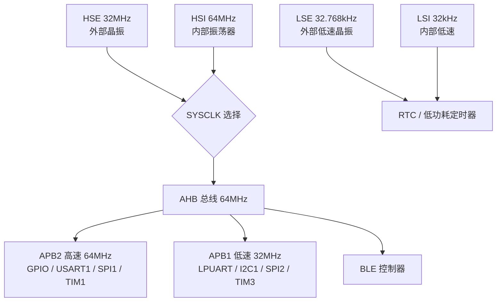
```mermaid
graph TD
    HSE["HSE 32MHz<br/>外部晶振"] --> SYSCLK{SYSCLK 选择}
    HSI["HSI 64MHz<br/>内部振荡器"] --> SYSCLK
    SYSCLK --> AHB["AHB 总线 64MHz"]
    AHB --> APB2["APB2 高速 64MHz<br/>GPIO / USART1 / SPI1 / TIM1"]
    AHB --> APB1["APB1 低速 32MHz<br/>LPUART / I2C1 / SPI2 / TIM3"]
    AHB --> BLE["BLE 控制器"]
    LSE["LSE 32.768kHz<br/>外部低速晶振"] --> RTC["RTC / 低功耗定时器"]
    LSI["LSI 32kHz<br/>内部低速"] --> RTC
```

BLE 协议栈通常要求 HSE 作为时钟源，因为射频收发需要精确的频率参考。在 `ns_ble.h` 中可以看到相关配置：

```c
#define HSE_VALUE        (32000000)    // 32 MHz
#define HSI_VALUE        (64000000)    // 64 MHz
#define LSE_VALUE        (32768)       // 32.768 kHz
#define LSI_VALUE        (32000)       // 32 kHz
```

---

## 第二章：开发环境搭建

本章完成 Keil MDK 环境安装、SDK 解压和 PACK 导入。流程本身并不复杂，但官方 PACK 包存在格式规范问题，本章一并给出修复方案。

### 2.1 资源下载

N32WB031 官方产品页：

[N32WB031 - 国民技术官网](https://www.nationstech.com/product/General/cortexm0/N32WBBLE/N32WB031)

在官网"技术资源 -> 固件和软件"页面，可下载以下关键资源：

- **SDK 包**：N32WB031 系列 Firmware 软件开发套件，版本 V2.0.0
- **IDE 环境包**：KEIL-N32WB031，版本 V1.4.0
- **SDK 使用指南**：建议一并下载，便于查阅示例、目录结构和外设/BLE 用法

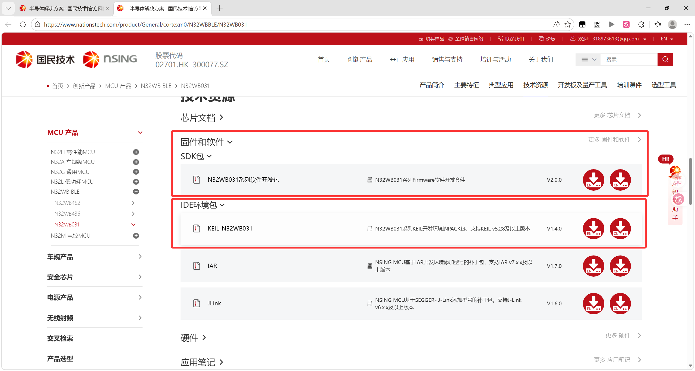

上图红框部分即为 SDK 包和 KEIL PACK 包。

### 2.2 安装顺序

1. 安装 Keil MDK（建议 v5.28 及以上）
2. 下载 SDK 包并解压到本地目录
3. 下载 KEIL-N32WB031 PACK 包
4. 安装 PACK 包
5. 打开 SDK 中对应示例工程的 `*.uvprojx` 文件开始编译

导入 PACK 时的安装界面：

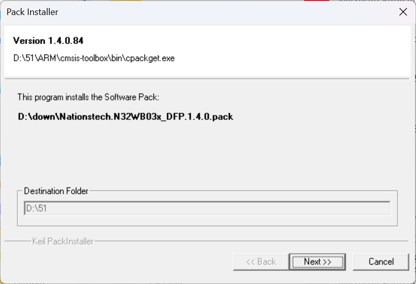

SDK 解压后的常用工程入口：

```
<N32WB03x_SDK>/projects/n32wb03x_EVAL/
```

其中包含：

- `peripheral/`：GPIO、ADC、I2C、SPI、USART、TIM 等外设例程
- `ble/`：BLE 外设角色示例
- `ble_central/`：BLE 中央角色示例
- `dfu/`：升级相关示例
- `application/`：FreeRTOS 和组合示例

### 2.3 PACK 安装问题与修复

安装 PACK 时如果遇到以下报错：

- `bad pack name`
- `pdsc not found`
- `version does not match`

原因是官方 PACK 包未严格遵守 CMSIS-Pack 规范，并非安装操作有误。

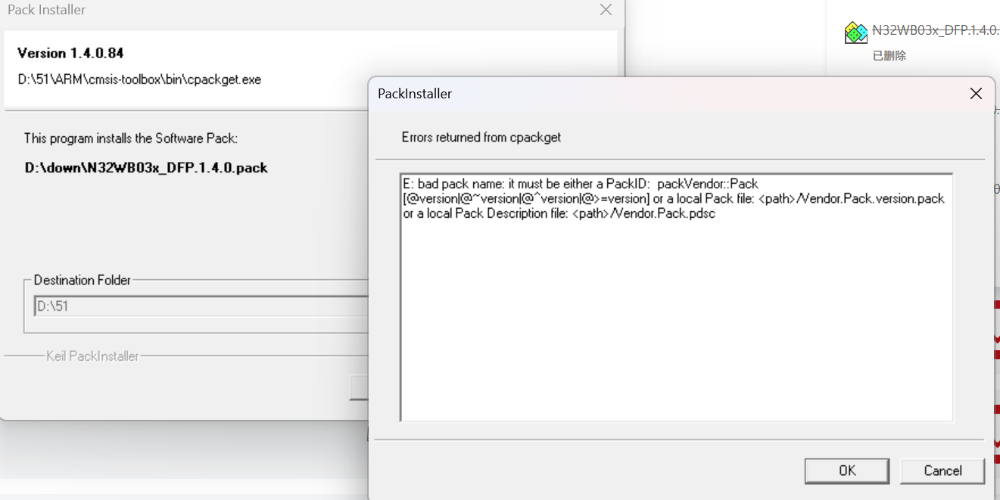

#### 根因分析

1. **外层文件名缺少供应商前缀** → `bad pack name`
   - 规范要求：`<供应商>.<包名>.<版本号>.pack`
   - 官方实际：`N32WB03x_DFP.1.4.0.pack`
   - 正确格式：`Nationstech.N32WB03x_DFP.1.4.0.pack`

2. **包内 pdsc 文件命名不规范** → `pdsc not found`
   - 规范要求：`<供应商>.<包名>.pdsc`
   - 官方实际：`Nationstech.N32WB03x_DFP.1.4.0.pdsc`（多带了版本号）

3. **pdsc 中版本发布顺序错误** → `version does not match`
   - 规范要求：`<releases>` 节点中最新版本排在最前
   - 官方实际：最老版本排在前面，导致工具误判包版本

#### 修复步骤

1. 备份原始文件 `N32WB03x_DFP.1.4.0.pack`
2. 将 `.pack` 文件解压到临时目录
3. 将外层包文件名改为 `Nationstech.N32WB03x_DFP.1.4.0.pack`
4. 将包内 `Nationstech.N32WB03x_DFP.1.4.0.pdsc` 改名为 `Nationstech.N32WB03x_DFP.pdsc`
5. 打开 `.pdsc` 文件，找到 `<releases>` 节点
6. 将最新版本 `1.4.0` 的 `<release>` 移到第一条
7. 保持目录结构不变，重新打包为 `.pack`
8. 通过 Keil Pack Installer 重新导入

#### 修复后预期

安装成功后，在 Keil 的器件/Pack 选择界面中可正常看到 Nationstech 厂商下的 N32WB03x Series 和 N32WB031 设备：

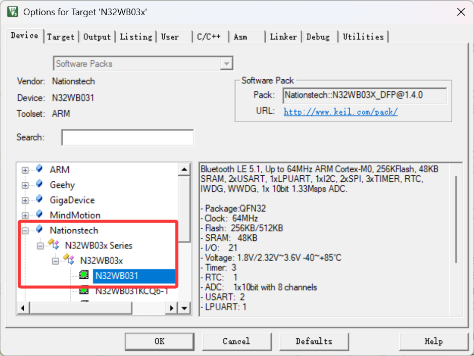

### 2.4 补充说明

- PACK 暂时未安装成功时，仍可直接打开 SDK 中的 uvprojx 工程尝试编译
- PACK 的主要作用是补齐设备支持、模板、启动文件识别和工程集成体验，建议后续修复
- 如官网后续更新了新版本 PACK，优先下载最新版，可能不再需要手动修包

### 2.5 小结

环境搭建的标准流程为：从官网下载 SDK 和 PACK，正常安装即可。本次遇到的问题源于官方 PACK 包的格式不规范，通过手动修正包结构后可正常完成安装。环境就绪后，下一章开始编写第一个工程。

---

## 第三章：第一个工程 — LED 点灯

本章目标：建立一个最小 Keil 工程，编译下载后让 PB0 和 PA6 对应的两个板载 LED 执行启动动画和循环灯效。

工程目录：`N32WB031_STB_Blank_LED`

### 3.1 工程结构

采用"基于官方例程收敛成最小模板"的方式，保留空白工程所需的基本部分：

```
N32WB031_STB_Blank_LED/
├── inc/
│   └── main.h              ← LED 引脚定义、函数声明
├── src/
│   ├── main.c              ← 主函数、GPIO 初始化、灯效逻辑
│   └── n32wb03x_it.c       ← 默认中断处理函数
├── MDK-ARM/
│   ├── N32WB031_STB_Blank_LED.uvprojx   ← Keil 工程文件
│   └── N32WB031_STB_Blank_LED.uvoptx    ← 调试与下载配置
└── readme.txt
```

### 3.2 打开工程

1. 打开 Keil uVision
2. 选择 `Project -> Open Project...`
3. 进入工程目录下的 `MDK-ARM/` 文件夹
4. 打开 `N32WB031_STB_Blank_LED.uvprojx`

环境和 PACK 安装正常的情况下，工程可被 Keil 正常识别：

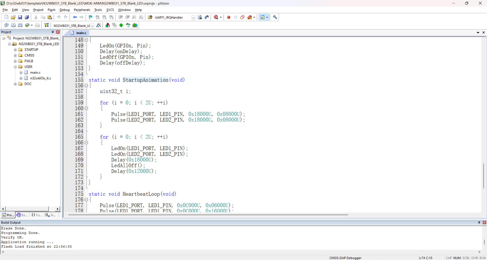

### 3.3 GPIO 前置知识

在 N32WB031 中，每个 GPIO 引脚的配置涉及三个关键步骤：

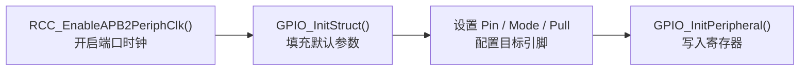
```mermaid
flowchart LR
    A["RCC_EnableAPB2PeriphClk()<br/>开启端口时钟"] --> B["GPIO_InitStruct()<br/>填充默认参数"]
    B --> C["设置 Pin / Mode / Pull<br/>配置目标引脚"]
    C --> D["GPIO_InitPeripheral()<br/>写入寄存器"]
```

**为什么必须先开时钟？**

N32WB031 的外设挂载在 APB 总线上，时钟默认关闭以节省功耗。不开启时钟就访问 GPIO 寄存器，读写操作会被忽略。

**GPIO_Mode 常用取值：**

| 模式 | 宏定义 | 用途 |
|------|--------|------|
| 推挽输出 | `GPIO_MODE_OUTPUT_PP` | 驱动 LED、控制数字输出 |
| 开漏输出 | `GPIO_MODE_OUTPUT_OD` | I2C、线与逻辑 |
| 复用推挽 | `GPIO_MODE_AF_PP` | USART TX、SPI MOSI |
| 浮空输入 | `GPIO_MODE_INPUT` | 外部信号检测 |
| 上拉输入 | `GPIO_MODE_INPUT` + `GPIO_PULL_UP` | 按键（低电平有效） |

**GPIO_Module 寄存器结构（来自 `n32wb03x.h`）：**

```c
typedef struct
{
    __IO uint32_t PMODE;      // 模式寄存器
    __IO uint32_t POTYPE;     // 输出类型寄存器
    __IO uint32_t PUPD;       // 上下拉寄存器
    __IO uint32_t PID;        // 输入数据寄存器
    __IO uint32_t POD;        // 输出数据寄存器
    __IO uint32_t PBSC;       // 位设置/清除寄存器
    __IO uint32_t PLOCK;      // 锁定寄存器
    __IO uint32_t AFL;        // 复用功能低位
    __IO uint32_t AFH;        // 复用功能高位
} GPIO_Module;
```

SDK 封装了 `GPIO_SetBits()`、`GPIO_ResetBits()`、`GPIO_TogglePin()` 等函数，开发者无需直接操作寄存器。

### 3.4 工程功能概述

该模板在最小化 GPIO 点灯基础上，加入了一套轻量级灯效逻辑，不依赖串口、中断或定时器。

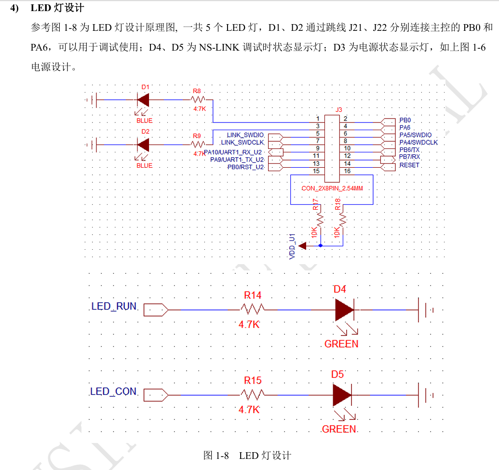

执行流程：

1. 打开 GPIOA 和 GPIOB 时钟
2. 将 PB0 和 PA6 配置为推挽输出
3. 上电后执行启动动画
4. 进入交替"心跳灯"循环

该工程可作为后续扩展的起点，在此骨架上可叠加按键、串口、定时器或 BLE。

### 3.5 引脚定义与主函数

```c
#define LED1_PORT   GPIOB
#define LED1_PIN    GPIO_PIN_0

#define LED2_PORT   GPIOA
#define LED2_PIN    GPIO_PIN_6
```

- PB0 → LED1
- PA6 → LED2

模板默认采用高电平点亮方式。

```c
int main(void)
{
    LedInit(LED1_PORT, LED1_PIN);
    LedInit(LED2_PORT, LED2_PIN);

    LedAllOff();
    StartupAnimation();

    while (1)
    {
        HeartbeatLoop();
    }
}
```

- `LedInit()`：将对应引脚初始化为推挽输出
- `LedAllOff()`：统一熄灯，确保启动状态一致
- `StartupAnimation()`：上电动画
- `HeartbeatLoop()`：主循环中持续运行交替灯效

### 3.6 GPIO 初始化

```c
void LedInit(GPIO_Module* GPIOx, uint16_t Pin)
{
    GPIO_InitType GPIO_InitStructure;

    assert_param(IS_GPIO_ALL_PERIPH(GPIOx));

    if (GPIOx == GPIOA)
    {
        RCC_EnableAPB2PeriphClk(RCC_APB2_PERIPH_GPIOA, ENABLE);
    }
    else if (GPIOx == GPIOB)
    {
        RCC_EnableAPB2PeriphClk(RCC_APB2_PERIPH_GPIOB, ENABLE);
    }
    else
    {
        return;
    }

    if (Pin <= GPIO_PIN_ALL)
    {
        GPIO_InitStruct(&GPIO_InitStructure);
        GPIO_InitStructure.Pin = Pin;
        GPIO_InitStructure.GPIO_Mode = GPIO_MODE_OUTPUT_PP;
        GPIO_InitPeripheral(GPIOx, &GPIO_InitStructure);
    }
}
```

完成两个关键动作：打开对应端口时钟，将目标引脚配置为推挽输出（`GPIO_MODE_OUTPUT_PP`）。

### 3.7 灯效逻辑

灯效由 GPIO 高低电平切换和软件延时实现，不依赖额外外设。

核心辅助函数：

```c
static void Pulse(GPIO_Module* GPIOx, uint16_t Pin, uint32_t onDelay, uint32_t offDelay)
{
    LedOn(GPIOx, Pin);
    Delay(onDelay);
    LedOff(GPIOx, Pin);
    Delay(offDelay);
}
```

**启动动画：**

```c
static void StartupAnimation(void)
{
    uint32_t i;

    for (i = 0; i < 2U; ++i)
    {
        Pulse(LED1_PORT, LED1_PIN, 0x18000U, 0x08000U);
        Pulse(LED2_PORT, LED2_PIN, 0x18000U, 0x08000U);
    }

    for (i = 0; i < 2U; ++i)
    {
        LedOn(LED1_PORT, LED1_PIN);
        LedOn(LED2_PORT, LED2_PIN);
        Delay(0x18000U);
        LedAllOff();
        Delay(0x12000U);
    }
}
```

**主循环（心跳灯）：**

```c
static void HeartbeatLoop(void)
{
    Pulse(LED1_PORT, LED1_PIN, 0x0C000U, 0x06000U);
    Pulse(LED1_PORT, LED1_PIN, 0x0C000U, 0x16000U);
    Pulse(LED2_PORT, LED2_PIN, 0x0C000U, 0x06000U);
    Pulse(LED2_PORT, LED2_PIN, 0x0C000U, 0x2A000U);
}
```

通过调整 `onDelay` 和 `offDelay` 参数即可实现不同灯效模式（流水灯、报警灯、SOS 等）。

### 3.8 编译与下载

1. 在 Keil 中点击 Rebuild
2. 确认编译通过
3. 连接开发板
4. 点击 Download
5. 复位开发板或重新上电

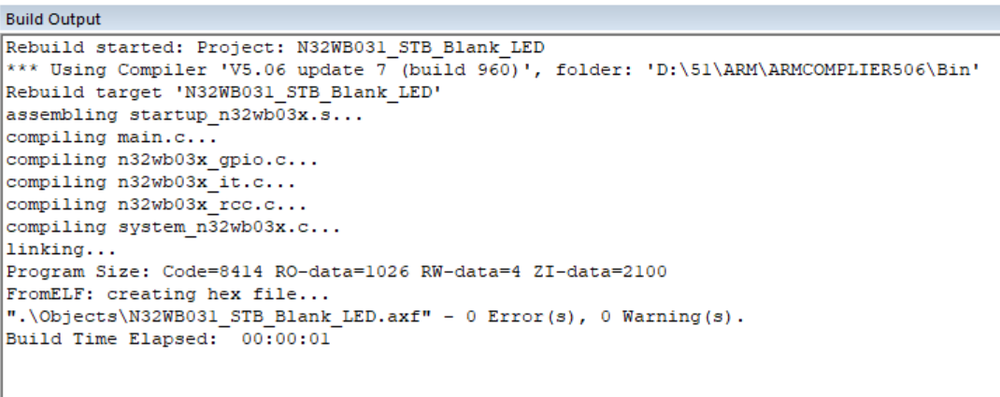
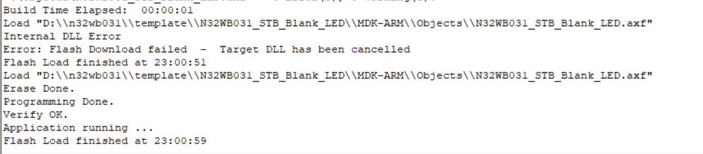

编译失败时优先排查：

- PACK 是否正确安装
- Keil 是否识别到 N32WB031
- 工程相对路径是否被修改

### 3.9 运行现象

程序下载后，开发板行为：

- 上电后执行短暂启动动画
- PB0 和 PA6 交替执行双闪
- 效果比常亮更易于确认程序已正常运行


### 3.10 模板适用性

该工程仅保留新工程最基本的骨架：

- 正确的芯片与 Pack 配置
- 启动文件
- CMSIS 系统文件
- 必要的标准外设驱动
- 用户代码入口 main.c

已具备"能编、能下、能跑"的基本条件，同时未引入串口、定时器或 BLE 协议栈等额外复杂度，适合作为后续学习的起点。

**如果你成功了，你应该看到：**

- 编译无 Error、无 Warning
- 下载后开发板 LED 持续闪烁（约 1 秒亮、1 秒灭）
- Keil 输出 `Download successful` 提示

**如果失败了，优先怀疑：**

- Keil 未安装 N32WB031 器件包 → `Pack Installer` 搜索 `N32WB031` 安装
- SWD 仿真器未连接或接触不良 → 检查接线、换 USB 口
- 芯片被锁无法下载 → 参见附录"芯片无法识别的处理方法"
- 编译报错找不到头文件 → 确认 SDK 路径在 `Manage Project Items` 中已正确添加

---

## 第四章：按键 + 串口基础外设

本章新建第二个独立工程，同时实现板载按键输入、串口日志输出、按键与串口共同控制 LED 动画模式三项功能。

工程目录：`N32WB031_STB_Key_USART`

### 4.1 交互设计

工程设计为一个小型交互 Demo，而非简单的按键亮灯：

- **KEY1（PB1）**：切换当前 LED 动画模式
- **KEY2（PB2）**：暂停/恢复当前动画，打印状态
- **USART1（PB6/PB7, 115200）**：上电打印命令菜单，支持串口指令控制

串口命令列表：

| 命令 | 功能 |
|------|------|
| `1` | 切换到 heartbeat 模式 |
| `2` | 切换到 pingpong 模式 |
| `3` | 切换到 sync 模式 |
| `m` | 切换到下一个模式 |
| `p` | 暂停 / 恢复动画 |
| `s` | 打印当前状态 |
| `h` | 打印帮助菜单 |

### 4.2 独立工程的原因

未在上一章工程基础上修改，而是新建独立工程：

1. 各章节工程独立，便于按章节学习
2. 每个工程可独立打开、单独编译下载
3. 工程结构更清晰，便于管理

### 4.3 工程结构

```
N32WB031_STB_Key_USART/
├── inc/
│   └── main.h              ← LED/KEY/USART 引脚定义、函数声明
├── src/
│   ├── main.c              ← 串口初始化、按键扫描、状态打印、灯效模式切换
│   └── n32wb03x_it.c       ← 默认中断处理函数
├── MDK-ARM/
│   ├── N32WB031_STB_Key_USART.uvprojx   ← Keil 工程配置
│   └── N32WB031_STB_Key_USART.uvoptx    ← 调试下载配置
└── readme.txt
```

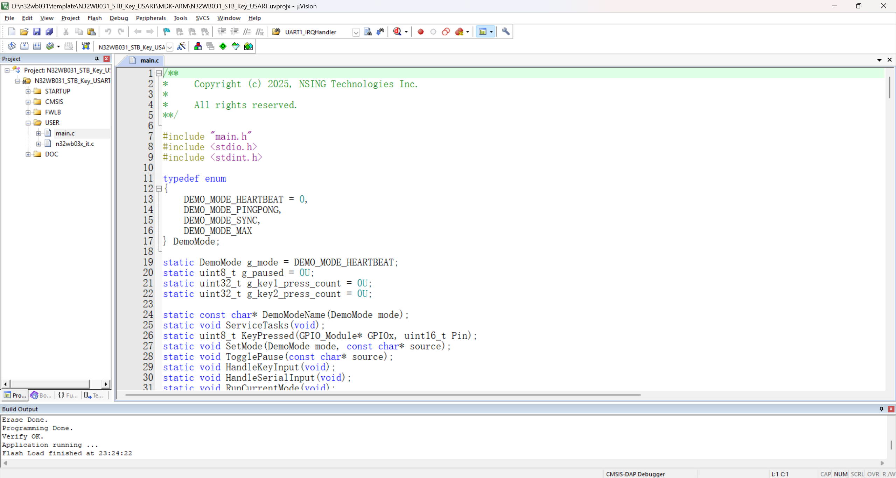

### 4.4 硬件资源与引脚分配

| 资源 | 引脚 | 用途 |
|------|------|------|
| LED1 | PB0 | 显示当前动画效果 |
| LED2 | PA6 | 显示当前动画效果 |
| KEY1 | PB1 | 本地输入 — 切换模式 |
| KEY2 | PB2 | 本地输入 — 暂停/恢复 |
| USART1_TX | PB6 | 串口发送 |
| USART1_RX | PB7 | 串口接收 |

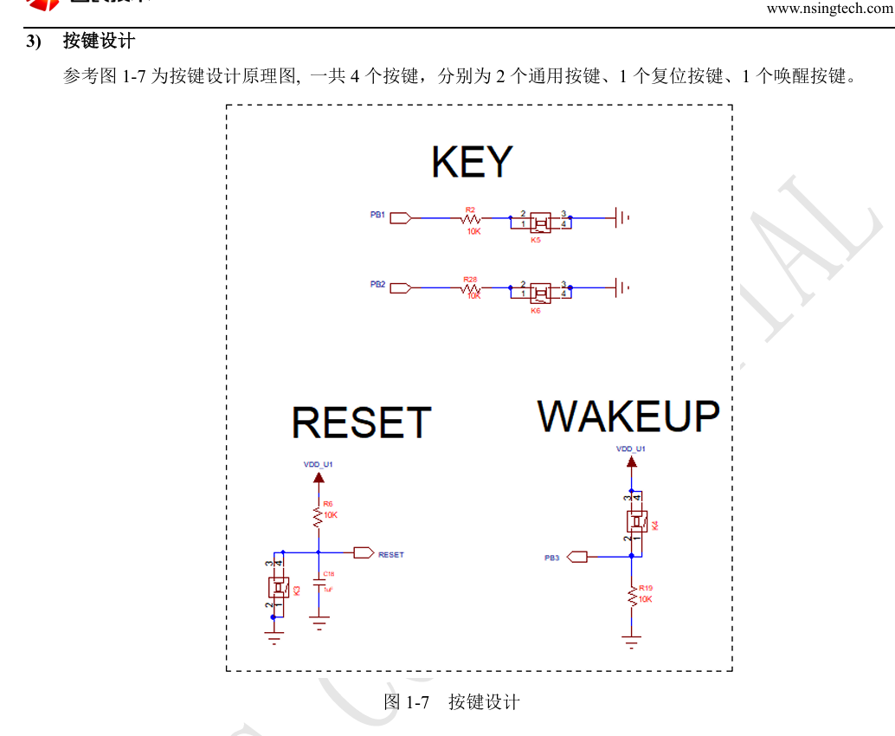
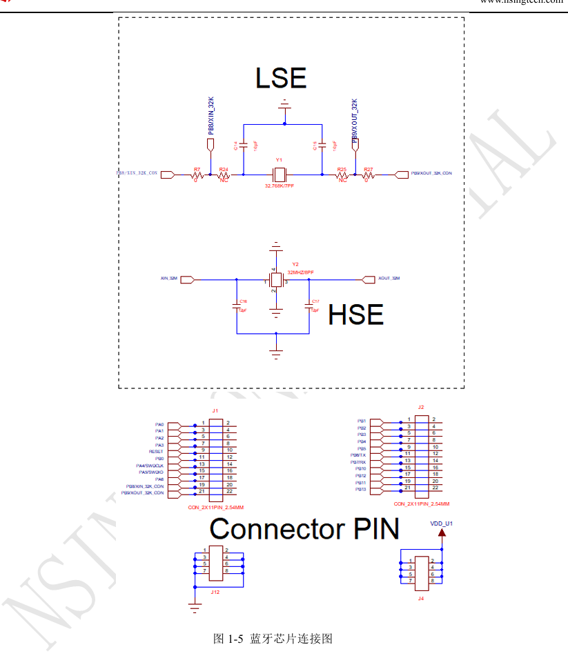

### 4.5 前置知识：轮询架构与消抖

**轮询 vs 中断：**

本工程采用纯轮询架构，不使用任何中断。主循环中持续调用 `ServiceTasks()` 检查串口和按键状态。这种方式逻辑简单、调试方便，适合入门阶段理解外设交互。

**按键消抖原理：**

机械按键按下时，触点会在数毫秒内反复弹跳，产生多次高低电平变化。消抖的核心思路是：检测到低电平后延时一段时间，再次确认仍为低电平才认定为有效按下。

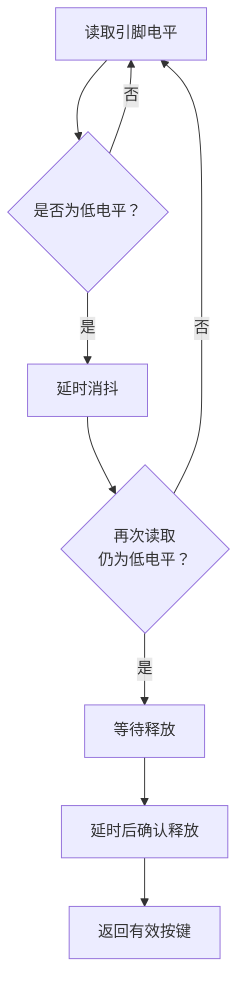
```mermaid
flowchart TD
    A["读取引脚电平"] --> B{"是否为低电平？"}
    B -->|否| A
    B -->|是| C["延时消抖"]
    C --> D{"再次读取<br/>仍为低电平？"}
    D -->|否| A
    D -->|是| E["等待释放"]
    E --> F["延时后确认释放"]
    F --> G["返回有效按键"]
```

**DelayWithService 模式：**

普通 `Delay()` 在延时期间 CPU 空转，无法响应任何输入。`DelayWithService()` 将长延时拆分为多个 0x2000 周期的短延时片段，每完成一个片段就调用一次 `ServiceTasks()`，确保延时期间仍能响应串口命令和按键操作。

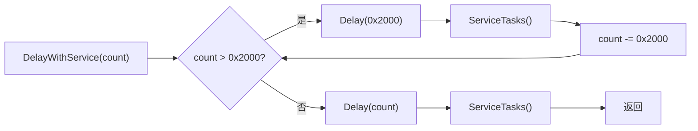
```mermaid
flowchart LR
    A["DelayWithService(count)"] --> B{"count > 0x2000?"}
    B -->|是| C["Delay(0x2000)"]
    C --> D["ServiceTasks()"]
    D --> E["count -= 0x2000"]
    E --> B
    B -->|否| F["Delay(count)"]
    F --> G["ServiceTasks()"]
    G --> H["返回"]
```

核心代码：

```c
void DelayWithService(uint32_t count)
{
    while (count > 0U)
    {
        uint32_t slice = (count > 0x2000U) ? 0x2000U : count;
        Delay(slice);
        count -= slice;
        ServiceTasks();
    }
}
```

这个模式贯穿整个工程，所有 LED 动画的延时都通过 `DelayWithService()` 实现，保证用户在任意时刻都能通过按键或串口中断当前动画。

**状态机设计：**

工程使用 `DemoMode` 枚举管理三种灯效模式，配合暂停标志构成简单状态机：

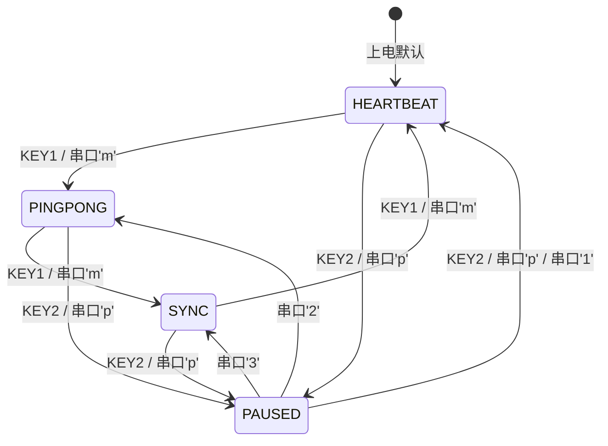
```mermaid
stateDiagram-v2
    [*] --> HEARTBEAT: 上电默认
    HEARTBEAT --> PINGPONG: KEY1 / 串口'm'
    PINGPONG --> SYNC: KEY1 / 串口'm'
    SYNC --> HEARTBEAT: KEY1 / 串口'm'
    HEARTBEAT --> PAUSED: KEY2 / 串口'p'
    PINGPONG --> PAUSED: KEY2 / 串口'p'
    SYNC --> PAUSED: KEY2 / 串口'p'
    PAUSED --> HEARTBEAT: KEY2 / 串口'p' / 串口'1'
    PAUSED --> PINGPONG: 串口'2'
    PAUSED --> SYNC: 串口'3'
```

### 4.6 串口初始化

使用 USART1 作为日志串口，波特率 115200，沿用官方 Printf 例程思路：

```c
void UsartInit(void)
{
    GPIO_InitType GPIO_InitStructure;
    USART_InitType USART_InitStructure;

    GPIO_APBxClkCmd(USARTx_GPIO_CLK, ENABLE);
    USART_APBxClkCmd(USARTx_CLK, ENABLE);

    GPIO_InitStruct(&GPIO_InitStructure);

    GPIO_InitStructure.Pin = USARTx_TxPin;
    GPIO_InitStructure.GPIO_Mode = GPIO_MODE_AF_PP;
    GPIO_InitStructure.GPIO_Alternate = USARTx_Tx_GPIO_AF;
    GPIO_InitPeripheral(USARTx_GPIO, &GPIO_InitStructure);

    GPIO_InitStructure.Pin = USARTx_RxPin;
    GPIO_InitStructure.GPIO_Alternate = USARTx_Rx_GPIO_AF;
    GPIO_InitPeripheral(USARTx_GPIO, &GPIO_InitStructure);

    USART_InitStructure.BaudRate = 115200;
    USART_InitStructure.WordLength = USART_WL_8B;
    USART_InitStructure.StopBits = USART_STPB_1;
    USART_InitStructure.Parity = USART_PE_NO;
    USART_InitStructure.HardwareFlowControl = USART_HFCTRL_NONE;
    USART_InitStructure.Mode = USART_MODE_RX | USART_MODE_TX;

    USART_Init(USARTx, &USART_InitStructure);
    USART_Enable(USARTx, ENABLE);
}
```

`printf()` 重定向：

```c
int fputc(int ch, FILE* f)
{
    (void)f;
    USART_SendData(USARTx, (uint8_t)ch);
    while (USART_GetFlagStatus(USARTx, USART_FLAG_TXDE) == RESET)
    {
    }
    return ch;
}
```

### 4.7 按键输入与消抖

采用轮询消抖方案，逻辑清晰，便于理解：

```c
static uint8_t KeyPressed(GPIO_Module* GPIOx, uint16_t Pin)
{
    if (GPIO_ReadInputDataBit(GPIOx, Pin) == RESET)
    {
        Delay(0x5000U);
        if (GPIO_ReadInputDataBit(GPIOx, Pin) == RESET)
        {
            while (GPIO_ReadInputDataBit(GPIOx, Pin) == RESET)
            {
            }
            Delay(0x5000U);
            return 1U;
        }
    }

    return 0U;
}
```

处理流程：检测按下 → 延时消抖 → 等待释放 → 返回单次触发。

### 4.8 主循环与交互逻辑

```c
int main(void)
{
    LedInit(LED1_PORT, LED1_PIN);
    LedInit(LED2_PORT, LED2_PIN);
    KeyInit(KEY1_PORT, KEY1_PIN);
    KeyInit(KEY2_PORT, KEY2_PIN);
    UsartInit();

    LedAllOff();
    PrintBanner();
    PrintHelp();
    PrintStatus();
    StartupAnimation();

    while (1)
    {
        ServiceTasks();
        RunCurrentMode();
    }
}
```

- `PrintBanner()`：打印欢迎信息
- `PrintHelp()`：打印串口命令列表
- `PrintStatus()`：打印当前模式和按键计数
- `ServiceTasks()`：持续处理串口输入和按键输入
- `RunCurrentMode()`：根据当前模式执行对应 LED 动画

串口输入处理：

```c
static void HandleSerialInput(void)
{
    if (USART_GetFlagStatus(USARTx, USART_FLAG_RXDNE) == RESET)
    {
        return;
    }

    switch ((char)USART_ReceiveData(USARTx))
    {
        case '1':
            SetMode(DEMO_MODE_HEARTBEAT, "UART");
            break;
        case '2':
            SetMode(DEMO_MODE_PINGPONG, "UART");
            break;
        case '3':
            SetMode(DEMO_MODE_SYNC, "UART");
            break;
        case 'm':
        case 'M':
            SetMode((DemoMode)((g_mode + 1U) % DEMO_MODE_MAX), "UART");
            break;
        case 'p':
        case 'P':
            TogglePause("UART");
            break;
        case 's':
        case 'S':
            PrintStatus();
            break;
        case 'h':
        case 'H':
        case '?':
            PrintHelp();
            break;
        case '\r':
        case '\n':
            break;
        default:
            printf("[UART] unknown command\r\n");
            PrintHelp();
            break;
    }
}
```

按键输入处理：

```c
static void HandleKeyInput(void)
{
    if (KeyPressed(KEY1_PORT, KEY1_PIN) != 0U)
    {
        g_key1_press_count++;
        SetMode((DemoMode)((g_mode + 1U) % DEMO_MODE_MAX), "KEY1");
    }

    if (KeyPressed(KEY2_PORT, KEY2_PIN) != 0U)
    {
        g_key2_press_count++;
        TogglePause("KEY2");
        PrintStatus();
    }
}
```

### 4.9 三种灯效模式

1. **heartbeat**：两个灯交替双闪，类似"心跳"节奏
2. **pingpong**：PB0 和 PA6 左右交替闪烁
3. **sync**：两个灯同步双闪

按 KEY1 或串口发送 `m` 可切换至下一模式。

### 4.10 串口测试

串口助手参数：

- 波特率：115200
- 数据位：8
- 停止位：1
- 校验位：None

测试步骤：

1. 复位开发板
2. 观察串口欢迎信息和帮助菜单
3. 发送 `1`、`2`、`3`，查看灯效切换
4. 发送 `p`，查看动画暂停
5. 发送 `s`，查看状态打印
6. 发送 `h`，查看帮助菜单重新输出

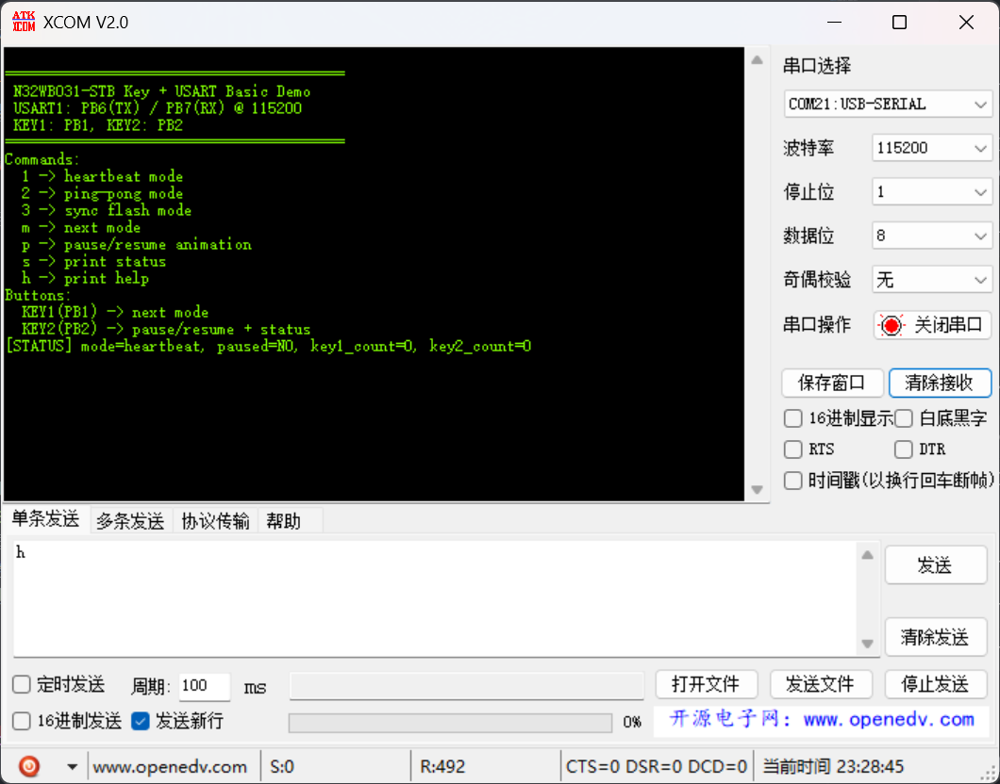
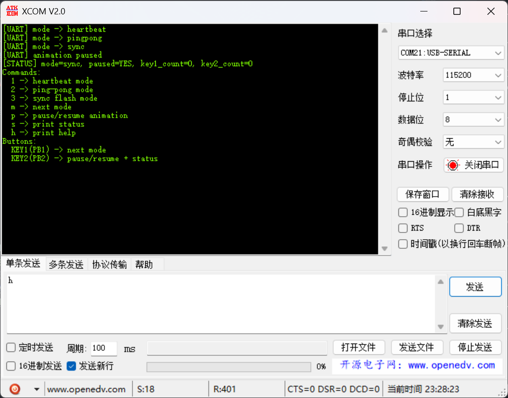

### 4.11 按键测试

- 按 KEY1（PB1）：切换动画模式
- 按 KEY2（PB2）：暂停/恢复动画，打印状态

按下 KEY1 后串口输出：

```text
[KEY1] mode -> pingpong
```

按下 KEY2 后串口输出：

```text
[KEY2] animation paused
[STATUS] mode=pingpong, paused=YES, key1_count=1, key2_count=1
```

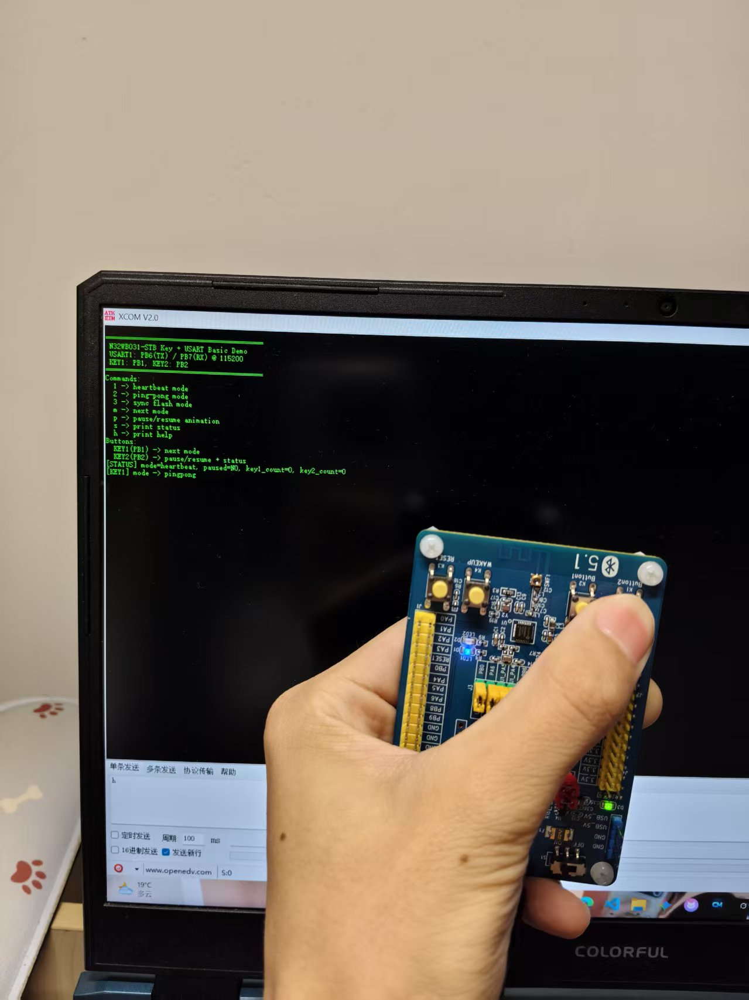
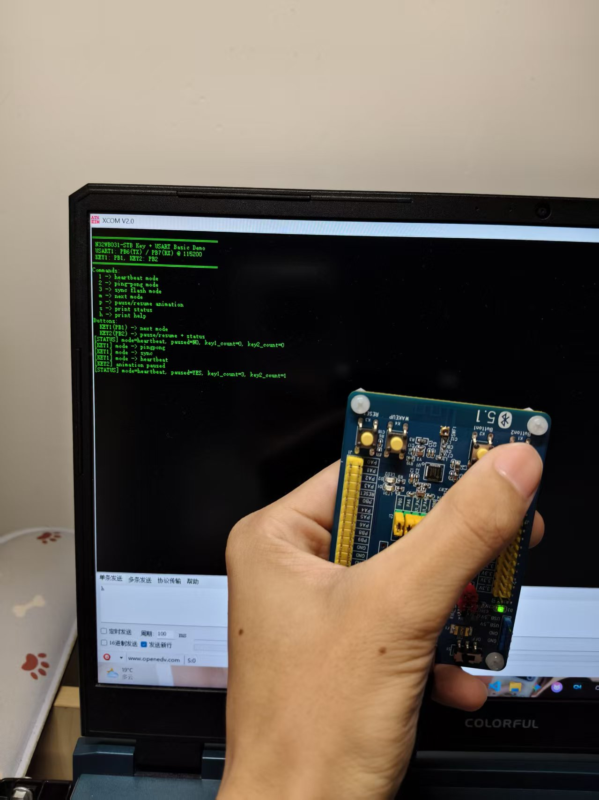


### 4.12 小结

至此已完成两份独立工程：

1. **N32WB031_STB_Blank_LED**：从零建立最小可运行骨架
2. **N32WB031_STB_Key_USART**：按键、串口和状态交互的组合

第一份工程建立工程结构认知，第二份工程掌握基础外设联动。具备这两个基础后，进入 BLE 开发的门槛将显著降低。

**如果你成功了，你应该看到：**

- 按下 KEY1 → LED 动画模式切换（流水灯 ↔ 呼吸灯 ↔ 全亮），串口打印当前模式
- 按下 KEY2 → 动画暂停/恢复，串口打印 `Paused` / `Running`
- 串口发送 `mode` → 返回当前模式信息
- 串口发送 `led on` / `led off` → LED 响应

**如果失败了，优先怀疑：**

- 按键无反应 → 检查 PB1/PB2 接线，确认按键接地
- 串口无输出 → 确认波特率 115200、TX 接 PB6、RX 接 PB7
- 串口乱码 → 波特率不匹配，或 USB-TTL 模块电平不兼容
- LED 不亮 → 确认 PB0 接线方向，检查限流电阻

---

## 第五章：BLE 透传工程

基础外设验证完成后，下一步进入 BLE 透传。本章基于官方 rdtss 例程整理出一份独立工程，而非从零手写蓝牙协议栈。

工程目录：`N32WB031_STB_BLE_RDTSS`

BLE 透传本身已具有足够复杂度，基于官方已跑通的服务例程进行理解、测试和讲解，是更稳妥的路径。

### 5.1 BLE 透传原理

BLE 透传的核心逻辑可以概括为：

**手机发送的数据不做复杂解析，直接转发至板载串口；串口接收的数据不做复杂封装，直接回传至手机。**

数据流向示意：

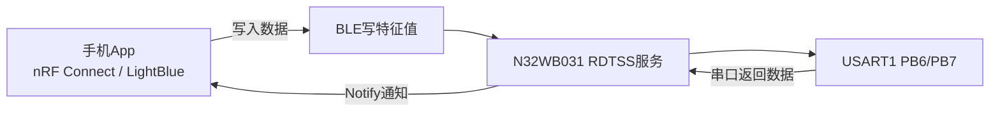
```mermaid
flowchart LR
    A[手机App<br/>nRF Connect / LightBlue] -->|写入数据| B[BLE写特征值]
    B --> C[N32WB031 RDTSS服务]
    C --> D[USART1 PB6/PB7]
    D -->|串口返回数据| C
    C -->|Notify通知| A
```

系统角色：

- 手机：无线调试窗口
- 开发板：蓝牙桥接器
- 串口另一端：本地设备或逻辑模块

### 5.2 BLE 透传的价值

1. **直观性**：连接即可测试写入、通知和日志，效果即时可见
2. **可扩展性**：透传链路打通后，可叠加传感器上传、手机控制外设、OLED 显示、OTA 等功能
3. **桥梁作用**：将前期的串口知识与后续蓝牙项目自然衔接

**为什么用自定义 128 位 UUID，而不是 SIG 标准服务？**

BLE SIG 定义了标准服务（如心率 `0x180D`、设备信息 `0x180A`），但"串口透传"不在标准服务列表中。RDTSS 是国民技术自定义的透传服务，使用 128 位 UUID 可以避免与标准服务冲突，也方便在同一个设备上同时运行标准服务（如设备信息服务）和自定义服务。如果用 16 位短 UUID，需要向 BLE SIG 申请注册，对于开发评估阶段没有必要。

### 5.3 BLE 协议前置知识

在正式进入工程代码之前，有必要先理解 BLE 协议栈的基本分层和核心概念。

**BLE 协议栈分层：**

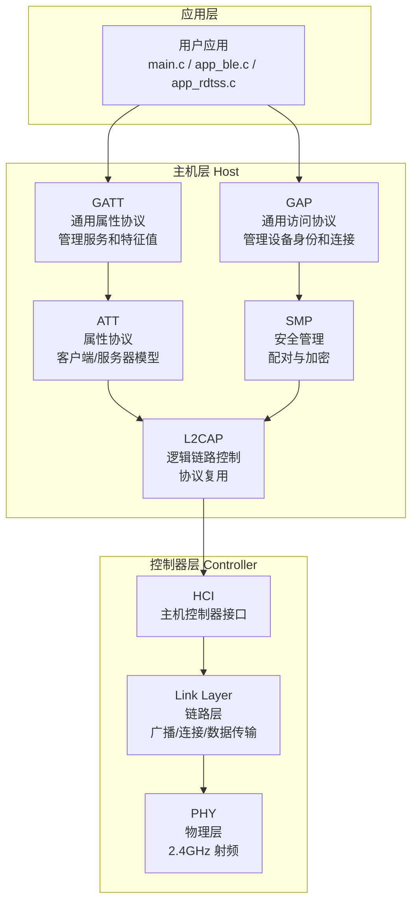
```mermaid
graph TD
    subgraph 应用层
        APP["用户应用<br/>main.c / app_ble.c / app_rdtss.c"]
    end
    subgraph 主机层 Host
        GATT["GATT<br/>通用属性协议<br/>管理服务和特征值"]
        GAP["GAP<br/>通用访问协议<br/>管理设备身份和连接"]
        ATT["ATT<br/>属性协议<br/>客户端/服务器模型"]
        SMP["SMP<br/>安全管理<br/>配对与加密"]
        L2CAP["L2CAP<br/>逻辑链路控制<br/>协议复用"]
    end
    subgraph 控制器层 Controller
        HCI["HCI<br/>主机控制器接口"]
        LL["Link Layer<br/>链路层<br/>广播/连接/数据传输"]
        PHY["PHY<br/>物理层<br/>2.4GHz 射频"]
    end
    APP --> GATT
    APP --> GAP
    GATT --> ATT
    GAP --> SMP
    ATT --> L2CAP
    SMP --> L2CAP
    L2CAP --> HCI
    HCI --> LL
    LL --> PHY
```

**从应用视角看 BLE 分层（简化版）：**

上面是完整的协议栈分层，实际开发中你打交道最多的是下面这四层：

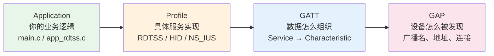
```mermaid
graph LR
    A["Application<br/>你的业务逻辑<br/>main.c / app_rdtss.c"] --> B["Profile<br/>具体服务实现<br/>RDTSS / HID / NS_IUS"]
    B --> C["GATT<br/>数据怎么组织<br/>Service → Characteristic"]
    C --> D["GAP<br/>设备怎么被发现<br/>广播名、地址、连接"]

    style A fill:#e8f5e9
    style B fill:#fff3e0
    style C fill:#e3f2fd
    style D fill:#fce4ec
```

| 层 | 回答的问题 | 本工程的对应 |
|----|-----------|-------------|
| GAP | 手机怎么搜到我？ | 广播名 `N32WB031_BLE_RDTSS`、从机角色 |
| GATT | 数据怎么组织？ | RDTSS 服务 + 写特征值 + 通知特征值 |
| Profile | 具体干什么？ | 串口 ↔ 手机双向透传 |
| Application | 我的业务逻辑？ | 串口收发、按键检测、LED 控制 |

后续章节的 HID 和 OTA 工程也遵循同样的分层，只是 Profile 层换成了 HID 或 NS_IUS。

**核心概念：**

| 概念 | 说明 |
|------|------|
| **GAP** | 管理设备身份（名称、地址、角色）、广播和连接流程。本工程中设备角色为 `GAP_ROLE_PERIPHERAL`（从机） |
| **GATT** | 管理数据的组织方式。数据以 Service（服务）→ Characteristic（特征值）的层级结构组织 |
| **Service** | 一组相关特征值的容器。本工程使用自定义 128 位 UUID 的 RDTSS 服务 |
| **Characteristic** | 服务中的单个数据点，支持 Read / Write / Notify 等操作 |
| **Notify** | 服务器主动向客户端推送数据，无需客户端轮询。本工程的串口→手机方向即使用 Notify |
| **Write** | 客户端向服务器写入数据。本工程的手机→串口方向即使用 Write |
| **UUID** | 服务和特征值的唯一标识。BLE SIG 标准服务用 16 位短 UUID（如 `0x180A` 表示设备信息服务），自定义服务用 128 位 UUID（如 `12345678-1234-5678-1234-56789abcdef0`） |

**RDTSS 服务结构：**

本工程定义的 RDTSS 服务包含两个特征值：

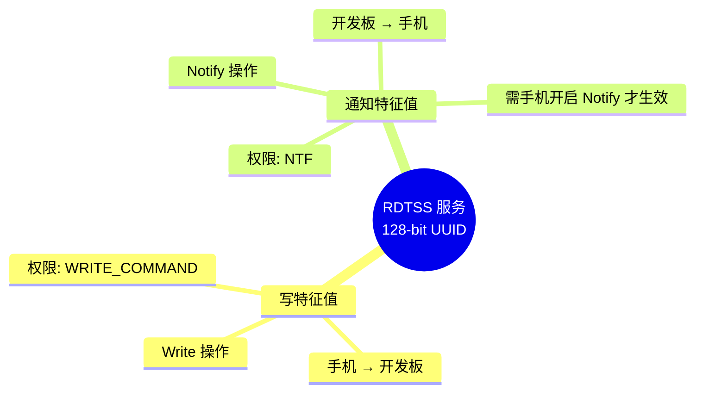
```mermaid
mindmap
  root((RDTSS 服务<br/>128-bit UUID))
    写特征值
      Write 操作
      手机 → 开发板
      权限: WRITE_COMMAND
    通知特征值
      Notify 操作
      开发板 → 手机
      权限: NTF
      需手机开启 Notify 才生效
```

**BLE 初始化流程：**

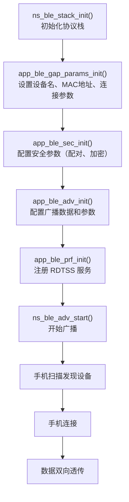
```mermaid
flowchart TD
    A["ns_ble_stack_init()<br/>初始化协议栈"] --> B["app_ble_gap_params_init()<br/>设置设备名、MAC地址、连接参数"]
    B --> C["app_ble_sec_init()<br/>配置安全参数（配对、加密）"]
    C --> D["app_ble_adv_init()<br/>配置广播数据和参数"]
    D --> E["app_ble_prf_init()<br/>注册 RDTSS 服务"]
    E --> F["ns_ble_adv_start()<br/>开始广播"]
    F --> G["手机扫描发现设备"]
    G --> H["手机连接"]
    H --> I["数据双向透传"]
```

### 5.4 工程功能

该工程完成三项核心任务：

1. 初始化蓝牙协议栈并开始广播
2. 建立自定义 RDTSS 服务
3. BLE 与 USART1 双向打通

工程启动后广播蓝牙名称：**N32WB031_RDTSS**

连接后：

- 手机写入数据 → 转发至 USART1
- USART1 接收数据 → 通过 Notify 回传手机

状态指示：

- LED1（PB0）：上电运行指示
- LED2（PA6）：蓝牙连接状态指示

### 5.5 工程结构

```
N32WB031_STB_BLE_RDTSS/
├── inc/
│   ├── app_user_config.h      ← 蓝牙名称、广播参数
│   ├── app_ble.h              ← BLE 初始化接口
│   ├── app_usart.h            ← 串口桥接接口
│   └── app_profile/
│       └── app_rdtss.h        ← 透传服务接口
├── src/
│   ├── main.c                 ← 主函数、蓝牙栈启动
│   ├── app_ble.c              ← GAP 参数、广播启动、连接/断开回调
│   ├── app_usart.c            ← USART DMA 接收、串口与 BLE 双向转发
│   └── app_profile/
│       └── app_rdtss.c        ← 写特征值处理、Notify 发送
└── MDK-ARM/
    └── N32WB031_STB_BLE_RDTSS.uvprojx
```

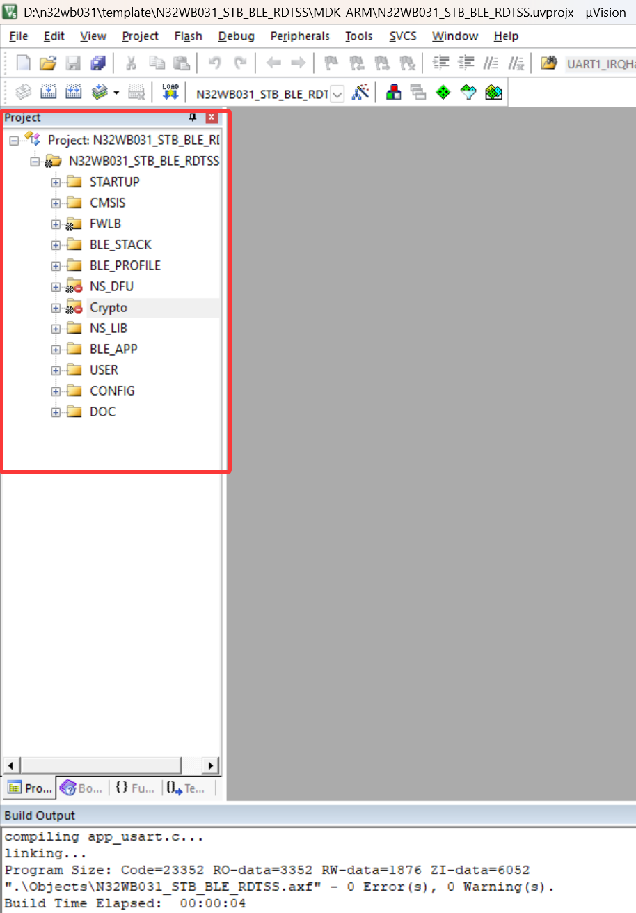

### 5.6 蓝牙名称配置

蓝牙名称定义在 `app_user_config.h` 中：

```c
#define CUSTOM_DEVICE_NAME "N32WB031_RDTSS"
```

手机蓝牙调试 App 搜索到的设备名即为此处定义。若需自定义项目，修改此行即可，例如 `My_BLE_UART`、`Sensor_Node_01` 等。

### 5.7 主函数解析

```c
int main(void)
{
    delay_n_10us(200*1000);

    NS_LOG_INIT();
    app_ble_init();

    LedInit(LED1_PORT,LED1_PIN);
    LedInit(LED2_PORT,LED2_PIN);
    LedOn(LED1_PORT,LED1_PIN);

    app_usart_dma_enable(ENABLE);
    usart_tx_dma_send((uint8_t*)DEMO_STRING, sizeof(DEMO_STRING));
    app_usart_dma_enable(DISABLE);

    while (1)
    {
        rwip_schedule();
        ns_sleep();
    }
}
```

执行流程：

1. 上电延时，预留调试器连接时间
2. 初始化日志系统
3. 初始化蓝牙协议栈并开始广播
4. 点亮运行指示灯
5. 初始化串口桥接资源
6. 进入蓝牙协议栈调度循环

该工程的蓝牙逻辑主要由协议栈调度完成，连接、收发和状态切换通过回调函数处理。

### 5.8 广播与连接机制

手机能够发现设备，依赖 `app_ble.c` 中的配置：

1. 设置设备名
2. 设置 GAP 参数
3. 初始化广播数据
4. 调用 `ns_ble_adv_start()` 开始广播

核心初始化函数：

```c
void app_ble_init(void)
{
    struct ns_stack_cfg_t app_handler = {0};
    app_handler.ble_msg_handler  = app_ble_msg_handler;
    app_handler.user_msg_handler = app_user_msg_handler;
    app_handler.lsc_cfg          = BLE_LSC_LSI_32000HZ;
    ns_ble_stack_init(&app_handler);

    app_ble_gap_params_init();
    app_ble_sec_init();
    app_ble_adv_init();
    app_ble_prf_init();
    ns_ble_adv_start();
}
```

GAP 参数配置中，设备名和连接参数是关键：

```c
void app_ble_gap_params_init(void)
{
    struct ns_gap_params_t dev_info = {0};
    uint8_t *p_mac = SystemGetMacAddr();
    if(p_mac != NULL)
    {
        memcpy(dev_info.mac_addr.addr, p_mac, BD_ADDR_LEN);
    }
    else{
        memcpy(dev_info.mac_addr.addr, "\x01\x02\x03\x04\x05\x06", BD_ADDR_LEN);
    }

    dev_info.mac_addr_type = GAPM_STATIC_ADDR;
    dev_info.appearance = 0;
    dev_info.dev_role = GAP_ROLE_PERIPHERAL;

    dev_info.dev_name_len = sizeof(CUSTOM_DEVICE_NAME)-1;
    memcpy(dev_info.dev_name, CUSTOM_DEVICE_NAME, dev_info.dev_name_len);

    dev_info.dev_conn_param.intv_min = MSECS_TO_UNIT(MIN_CONN_INTERVAL, MSECS_UNIT_1_25_MS);
    dev_info.dev_conn_param.intv_max = MSECS_TO_UNIT(MAX_CONN_INTERVAL, MSECS_UNIT_1_25_MS);
    dev_info.dev_conn_param.latency  = SLAVE_LATENCY;
    dev_info.dev_conn_param.time_out = MSECS_TO_UNIT(CONN_SUP_TIMEOUT, MSECS_UNIT_10_MS);
    dev_info.conn_param_update_delay = FIRST_CONN_PARAMS_UPDATE_DELAY;

    ns_ble_gap_init(&dev_info);
}
```

连接和断开回调决定了透传链路的开关：

```c
void app_ble_connected(void)
{
    app_usart_dma_enable(ENABLE);
    LedOn(LED2_PORT, LED2_PIN);
    notify_en = 0;
}

void app_ble_disconnected(void)
{
    ns_ble_adv_start();
    app_usart_dma_enable(DISABLE);
    LedOff(LED2_PORT, LED2_PIN);
    notify_en = 0;
}
```

### 5.9 数据流向：手机 → 串口

在 `app_rdtss.c` 中，手机写入 BLE 特征值的处理函数：

```c
static int rdtss_val_write_ind_handler(ke_msg_id_t const msgid,
                                        struct rdtss_val_write_ind const *ind_value,
                                        ke_task_id_t const dest_id,
                                        ke_task_id_t const src_id)
{
    uint16_t handle = ind_value->handle;
    uint16_t length = ind_value->length;

    switch (handle)
    {
        case RDTSS_IDX_NTF_CFG:
            if(length == 2)
            {
                uint16_t cfg_value = ind_value->value[0] + ind_value->value[1];
                if(cfg_value == PRF_CLI_START_NTF)
                {
                    notify_en = 1;
                }
                else if(cfg_value == PRF_CLI_STOP_NTFIND)
                {
                    notify_en = 0;
                }
            }
            break;
        case RDTSS_IDX_WRITE_VAL:
            app_usart_tx_fifo_enter(ind_value->value, ind_value->length);
            break;
        default:
            break;
    }
    return (KE_MSG_CONSUMED);
}
```

该回调处理两类写入事件：

- `RDTSS_IDX_NTF_CFG`：手机开启或关闭 Notify 时触发，更新 `notify_en` 标志
- `RDTSS_IDX_WRITE_VAL`：手机写入数据时触发，将数据塞入串口发送 FIFO

数据路径：手机写入特征值 → BLE 协议栈回调 → 塞入串口发送 FIFO → USART 发出。

### 5.10 数据流向：串口 → 手机

在 `app_usart.c` 中，串口接收数据的转发逻辑：

```c
void usart_forward_to_ble_loop(void)
{
    ...
    rdtss_send_notify(&usart_rx_fifo_buf[usart_rx_fifo_out], ble_send_len);
    ...
}
```

Notify 发送函数检查 `notify_en` 标志，只有手机开启了 Notify 才会实际发送：

```c
void rdtss_send_notify(uint8_t *data, uint16_t length)
{
    if (notify_en)
    {
        struct rdtss_val_ntf_ind_req *req = KE_MSG_ALLOC_DYN(RDTSS_VAL_NTF_REQ,
                                                              prf_get_task_from_id(TASK_ID_RDTSS),
                                                              TASK_APP,
                                                              rdtss_val_ntf_ind_req,
                                                              length);
        req->conidx = app_env.conidx;
        req->notification = true;
        req->handle = RDTSS_IDX_NTF_VAL;
        req->length = length;
        memcpy(&req->value[0], data, length);
        ke_msg_send(req);
    }
    else
    {
        ble_sending = false;
    }
}
```

数据路径：USART 接收 → 缓冲区 → BLE Notify → 手机。

至此，BLE 透传的双向链路完整建立。

### 5.11 手机端测试

推荐测试工具：

- **蓝牙调试器**（iOS / Android）
- **LightBlue**（iOS）

测试步骤：

1. 下载程序到开发板
2. 上电后打开手机 蓝牙调试器
3. 搜索设备名 `N32WB031_RDTSS`
4. 点击连接
5. 找到可写入特征值
6. 找到可通知特征值，打开 Notify
7. 从手机写入一段文本，确认串口侧收到
8. 从串口发送一段文本，确认手机侧收到通知

最小验证标准：手机写入 → 串口收到，串口发送 → 手机收到。两步均通过即表示透传主链路已打通。
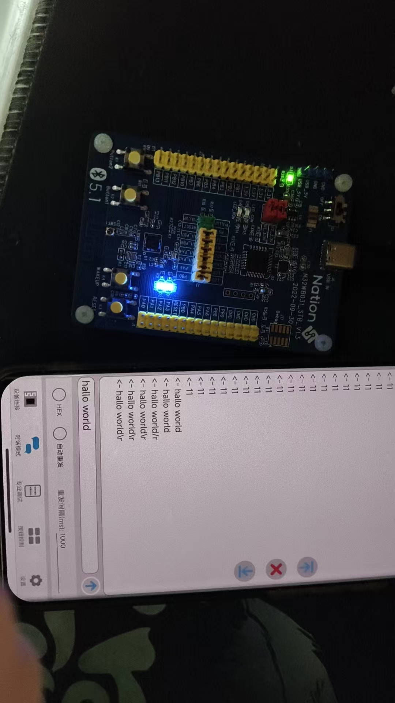
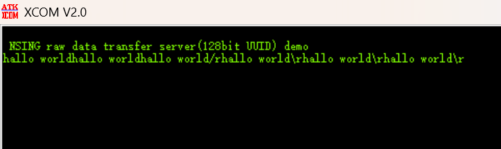


### 5.12 测试观察要点

1. 手机是否能搜到设备名 `N32WB031_RDTSS`
2. 连接后 LED2（PA6）是否点亮
3. 手机写入数据后，串口侧是否收到内容
4. 串口发送数据后，手机通知窗口是否显示返回内容

### 5.13 小结

BLE 透传的核心可以归纳为两条链路：

- 手机 → BLE 写入 → 板子 → 串口
- 串口 → 板子 → BLE Notify → 手机

理解这两条数据路径后，即可在此基础上进行功能扩展，如传感器数据上传、手机控制外设、OLED 显示联动等。

下一章将 BLE 透传与 OLED 屏幕结合，实现手机、串口、屏幕三端联动。

**如果你成功了，你应该看到：**

- 手机蓝牙扫描到 `N32WB031_RDTSS` 设备
- 连接后 LED2（PA6）点亮
- 手机 BLE 工具写入数据 → 串口收到相同内容
- 串口发送数据 → 手机 BLE 工具 Notify 窗口显示返回内容

**如果失败了，优先怀疑：**

- 扫描不到设备 → 确认代码中 `CUSTOM_DEVICE_NAME` 已修改、广播已启动
- 连接后立即断开 → 检查 BLE 协议栈是否正确初始化、内存是否足够
- 写入成功但串口无输出 → 确认 Notify 已开启、串口 TX 接线正确
- 串口发数据但手机收不到 → 确认手机侧已订阅 Notify（不是 Read）

---

## 第六章：BLE 透传 + OLED 联动

BLE 透传跑通之后，最有展示感的升级方向就是加一块 OLED 屏幕。本章在透传工程基础上，增加 0.96 寸 SSD1306 OLED 显示，实现手机、串口、屏幕三端联动。

工程目录：`N32WB031_STB_BLE_RDTSS_OLED`

### 6.1 工程目标

- 开发板广播蓝牙设备名
- 手机连接后可进行 BLE 透传收发
- OLED 同步显示连接状态、手机发来的数据和串口发来的数据

相比纯透传工程，本工程的核心变化是：**让数据流动变得可见**。

### 6.2 运行效果

上电后工程行为：

1. 开发板开始广播蓝牙设备
2. OLED 显示状态为 `ADVERTISING`
3. 手机连接成功后，OLED 状态切换为 `CONNECTED`
4. 手机发来的数据显示在 OLED 的 `BLE:` 行
5. 串口发来的数据显示在 OLED 的 `UART:` 行
6. 手机打开 Notify 后，串口数据还会通过 BLE 回传手机

测试时可同时观察三处反馈：

- 手机蓝牙调试 App
- 开发板状态灯
- OLED 屏幕内容

### 6.3 硬件准备

本工程默认使用 0.96 寸 I2C SSD1306 OLED 模块，常见 4 引脚封装：

- VCC
- GND
- SCL
- SDA

SPI 版本的 OLED 模块不适用本工程。

### 6.4 引脚分配

| 功能 | 引脚 | 说明 |
|------|------|------|
| LED1 | PB0 | 运行状态指示 |
| LED2 | PA6 | BLE 连接状态指示 |
| BLE 透传串口 TX | PB6 | USART1_TX |
| BLE 透传串口 RX | PB7 | USART1_RX |
| OLED SCL | PB8 | 软件 I2C 时钟 |
| OLED SDA | PB9 | 软件 I2C 数据 |

### 6.5 OLED 接线

| OLED 引脚 | 开发板引脚 |
|-----------|-----------|
| VCC | 3.3V |
| GND | GND |
| SCL | PB8 |
| SDA | PB9 |

建议使用 3.3V 供电。虽然部分模块标称支持 5V，但本开发板为 3.3V 逻辑，直接使用 3.3V 更稳定。

### 6.6 蓝牙设备名

蓝牙广播名定义在 `app_user_config.h` 中：

```c
#define CUSTOM_DEVICE_NAME "N32WB031_OLED"
```

手机蓝牙调试 App 搜索到的设备名为 `N32WB031_OLED`。

### 6.7 软件 I2C 的设计决策

原始透传工程中，PB6/PB7 作为 USART1 透传串口，同时该开发板的板载 USB 虚拟串口也连接在这组引脚上。

本工程的处理方式：

- 透传串口保留 USART1 PB6/PB7 不变
- OLED 不使用硬件 I2C1
- OLED 改为软件 I2C，使用 PB8/PB9

这样做的优势：

- 板载 USB 串口可直接用于调试
- 透传逻辑与原始官方例程保持一致
- OLED 独立工作，不与串口资源冲突

### 6.8 前置知识：SSD1306 与软件 I2C

**SSD1306 控制器：**

SSD1306 是一款 128x64 点阵 OLED 驱动芯片，通过 I2C 接口与主控通信。其内部维护一个 8 页 × 128 列的显存缓冲区，每个字节控制 8 个垂直像素点。

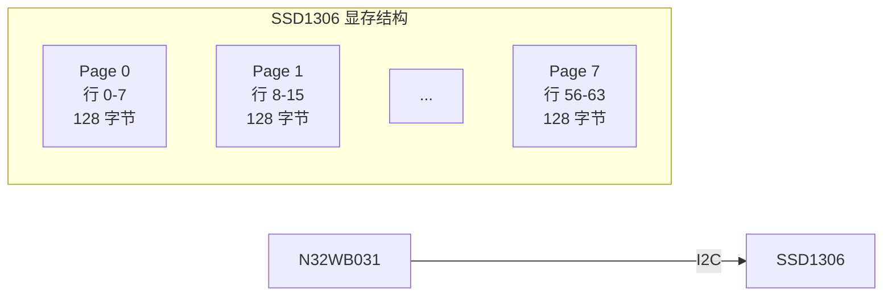
```mermaid
graph LR
    subgraph SSD1306 显存结构
        P0["Page 0<br/>行 0-7<br/>128 字节"]
        P1["Page 1<br/>行 8-15<br/>128 字节"]
        P2["..."]
        P7["Page 7<br/>行 56-63<br/>128 字节"]
    end
    MCU["N32WB031"] -->|I2C| SSD1306
```

**软件 I2C 时序：**

软件 I2C 通过 GPIO 高低电平模拟标准 I2C 协议。每个字节传输包含 8 个数据位和 1 个应答位。

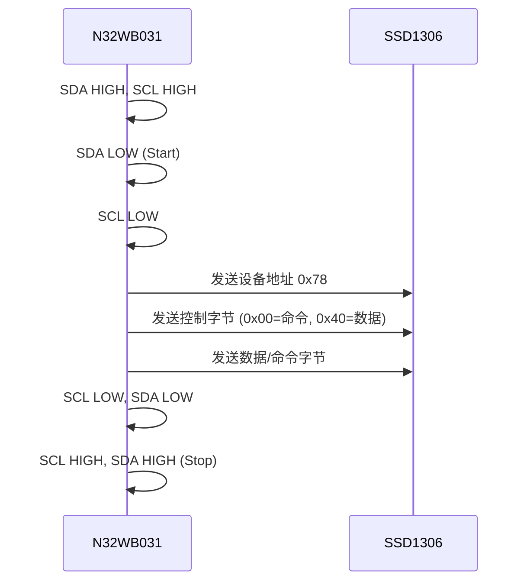
```mermaid
sequenceDiagram
    participant MCU as N32WB031
    participant OLED as SSD1306
    MCU->>MCU: SDA HIGH, SCL HIGH
    MCU->>MCU: SDA LOW (Start)
    MCU->>MCU: SCL LOW
    MCU->>OLED: 发送设备地址 0x78
    MCU->>OLED: 发送控制字节 (0x00=命令, 0x40=数据)
    MCU->>OLED: 发送数据/命令字节
    MCU->>MCU: SCL LOW, SDA LOW
    MCU->>MCU: SCL HIGH, SDA HIGH (Stop)
```

核心 I2C 位操作代码：

```c
static void oled_i2c_write_bit(uint8_t bit)
{
    if (bit != 0U)
        OLED_SDA_HIGH();
    else
        OLED_SDA_LOW();

    oled_i2c_delay();
    OLED_SCL_HIGH();
    oled_i2c_delay();
    OLED_SCL_LOW();
}

static void oled_i2c_write_byte_raw(uint8_t value)
{
    uint8_t i;
    for (i = 0U; i < 8U; i++)
    {
        oled_i2c_write_bit((uint8_t)((value & 0x80U) != 0U));
        value <<= 1;
    }
    // 应答位
    OLED_SDA_HIGH();
    oled_i2c_delay();
    OLED_SCL_HIGH();
    oled_i2c_delay();
    OLED_SCL_LOW();
}
```

**SSD1306 初始化命令序列：**

`oled_init()` 中发送的初始化命令控制 SSD1306 的显示模式、扫描方向、对比度等参数：

```c
void oled_init(void)
{
    oled_gpio_init();
    oled_delay(0x20000U);
    oled_write_cmd(0xAE);  // 关闭显示
    oled_write_cmd(0x20);  // 设置内存寻址模式
    oled_write_cmd(0x10);  // 页寻址模式
    oled_write_cmd(0xB0);  // 设置页起始地址
    oled_write_cmd(0xC8);  // COM 扫描方向：从上到下
    oled_write_cmd(0x00);  // 列低位地址
    oled_write_cmd(0x10);  // 列高位地址
    oled_write_cmd(0x40);  // 设置起始行
    oled_write_cmd(0x81);  // 设置对比度
    oled_write_cmd(0x7F);  // 对比度值 127
    oled_write_cmd(0xA1);  // 段重映射：左右反转
    oled_write_cmd(0xA6);  // 正常显示（非反色）
    oled_write_cmd(0xA8);  // 设置多路复用率
    oled_write_cmd(0x3F);  // 1/64 占空比
    oled_write_cmd(0xA4);  // 全局显示开启
    oled_write_cmd(0xD3);  // 设置显示偏移
    oled_write_cmd(0x00);  // 无偏移
    oled_write_cmd(0xD5);  // 设置显示时钟分频
    oled_write_cmd(0xF0);  // 分频值
    oled_write_cmd(0xD9);  // 设置预充电周期
    oled_write_cmd(0x22);
    oled_write_cmd(0xDA);  // 设置 COM 引脚配置
    oled_write_cmd(0x12);
    oled_write_cmd(0xDB);  // 设置 VCOMH 取消选择电平
    oled_write_cmd(0x20);
    oled_write_cmd(0x8D);  // 电荷泵设置
    oled_write_cmd(0x14);  // 启用电荷泵
    oled_write_cmd(0xAF);  // 打开显示
    oled_clear();
    oled_render_dashboard();
}
```

**OLED 集成架构：**

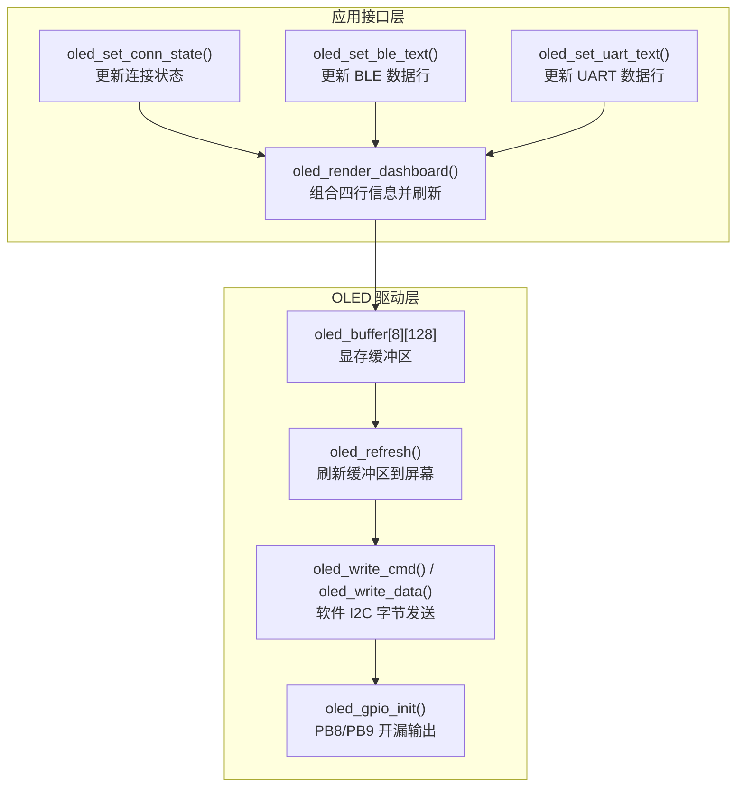
```mermaid
flowchart TD
    subgraph OLED 驱动层
        GPIO_INIT["oled_gpio_init()<br/>PB8/PB9 开漏输出"]
        I2C_WRITE["oled_write_cmd() / oled_write_data()<br/>软件 I2C 字节发送"]
        BUFFER["oled_buffer[8][128]<br/>显存缓冲区"]
        REFRESH["oled_refresh()<br/>刷新缓冲区到屏幕"]
    end
    subgraph 应用接口层
        CONN["oled_set_conn_state()<br/>更新连接状态"]
        BLE_TXT["oled_set_ble_text()<br/>更新 BLE 数据行"]
        UART_TXT["oled_set_uart_text()<br/>更新 UART 数据行"]
        DASHBOARD["oled_render_dashboard()<br/>组合四行信息并刷新"]
    end
    CONN --> DASHBOARD
    BLE_TXT --> DASHBOARD
    UART_TXT --> DASHBOARD
    DASHBOARD --> BUFFER
    BUFFER --> REFRESH
    REFRESH --> I2C_WRITE
    I2C_WRITE --> GPIO_INIT
```

### 6.9 OLED 显示内容

屏幕设计为四行信息：

1. **标题行**：`BLE OLED DEMO`
2. **状态行**：`STATE: ADVERTISING` 或 `STATE: CONNECTED`
3. **BLE 行**：最近一条手机发来的数据
4. **UART 行**：最近一条串口发来的数据

连接后 OLED 显示示例：

```text
BLE OLED DEMO
STATE: CONNECTED
BLE: HELLO
UART: OK123
```

### 6.10 新增文件

为支持 OLED 功能，新增两个文件：

- `inc/app_oled.h`：引脚定义和接口声明
- `src/app_oled.c`：SSD1306 初始化、字符显示、状态刷新

OLED 驱动基于 SSD1306 128x64 标准流程，通信层使用软件 I2C 实现：

1. 初始化 PB8/PB9
2. GPIO 模拟 I2C Start/Stop 时序
3. GPIO 模拟字节发送
4. 发送 SSD1306 初始化命令
5. 维护 8 x 128 显存缓冲区
6. 字符串写入对应行并刷新到屏幕

### 6.11 数据如何显示到 OLED

**手机数据 → OLED：**

在 `app_rdtss.c` 的写回调中，手机发来的数据会同步调用：

```c
oled_set_ble_text(ind_value->value, ind_value->length);
```

手机发来的最新数据会立即显示在 OLED 的 `BLE:` 行。

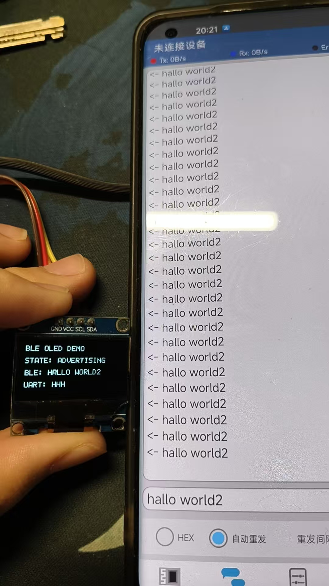

**串口数据 → OLED：**

在 `app_usart.c` 的接收处理中，串口数据会同步调用：

```c
oled_set_uart_text(p_data, len);
```

串口侧有新数据时，OLED 的 `UART:` 行会更新，同时如果手机已打开 Notify，数据还会通过 BLE 推回手机。

**数据格式化函数：**

`oled_copy_text()` 将原始字节数据转为可显示字符串，自动处理大小写转换和不可显示字符：

```c
static void oled_copy_text(char* dest, const char* prefix, const uint8_t* data, uint16_t len)
{
    uint8_t pos = 0U;
    uint8_t i = 0U;

    while (prefix[pos] != '\0' && pos < 20U)
    {
        dest[pos] = prefix[pos];
        pos++;
    }

    while (i < len && pos < 21U)
    {
        uint8_t ch = data[i++];
        if (ch < 32U || ch > 126U)
            ch = '.';
        if (ch >= 'a' && ch <= 'z')
            ch = (uint8_t)(ch - 'a' + 'A');
        dest[pos++] = (char)ch;
    }

    dest[pos] = '\0';
}
```

调用链：`oled_set_ble_text()` / `oled_set_uart_text()` → `oled_copy_text()` → `oled_render_dashboard()` → `oled_show_status()` → `oled_refresh()`

### 6.12 连接状态显示

在 `app_ble.c` 的连接和断开回调中，OLED 状态会同步刷新：

- 连接成功：`oled_set_conn_state(1)` → OLED 显示 `CONNECTED`
- 断开连接：`oled_set_conn_state(0)` → OLED 显示 `ADVERTISING`

未连接状态：

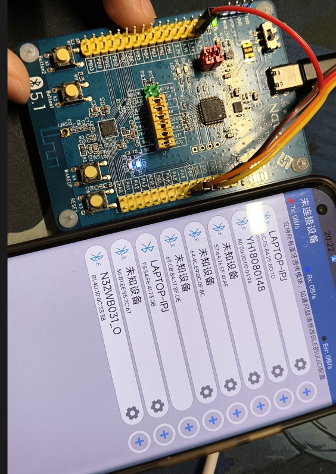

连接成功状态：

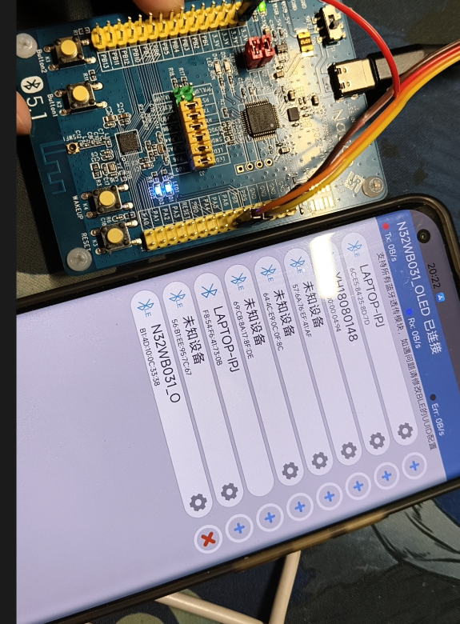

### 6.13 测试步骤

**手机端测试：**

1. 给开发板上电，确认 OLED 亮屏并显示 `BLE OLED DEMO`
2. 打开 nRF Connect，搜索设备 `N32WB031_OLED`
3. 点击连接，打开 Notify
4. 在可写特征值中发送文本（如 `HELLO`）
5. 观察 OLED 的 `BLE:` 行是否显示 `HELLO`

**串口端测试：**

1. 通过板载 USB 虚拟串口或外部串口模块连接 USART1（PB6/PB7）
2. 串口参数：115200 / 8 / 1 / None
3. 发送文本（如 `OK123`）
4. 观察 OLED 的 `UART:` 行是否显示 `OK123`
5. 同时观察手机是否收到 Notify 回传

### 6.14 完整联动效果

工程正常运行时的预期现象：

1. OLED 上电亮屏，初始显示 `STATE: ADVERTISING`
2. 手机搜到 `N32WB031_OLED` 并连接
3. LED2 点亮，OLED 状态切换为 `CONNECTED`
4. 手机发送内容 → OLED `BLE:` 行更新
5. 串口发送内容 → OLED `UART:` 行更新，手机收到 Notify


### 6.15 常见问题

**OLED 不亮：**

- 确认使用 I2C 版本 OLED，而非 SPI 版本
- 检查 VCC / GND / SDA / SCL 接线是否正确
- 确认模块 I2C 地址为 0x3C（8 位写法对应 0x78）

**手机能连接但 OLED 不更新：**

- 确认手机发送到了正确的写特征值
- 发送数据应为纯文本
- 检查 OLED 接线

**手机看不到串口回传：**

- 确认已打开 Notify
- 确认串口连接在 USART1 PB6/PB7
- 串口参数应为 115200 8N1

### 6.16 小结

本工程的核心变化：**在 BLE 透传基础上增加 OLED 显示，让数据流动变得可见。**

该工程可作为后续扩展的中间站：

- 往前承接 BLE 透传
- 往后可升级为 BLE 控制显示、BLE 传感器终端、BLE 文本显示器

**如果你成功了，你应该看到：**

- OLED 开机显示 `N32WB031` 标题页，随后显示 `Waiting...`
- 手机连接后 OLED 显示 `Connected` + 连接序号
- 手机发送 `Hello` → OLED 显示 `BLE: Hello`，串口同步输出
- 串口发送 `Test` → OLED 显示 `UART: Test`，手机收到 Notify

**如果失败了，优先怀疑：**

- OLED 无显示 → 检查 SCL(PB8)/SDA(PB9) 接线，确认 I2C 地址为 `0x3C`
- OLED 显示乱码 → 确认字库文件 `oled_font.h` 已正确包含
- BLE 通信正常但 OLED 不更新 → 检查刷新函数调用时机，确认未在中断中操作 I2C
- I2C 总线卡死 → 检查是否有上拉电阻（4.7kΩ），确认 SDA 未被外设占用

---

## 第七章：HID 蓝牙拍照遥控器

BLE 透传和 OLED 显示跑通之后，下一步更有展示感的方向是让开发板伪装成蓝牙输入设备。本章基于官方 HID 例程，实现一个蓝牙拍照遥控器：手机通过系统蓝牙配对后，按下开发板按键即可触发手机相机拍照。

工程目录：`N32WB031_STB_HID_SWIPE_OLED`

> 注：工程名中的 "SWIPE" 来自官方 HID 例程的原始命名（用于滑屏翻页），本章将其改造为拍照遥控器方向，功能以本文描述为准。

### 7.1 HID 前置知识

**什么是 HID？**

HID（Human Interface Device）即人机输入设备，包括键盘、鼠标、游戏手柄、媒体控制按键等。BLE HID 设备的核心特点是：手机或电脑将其视为"输入源"，系统直接接管按键行为，无需自定义 App 解析数据。

与前一章 BLE 透传的关键区别：

| 对比项 | BLE 透传（RDTSS） | BLE HID |
|--------|-------------------|---------|
| 数据流向 | 双向，手机↔串口 | 单向，板子→手机 |
| 手机端 | 需要专用 App（nRF Connect） | 系统蓝牙直接接管 |
| 配对方式 | App 内连接 | 系统蓝牙配对 |
| 数据格式 | 自定义文本 | HID Report 描述符 |
| 典型应用 | 串口透传、传感器上传 | 遥控器、键盘、鼠标 |

**为什么选"拍照"而不是"刷抖音翻页"？**

HID 设备可以模拟键盘、鼠标、媒体按键等，但不同场景的兼容性差异很大：

- **拍照（音量键）**：手机相机普遍支持"音量键拍照"，HID 发送 Consumer Control 的音量键事件就能直接触发，兼容性好
- **抖音翻页**：抖音等短视频 App 依赖"触摸滑屏"事件，而 HID 的鼠标/滚轮/键盘输入不一定被 App 识别为滑屏，兼容性差

所以从工程成功率看，HID + 拍照是更现实的选择。

**HID 协议栈位置：**

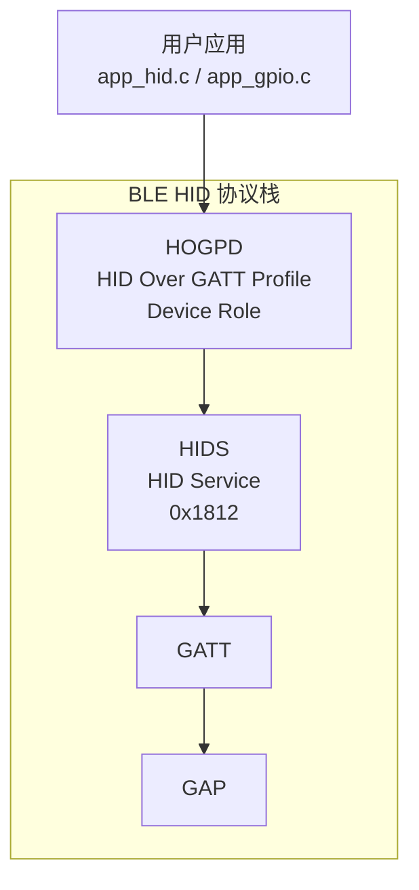
```mermaid
graph TD
    subgraph BLE HID 协议栈
        HOGPD["HOGPD<br/>HID Over GATT Profile<br/>Device Role"]
        HIDS["HIDS<br/>HID Service<br/>0x1812"]
        GATT["GATT"]
        GAP["GAP"]
    end
    APP["用户应用<br/>app_hid.c / app_gpio.c"] --> HOGPD
    HOGPD --> HIDS
    HIDS --> GATT
    GATT --> GAP
```

**HID Report Descriptor：**

HID 设备通过 Report Descriptor 向主机描述自身能力。本工程定义了两个 Report：

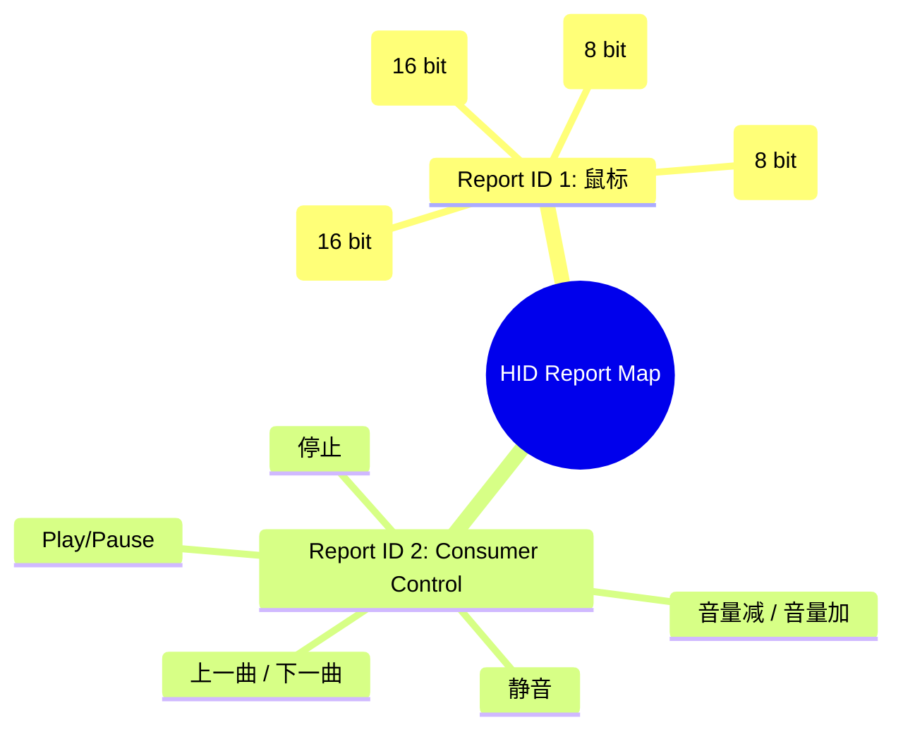
```mermaid
mindmap
  root((HID Report Map))
    Report ID 1: 鼠标
      按键状态 (8 bit)
      X 轴相对移动 (16 bit)
      Y 轴相对移动 (16 bit)
      滚轮 (8 bit)
    Report ID 2: Consumer Control
      Play/Pause
      上一曲 / 下一曲
      音量减 / 音量加
      静音
      停止
```

**Consumer Control 与拍照：**

本工程使用 Report ID 2（Consumer Control）发送音量键事件。许多手机相机支持"音量键拍照"功能，因此音量键输入可直接触发快门。

### 7.2 工程功能

该工程完成三项核心任务：

1. 初始化蓝牙协议栈，广播为 HID 设备
2. 通过系统蓝牙配对（密码 `123456`）
3. 按键触发 HID Consumer Report，发送音量键事件

蓝牙广播名：`N32WB031_CAMERA`

按键行为：

- KEY1（PB1）：发送 `VOL+`
- KEY2（PB2）：发送 `VOL-`

如果手机相机设置为"音量下键拍照"，则 KEY2 可作为快门键。

### 7.3 工程结构

```
N32WB031_STB_HID_SWIPE_OLED/
├── inc/
│   ├── app_user_config.h      ← 蓝牙名称、广播参数
│   ├── app_ble.h              ← BLE 初始化接口
│   ├── app_hid.h              ← HID 服务接口
│   ├── app_gpio.h             ← 按键、LED 引脚定义
│   └── app_oled.h             ← OLED 驱动接口
├── src/
│   ├── main.c                 ← 主函数、蓝牙栈启动
│   ├── app_ble.c              ← GAP 参数、连接/断开回调
│   ├── app_gpio.c             ← 按键中断、HID 按键发送
│   ├── app_oled.c             ← OLED 驱动
│   └── app_profile/
│       └── app_hid.c          ← HID Report 定义、发送逻辑
└── MDK-ARM/
    └── N32WB031_STB_HID_SWIPE_OLED.uvprojx
```

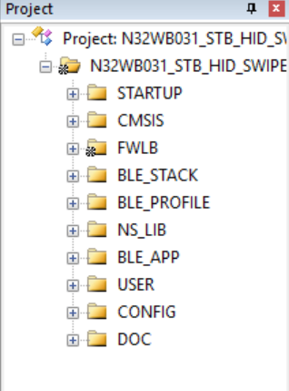

### 7.4 硬件资源与引脚分配

| 功能 | 引脚 | 说明 |
|------|------|------|
| LED1 | PB0 | 运行状态指示 |
| LED2 | PA6 | 连接状态指示 |
| KEY1 | PB1 | 发送 VOL+（拍照） |
| KEY2 | PB2 | 发送 VOL-（辅助） |
| OLED SCL | PB8 | 软件 I2C 时钟 |
| OLED SDA | PB9 | 软件 I2C 数据 |

### 7.5 蓝牙设备名与配对

蓝牙广播名定义在 `app_user_config.h` 中：

```c
#define CUSTOM_DEVICE_NAME "N32WB031_CAMERA"
```

配对密码在 `app_ble.c` 中配置：

```c
void app_ble_sec_init(void)
{
    struct ns_sec_init_t sec_init = {0};

    sec_init.rand_pin_enable = false;
    sec_init.pin_code = 123456;

    sec_init.pairing_feat.auth = (SEC_PARAM_BOND | (SEC_PARAM_MITM<<2) | ...);
    sec_init.pairing_feat.iocap = SEC_PARAM_IO_CAPABILITIES;
    ...

    sec_init.bond_enable = BOND_STORE_ENABLE;
    sec_init.bond_max_peer = MAX_BOND_PEER;

    ns_sec_init(&sec_init);
}
```

手机系统蓝牙搜索到 `N32WB031_CAMERA` 后，输入配对密码 `123456` 即可完成配对。

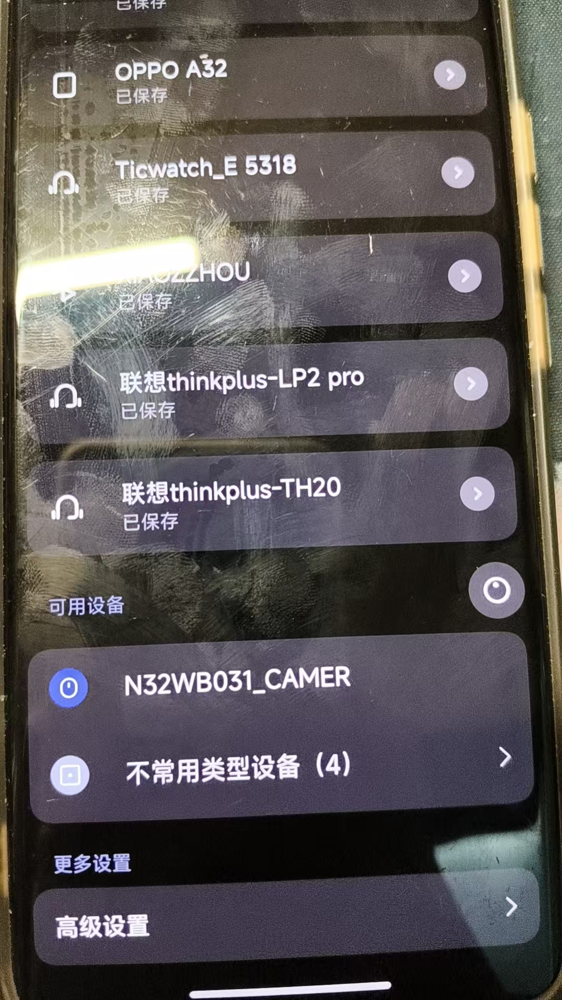
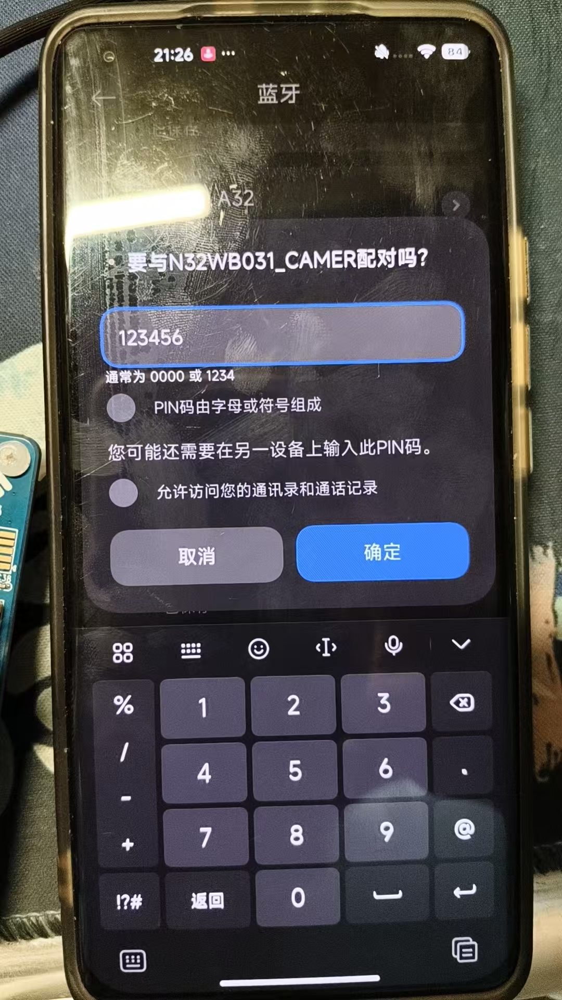

### 7.6 主函数

```c
int main(void)
{
    delay_n_10us(200*1000);

    NS_LOG_INIT();
    oled_init();
    oled_show_status("HID CAMERA DEMO", "STATE: BOOT", "KEY1: SHOT", "KEY2: AUX");

    app_ble_init();

    NS_LOG_INFO(DEMO_STRING);

    app_key_configuration();
    LedInit(LED1_PORT, LED1_PIN);
    LedInit(LED2_PORT, LED2_PIN);
    LedOn(LED1_PORT, LED1_PIN);

    while (1)
    {
        rwip_schedule();
        ns_sleep();
    }
}
```

与前几章工程的区别：本工程使用**中断方式**检测按键，而非轮询。主循环中只有协议栈调度和低功耗休眠。

### 7.7 按键中断配置

与第四章的轮询消抖不同，本工程使用 EXTI 外部中断检测按键：

```c
void app_key_configuration(void)
{
    GPIO_InitType GPIO_InitStructure;
    EXTI_InitType EXTI_InitStructure;
    NVIC_InitType NVIC_InitStructure;

    RCC_EnableAPB2PeriphClk(RCC_APB2_PERIPH_GPIOA | RCC_APB2_PERIPH_GPIOB | RCC_APB2_PERIPH_AFIO, ENABLE);

    // KEY1 (PB1) 上拉输入
    GPIO_InitStruct(&GPIO_InitStructure);
    GPIO_InitStructure.Pin = KEY1_INPUT_PIN;
    GPIO_InitStructure.GPIO_Pull = GPIO_PULL_UP;
    GPIO_InitPeripheral(KEY1_INPUT_PORT, &GPIO_InitStructure);

    // KEY2 (PB2) 上拉输入
    GPIO_InitStruct(&GPIO_InitStructure);
    GPIO_InitStructure.Pin = KEY2_INPUT_PIN;
    GPIO_InitStructure.GPIO_Pull = GPIO_PULL_UP;
    GPIO_InitPeripheral(KEY2_INPUT_PORT, &GPIO_InitStructure);

    // EXTI 配置：下降沿触发
    GPIO_ConfigEXTILine(KEY1_INPUT_PORT_SOURCE, KEY1_INPUT_PIN_SOURCE);
    EXTI_InitStructure.EXTI_Line = KEY1_INPUT_EXTI_LINE;
    EXTI_InitStructure.EXTI_Mode = EXTI_Mode_Interrupt;
    EXTI_InitStructure.EXTI_Trigger = EXTI_Trigger_Falling;
    EXTI_InitStructure.EXTI_LineCmd = ENABLE;
    EXTI_InitPeripheral(&EXTI_InitStructure);

    NVIC_InitStructure.NVIC_IRQChannel = KEY1_INPUT_IRQn;
    NVIC_InitStructure.NVIC_IRQChannelPriority = 3;
    NVIC_InitStructure.NVIC_IRQChannelCmd = ENABLE;
    NVIC_Init(&NVIC_InitStructure);

    // KEY2 同理...
}
```

中断服务函数中使用标志位实现简易消抖：

```c
void EXTI0_1_IRQHandler(void)
{
    if (EXTI_GetITStatus(KEY1_INPUT_EXTI_LINE) != RESET)
    {
        if (key1_irq_actived == 0)
        {
            ke_msg_send_basic(APP_KEY_DETECTED, TASK_APP, TASK_APP);
            key1_irq_actived = 1;
        }
        else if (key1_irq_actived == 1)
        {
            key1_irq_actived = 2;
        }
        EXTI_ClrITPendBit(KEY1_INPUT_EXTI_LINE);
    }
}
```

`key1_irq_actived` 的三态设计（0→1→2）配合定时器回调，实现"中断触发 → 延时确认 → 执行动作"的消抖流程。

### 7.8 HID Consumer Report 发送

按键触发后，通过 `app_hid_send_consumer_key()` 发送音量键事件：

```c
#define HID_KEY_VOL_UP      0x10
#define HID_KEY_VOL_DOWN    0x08

static void app_hid_send_consumer_key(uint8_t key_value)
{
    if (!is_app_hid_ready())
    {
        oled_show_status("HID CAMERA DEMO", "STATE: NOT READY", "ACTION: BLOCKED", "WAIT CONNECT");
        return;
    }

    app_hid_send_consumer_report(&key_value);   // 发送按键按下
    delay_n_10us(1000);                          // 保持 10ms
    key_value = 0x00;
    app_hid_send_consumer_report(&key_value);   // 发送按键释放
}
```

每次按键需要发送两帧：先发送按键值（按下），再发送 0x00（释放）。这与物理按键的行为一致。

`app_hid_send_consumer_report()` 将 Report 通过 HOGPD 协议栈发送至手机：

```c
void app_hid_send_consumer_report(uint8_t* report)
{
    if (app_hid_env.state == APP_HID_READY && app_hid_env.nb_report)
    {
        struct hogpd_report_upd_req *req = KE_MSG_ALLOC_DYN(HOGPD_REPORT_UPD_REQ,
                                                              prf_get_task_from_id(TASK_ID_HOGPD),
                                                              TASK_APP,
                                                              hogpd_report_upd_req,
                                                              APP_HID_CONSUMER_REPORT_LEN);
        req->conidx = app_hid_env.conidx;
        req->report.hid_idx = app_hid_env.conidx;
        req->report.type = HOGPD_REPORT;
        req->report.idx = 1;          // Report ID 2
        req->report.length = APP_HID_CONSUMER_REPORT_LEN;
        memcpy(&req->report.value[0], &report[0], APP_HID_CONSUMER_REPORT_LEN);
        ke_msg_send(req);
        app_hid_env.nb_report--;
    }
}
```

### 7.9 HID Report Descriptor 解析

Report Descriptor 是 HID 设备的核心，它告诉主机"我是什么设备，我能发送什么数据"。本工程的 Descriptor 定义了两个 Report：

```c
static const uint8_t app_hid_mouse_report_map[] =
{
    // Report ID 1: 鼠标
    0x05, 0x01,     // USAGE PAGE (Generic Desktop)
    0x09, 0x02,     // USAGE (Mouse)
    0xA1, 0x01,     // COLLECTION (Application)
    0x85, 0x01,     // REPORT ID (1)
    0x09, 0x01,     //     USAGE (Pointer)
    0xA1, 0x00,     //     COLLECTION (Physical)
    // 按键: 8 bit
    0x05, 0x09,     //         USAGE PAGE (Buttons)
    0x19, 0x01,     //         USAGE MINIMUM (1)
    0x29, 0x08,     //         USAGE MAXIMUM (8)
    0x75, 0x01,     //         REPORT SIZE (1)
    0x95, 0x08,     //         REPORT COUNT (8)
    0x81, 0x02,     //         INPUT (Data, Variable, Absolute)
    // X/Y 轴: 各 16 bit
    0x05, 0x01,     //         USAGE PAGE (Generic Desktop)
    0x75, 0x10,     //         REPORT SIZE (16)
    0x95, 0x02,     //         REPORT COUNT (2)
    0x09, 0x30,     //         USAGE (X)
    0x09, 0x31,     //         USAGE (Y)
    0x81, 0x06,     //         INPUT (Data, Variable, Relative)
    // 滚轮: 8 bit
    0x75, 0x08,     //         REPORT SIZE (8)
    0x95, 0x01,     //         REPORT COUNT (1)
    0x09, 0x38,     //         USAGE (Wheel)
    0x81, 0x06,     //         INPUT (Data, Variable, Relative)
    0xC0, 0xC0,     //     END COLLECTION

    // Report ID 2: Consumer Control（媒体控制）
    0x05, 0x0C,     // Usage Page (Consumer)
    0x09, 0x01,     // Usage (Consumer Control)
    0xA1, 0x01,     // Collection (Application)
    0x85, 0x02,     // Report Id (2)
    0x75, 0x01,     // Report Size (1)
    0x95, 0x08,     // Report Count (8)
    0x09, 0xCD,     // Usage (Play/Pause)
    0x09, 0xB6,     // Usage (Scan Previous Track)
    0x09, 0xB5,     // Usage (Scan Next Track)
    0x09, 0xEA,     // Usage (Volume Down)
    0x09, 0xE9,     // Usage (Volume Up)
    0x09, 0xE2,     // Usage (Mute)
    0x09, 0xCC,     // Usage (Stop eject)
    0x09, 0xB7,     // Usage (Stop)
    0x81, 0x06,     // Input (Data, Value, Relative, Bit Field)
    0xC0,           // End Collection
};
```

Report ID 2 中，每个 bit 对应一个媒体控制按键。`Volume Up` 对应 `0x10`（第 5 位），`Volume Down` 对应 `0x08`（第 4 位）。

### 7.10 连接与状态管理

连接回调中启用 HID Profile 并更新 OLED：

```c
void app_ble_msg_handler(struct ble_msg_t const *p_ble_msg)
{
    switch (p_ble_msg->msg_id)
    {
        case APP_BLE_GAP_CONNECTED:
            app_batt_enable_prf(app_env.conidx);
            app_hid_enable_prf(app_env.conidx);
            app_ble_connected();
            break;
        case APP_BLE_GAP_DISCONNECTED:
            app_ble_disconnected();
            break;
        default:
            break;
    }
}

void app_ble_connected(void)
{
    LedOn(LED2_PORT, LED2_PIN);
    oled_set_conn_state(1);
}

void app_ble_disconnected(void)
{
    ns_ble_adv_start();
    LedOff(LED2_PORT, LED2_PIN);
    oled_set_conn_state(0);
}
```

### 7.11 为什么不能用 nRF Connect 测试拍照

这是一个重要的知识点。nRF Connect 适合调试 BLE 广播、GATT 服务和特征值，但 HID 设备需要通过**系统蓝牙配对**才能被手机接管。

在 nRF Connect 中可以看到：

- 设备名 `N32WB031_CAMERA`
- HID Service（UUID `0x1812`）
- Appearance 为 `Mouse (HID subtype)`

但真正触发拍照，必须：

1. 在系统蓝牙设置中配对
2. 输入密码 `123456`
3. 配对成功后系统接管 HID 输入
4. 打开相机，确认"音量键拍照"已开启

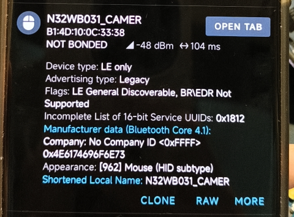

### 7.12 OLED 状态显示

OLED 在本工程中用于显示当前状态和最近一次操作：

```c
// 主函数中初始化显示
oled_show_status("HID CAMERA DEMO", "STATE: BOOT", "KEY1: SHOT", "KEY2: AUX");

// 连接成功后更新
oled_set_conn_state(1);  // 显示 "STATE: CONNECTED"

// 按键触发后更新
oled_show_status("HID CAMERA DEMO", "STATE: CONNECTED", "ACTION: SHOT", "KEY: VOL+");
oled_show_status("HID CAMERA DEMO", "STATE: CONNECTED", "ACTION: AUX", "KEY: VOL-");

// HID 未就绪时显示
oled_show_status("HID CAMERA DEMO", "STATE: NOT READY", "ACTION: BLOCKED", "WAIT CONNECT");
```


### 7.13 完整数据流

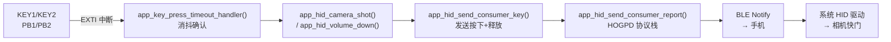
```mermaid
flowchart LR
    A["KEY1/KEY2<br/>PB1/PB2"] -->|EXTI 中断| B["app_key_press_timeout_handler()<br/>消抖确认"]
    B --> C["app_hid_camera_shot()<br/>/ app_hid_volume_down()"]
    C --> D["app_hid_send_consumer_key()<br/>发送按下+释放"]
    D --> E["app_hid_send_consumer_report()<br/>HOGPD 协议栈"]
    E --> F["BLE Notify<br/>→ 手机"]
    F --> G["系统 HID 驱动<br/>→ 相机快门"]
```

### 7.14 测试步骤

1. 给开发板上电，确认 OLED 显示 `STATE: BOOT`
2. 打开手机系统蓝牙设置
3. 搜索设备 `N32WB031_CAMERA`
4. 点击配对，输入密码 `123456`
5. 配对成功后，确认设备已连接
6. 打开手机相机
7. 在相机设置中确认"音量键功能 = 快门"
8. 按 KEY2（VOL-）测试拍照

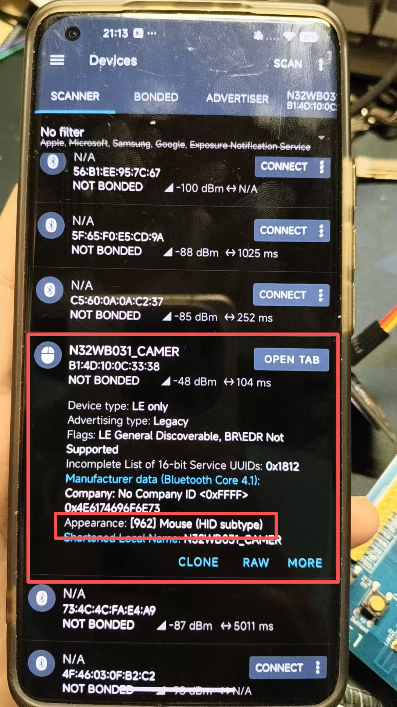
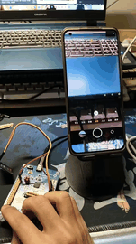

### 7.15 常见问题

**手机能搜到设备，但不能拍照：**

- 确认在系统蓝牙中配对，而非仅在 nRF Connect 中查看
- 确认输入了密码 `123456`
- 确认相机中"音量键拍照"已开启

**OLED 显示 CONNECTED，但相机没反应：**

- 板子和手机已连接，HID 事件已发出
- 尝试 KEY1 和 KEY2，看哪个键被相机识别为快门
- 不同手机对 HID 按键映射可能不同

**手机出现聚焦，不拍照：**

- 手机将 HID 输入当作鼠标事件处理
- 这是 HID Report Descriptor 与手机系统交互的兼容性问题
- 可尝试调整 Report Descriptor 或使用纯 Consumer Control 设备

**iPhone 和安卓行为差异：**

不同系统、不同版本对 HID 的兼容性不同。iPhone 对 BLE HID 的配对流程和权限管理与安卓有显著差异，建议分别测试。

### 7.16 小结

本工程的核心价值：**将开发板从"蓝牙调试板"变成一个真正能与手机交互的蓝牙遥控器。**

相比前几章的透传工程，HID 工程更贴近真实产品形态：

- 通过系统蓝牙配对，无需专用 App
- 按键直接触发系统级行为（音量控制、相机快门）
- OLED 可视化状态反馈

该工程可作为后续扩展的基础：蓝牙自拍杆、PPT 翻页器、媒体遥控器等。

**如果你成功了，你应该看到：**

- 手机蓝牙设置中出现 `N32WB031_HID` 设备（非 App 扫描，是系统蓝牙列表）
- 配对后按下 KEY1 → 手机音量增大（或打开相机后触发拍照）
- 按下 KEY2 → 手机音量减小
- OLED 显示当前连接状态

**如果失败了，优先怀疑：**

- 手机扫描不到 HID 设备 → 确认代码中 GAP 广播类型为 `GAP_ADTYPE_ADV_DIRECT_IND` 或可连接广播
- 能扫描但无法配对 → 检查 `SEC_PARAM_IO_CAPABILITIES` 配置、确认绑定了 HID Profile
- 按键无反应 → 确认 HID Report Descriptor 中 Consumer Control 的 Usage ID 正确（0x10=VOL+, 0x08=VOL-）
- iPhone 无法使用 → iOS 对 BLE HID 兼容性较严格，建议先用安卓测试

---

## 第八章：BLE OTA 空中升级

前几章的工程都是通过 Keil + SWD 将固件烧录到芯片。在产品实际部署后，用户不可能每次都拆机接线。OTA（Over-The-Air）空中升级允许通过蓝牙无线更新固件，是 BLE 产品走向量产的必备能力。

本章对应工程目录：

[N32WB031_STB_OTA](/d:/n32wb031/template/N32WB031_STB_OTA)

### 8.1 什么是 OTA

OTA 的全称是 Over-The-Air，即"空中下载"。在 BLE 语境下，OTA 指：

- 手机通过蓝牙连接开发板
- 手机将新固件以数据包形式发送到开发板
- 开发板将新固件写入 Flash 的备用区域
- 重启后引导程序跳转到新固件执行

整个过程不需要 SWD 调试器，不需要拆机，只需要一部手机。

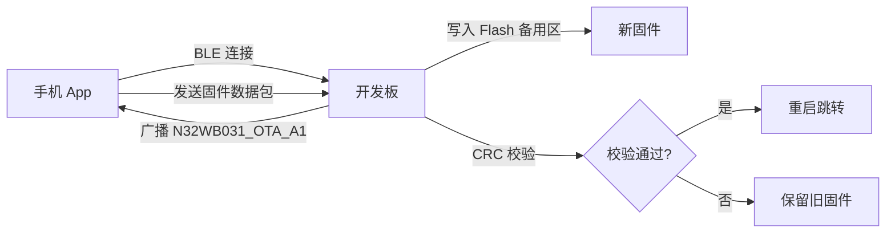
```mermaid
graph LR
    A[手机 App] -->|BLE 连接| B[开发板]
    B -->|广播 N32WB031_OTA_A1| A
    A -->|发送固件数据包| B
    B -->|写入 Flash 备用区| C[新固件]
    B -->|CRC 校验| D{校验通过?}
    D -->|是| E[重启跳转]
    D -->|否| F[保留旧固件]
```

### 8.2 A/B 分区方案

N32WB031 的 OTA 采用 **A/B 双分区** 方案，这是嵌入式 OTA 最安全的架构之一：

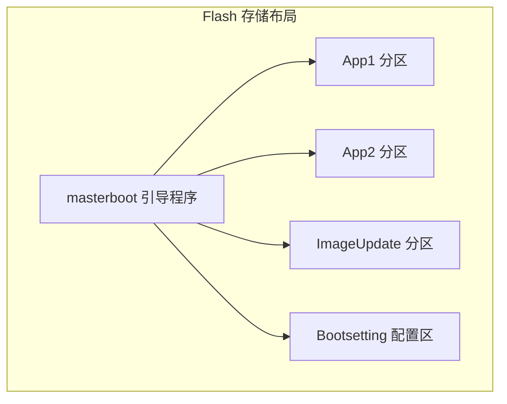
```mermaid
graph TB
    subgraph Flash 存储布局
        M[masterboot 引导程序] --> A[App1 分区]
        M --> B[App2 分区]
        M --> I[ImageUpdate 分区]
        M --> S[Bootsetting 配置区]
    end
```

| 分区 | 作用 |
|------|------|
| masterboot | 引导程序，决定跳转到哪个分区 |
| App1 | 应用固件 A |
| App2 | 应用固件 B |
| ImageUpdate | 临时接收区，用于中转新固件 |
| Bootsetting | 启动配置，记录哪个分区处于激活状态 |

核心思想：**永远保留一份可工作的固件**。升级时新固件写入非活动分区，校验通过后才切换激活状态。即使升级过程中断电，旧固件仍然完好。

### 8.3 工程结构概览

OTA 工程与前几章不同，它不是一个 Keil 工程，而是 **三个独立的 Keil 工程**：

```
N32WB031_STB_OTA/
├── masterboot/          # 引导程序
│   ├── src/main.c
│   └── MDK-ARM/N32WB031_STB_OTA_MASTERBOOT.uvprojx
├── app_ota/             # 应用固件（BLE OTA 服务）
│   ├── app_ota/src/
│   ├── app_ota/inc/
│   └── MDK-ARM/N32WB031_STB_OTA_APP.uvprojx
├── image_update/        # 镜像更新固件
│   ├── image_update/src/
│   ├── image_update/inc/
│   └── MDK-ARM/N32WB031_STB_OTA_IMAGE_UPDATE.uvprojx
└── common/              # 共享代码
    ├── dfu_crc.c/h      # CRC32 校验
    ├── dfu_led.c/h      # LED 驱动
    ├── dfu_delay.c/h    # 延时函数
    └── dfu_usart.c/h    # 串口驱动
```

三个工程各自编译为独立固件，分别烧录到 Flash 的不同区域。

```mermaid
graph TD
    subgraph 编译产物
        A[masterboot.hex] --> M[Flash: masterboot 区]
        B[N32WB031_STB_OTA_APP.hex] --> APP[Flash: App1 或 App2 区]
        C[N32WB031_STB_OTA_IMAGE_UPDATE.hex] --> IU[Flash: ImageUpdate 区]
    end
```

### 8.4 前置知识：DFU 与 Bootloader

#### 什么是 DFU

DFU（Device Firmware Update）是设备固件更新的通用术语。OTA 是 DFU 的一种实现方式——通过无线传输。DFU 也可以通过 UART、USB、SPI 等有线方式实现。

#### 什么是 Bootloader

Bootloader 是芯片上电后最先运行的一段程序。它的职责不是执行业务逻辑，而是：

1. 检查各分区的固件是否有效（CRC 校验）
2. 决定跳转到哪个分区
3. 如果收到串口升级指令，进入串口升级模式

N32WB031 的 masterboot 就是这样一个 Bootloader。

#### CRC32 校验

CRC32 是一种循环冗余校验算法，用于检测数据在传输或存储过程中是否损坏。OTA 工程中使用 N32WB031 的硬件 CRC 模块加速计算：

```mermaid
graph LR
    A[固件二进制] --> B[硬件 CRC32 模块]
    B --> C[CRC32 值]
    C --> D{与预期值匹配?}
    D -->|是| E[固件完整]
    D -->|否| F[固件损坏]
```

### 8.5 masterboot 引导程序详解

masterboot 是整个 OTA 方案的"大脑"。它在芯片上电后第一个执行，负责决定系统走向。

#### 启动流程

```mermaid
flowchart TD
    A[芯片上电] --> B[初始化 USART]
    B --> C{收到串口 0x7F?}
    C -->|PA4/5 1Mbaud| D[进入串口升级]
    C -->|PA4/5 115200| D
    C -->|PB6/7 1Mbaud| D
    C -->|PB6/7 115200| D
    C -->|超时未收到| E[读取 Bootsetting]
    E --> F{Bootsetting CRC 有效?}
    F -->|否| G[等待]
    F -->|是| H{App1 激活?}
    H -->|是| I{App1 CRC 通过?}
    I -->|是| J[跳转 App1]
    I -->|否| K{App2 激活?}
    H -->|否| K
    K -->|是| L{App2 CRC 通过?}
    L -->|是| M[跳转 App2]
    L -->|否| N{ImageUpdate 激活?}
    K -->|否| N
    N -->|是| O{ImageUpdate CRC 通过?}
    O -->|是| P[跳转 ImageUpdate]
    O -->|否| G
    N -->|否| G
```

#### 核心代码：masterboot 主函数

```c
// masterboot/src/main.c

#define POLL_UART_CYCLE (0x6FFF) // 约 20ms

int main(void)
{
    // 依次尝试 4 种串口配置，等待 0x7F 启动字节
    dfu_usart1_poll_config(USART1_GPIO_PA45, 1000000);
    if (dfu_usart1_poll_boot_byte(0x7F, POLL_UART_CYCLE) == false)
    {
        dfu_usart1_poll_config(USART1_GPIO_PA45, 115200);
        if (dfu_usart1_poll_boot_byte(0x7F, POLL_UART_CYCLE) == false)
        {
            dfu_usart1_poll_config(USART1_GPIO_PB67, 1000000);
            if (dfu_usart1_poll_boot_byte(0x7F, POLL_UART_CYCLE) == false)
            {
                dfu_usart1_poll_config(USART1_GPIO_PB67, 115200);
                if (dfu_usart1_poll_boot_byte(0x7F, POLL_UART_CYCLE) == false)
                {
                    // 无串口请求，正常启动
                    masterboot();
                }
            }
        }
    }
    // 收到 0x7F，进入串口 DFU 模式
    NS_SCHED_INIT(256, 16);
    ns_dfu_serial_init();
    while (1)
    {
        app_sched_execute();
        __WFE();
        __SEV();
        __WFE();
    }
}
```

这段代码的逻辑是：先用 4 种串口配置（PA4/5 和 PB6/7 各两种波特率）快速探测是否有上位机发起串口升级请求。如果 4 次都超时，则进入正常的 Bootloader 跳转逻辑。

#### 核心代码：Bootsetting 跳转决策

```c
// masterboot/src/main.c

static void masterboot(void)
{
    uint32_t jump_address = NULL;

    // 1. 校验 Bootsetting 本身是否完整
    if (ns_bootsetting.crc ==
        dfu_crc32((uint8_t *)&ns_bootsetting.crc + 4,
                  sizeof(NS_Bootsetting_t) - 4))
    {
        // 2. 非强制更新模式下，按优先级查找激活分区
        if (ns_bootsetting.master_boot_force_update !=
            NS_BOOTSETTING_MASTER_BOOT_FORCE_UPDATE_YES)
        {
            if (ns_bootsetting.app1.activation == NS_BOOTSETTING_ACTIVATION_YES)
            {
                if (ns_bootsetting.app1.crc ==
                    dfu_crc32((uint8_t *)ns_bootsetting.app1.start_address,
                              ns_bootsetting.app1.size))
                    jump_address = ns_bootsetting.app1.start_address;
            }
            // ... App2、ImageUpdate 同理
        }
        // 3. 跳转
        if (jump_address != NULL)
        {
            dfu_usart1_default_config();  // 清理串口状态
            ns_dfu_boot_jump(jump_address);
        }
    }
}
```

关键点：**跳转前必须做 CRC 校验**，确保目标分区的固件完整无损。

### 8.6 app_ota 应用固件详解

app_ota 是运行在设备上的"正常应用"。它和前几章的 BLE 工程结构类似，但额外集成了 OTA 服务。

#### BLE 广播名与分区识别

```c
// app_ota/src/app_ble.c

if (CURRENT_APP_START_ADDRESS == NS_APP1_START_ADDRESS)
    dev_name = "N32WB031_OTA_A1";
else if (CURRENT_APP_START_ADDRESS == NS_APP2_START_ADDRESS)
    dev_name = "N32WB031_OTA_A2";
```

设备会根据自身所在的分区，广播不同的名字。这样手机端可以区分当前运行的是哪个分区的固件。

#### OTA 服务注册

```c
// app_ota/src/app_ble.c

void app_ble_prf_init(void)
{
    #if (BLE_APP_DIS)
    ns_ble_add_prf_func_register(app_dis_add_dis);      // 设备信息服务
    #endif

    #if (BLE_APP_NS_IUS)
    ns_ble_add_prf_func_register(app_ns_ius_add_ns_ius); // OTA 服务
    #endif
}
```

OTA 服务通过 `BLE_APP_NS_IUS` 宏控制是否编译。该服务基于国民技术自定义的 NS_IUS（Nations Image Update Service）协议。

#### NS_IUS 服务结构

NS_IUS 是一个自定义 128-bit UUID 的 BLE 服务，包含两个特征值：

| 特征值 | UUID | 用途 |
|--------|------|------|
| RC (Remote Control) | CHAR_NS_IUS_RC | 手机 → 设备，写入控制命令 |
| CC (Communication Channel) | CHAR_NS_IUS_CC | 双向，写入 + 通知，传输固件数据 |

```mermaid
graph LR
    subgraph NS_IUS 服务
        RC[RC 特征值<br/>Write] -->|控制命令| HANDLER[ns_dfu_ble_handler_rc]
        CC[CC 特征值<br/>Write + Notify] -->|固件数据| HANDLER2[ns_dfu_ble_handler_cc]
        HANDLER2 -->|响应数据| CC
    end
```

#### 核心代码：写入请求处理

```c
// app_ota/src/app_profile/app_ns_ius.c

static int ns_ius_val_write_ind_handler(...)
{
    switch (p_param->handle)
    {
        case NS_IUS_IDX_CC_CFG:
            // 手机使能/禁用通知
            if (cfg_value == PRF_CLI_START_NTF)
                notification_enable = true;
            else if (cfg_value == PRF_CLI_STOP_NTFIND)
                notification_enable = false;
            break;

        case NS_IUS_IDX_CC_VAL:
            // 收到固件数据，交给 DFU 处理
            ns_dfu_ble_handler_cc(p_param->value, p_param->length,
                                  output, &output_len);
            if (output_len)
                ns_ble_ius_app_cc_send(output, output_len);  // 回复响应
            break;

        case NS_IUS_IDX_RC_VAL:
            // 收到控制命令
            ns_dfu_ble_handler_rc(p_param->value, p_param->length);
            break;
    }
}
```

整个 OTA 数据传输的核心在 `ns_dfu_ble_handler_cc` 和 `ns_dfu_ble_handler_rc` 中，这两个函数由 SDK 的 `ns_dfu_ble` 模块提供，负责：

- 解析固件数据包
- 写入 Flash
- 管理传输状态
- 返回进度和结果

### 8.7 image_update 镜像更新固件

image_update 是一个特殊的"中间固件"。它的作用是：

1. 接收通过 BLE 传输的新固件
2. 将新固件写入目标 App 分区
3. 更新 Bootsetting，激活新分区
4. 重启后 masterboot 跳转到新固件

image_update 的 BLE 部分和 app_ota 几乎相同，都注册了 NS_IUS 服务。区别在于 image_update 本身不执行业务逻辑，只专注于固件接收和写入。

#### 为什么需要 image_update

如果让 app_ota 自己更新自己，会遇到一个问题：固件正在运行的同时被覆盖，可能导致崩溃。image_update 作为独立固件运行，可以安全地将新固件写入 App 分区。

```mermaid
sequenceDiagram
    participant 手机
    participant App1 (当前运行)
    participant ImageUpdate
    participant App2 (待更新)

    手机->>App1: 发送升级指令
    App1->>App1: 更新 Bootsetting，激活 ImageUpdate
    App1->>App1: 重启

    Note over ImageUpdate: masterboot 跳转到 ImageUpdate

    手机->>ImageUpdate: 发送新固件数据
    ImageUpdate->>App2: 写入 Flash
    ImageUpdate->>ImageUpdate: CRC 校验
    ImageUpdate->>ImageUpdate: 更新 Bootsetting，激活 App2
    ImageUpdate->>ImageUpdate: 重启

    Note over App2: masterboot 跳转到 App2

    手机->>App2: 确认新固件运行正常
```

### 8.8 CRC32 校验实现

OTA 工程使用 N32WB031 的硬件 CRC 模块进行校验，比软件实现快得多：

```c
// common/dfu_crc.c

uint32_t dfu_crc32(uint8_t *p_data, uint32_t len)
{
    uint32_t u32p_data;
    RCC->AHBPCLKEN |= RCC_AHB_PERIPH_CRC;   // 使能 CRC 时钟
    CRC->CRC32CTRL = CRC32_CTRL_RESET;        // 复位 CRC

    // 处理非 4 字节对齐的头部
    switch (len & 0x3)
    {
        case 1: /* ... */ break;
        case 2: /* ... */ break;
        case 3: /* ... */ break;
        default: break;
    }

    // 每次 4 字节送入硬件 CRC
    while (index < len)
    {
        u32p_data = p_data[index];     index++;
        u32p_data = (u32p_data << 8) | p_data[index]; index++;
        u32p_data = (u32p_data << 8) | p_data[index]; index++;
        u32p_data = (u32p_data << 8) | p_data[index]; index++;
        CRC->CRC32DAT = u32p_data;
    }

    return CRC->CRC32DAT;  // 返回 CRC32 结果
}
```

每次固件写入 Flash 后，都会调用 `dfu_crc32` 计算整段固件的 CRC 值，与预期值比对。只有匹配时才认为固件有效。

### 8.9 Flash 分区地址与 Bootsetting

#### 分区地址表

N32WB031 OTA 方案的 Flash 布局如下：

| 区域 | 起始地址 | 大小 | 作用 |
|------|----------|------|------|
| MASTERBOOT | `0x01000000` | 8KB | 启动入口 |
| BOOTSETTING | `0x01002000` | 4KB | 启动配置区 |
| APP_DATA | `0x01003000` | 4KB | 应用数据区 |
| APP1 | `0x01004000` | 112KB | 应用槽位 1 |
| APP2 | `0x01020000` | 112KB | 应用槽位 2 |
| IMAGE_UPDATE | `0x0103C000` | 16KB | 升级执行层 |

这张表是整个 OTA 方案的地址基础——烧录地址、bootsetting 内容、OTA 升级包的目标区域都依赖它。

#### Bootsetting 结构体

Bootsetting 是存储在 Qflash 中的一个配置结构体，记录了各分区的状态：

```c
typedef struct
{
    uint32_t start_address;
    uint32_t size;
    uint32_t crc;
    uint32_t version;
    uint32_t activation;
    uint32_t reserve[5];
} NS_Bank_t;

typedef struct
{
    uint32_t crc;                    // Bootsetting 自身的 CRC32
    uint32_t master_boot_force_update;
    NS_Bank_t app1;                  // App1 分区信息
    NS_Bank_t app2;                  // App2 分区信息
    NS_Bank_t ImageUpdate;           // ImageUpdate 分区信息
    uint8_t public_key[64];
} NS_Bootsetting_t;
```

各字段含义：

| 字段 | 含义 |
|------|------|
| app1.start_address | App1 分区起始地址 |
| app1.size | App1 固件大小 |
| app1.crc | App1 固件的 CRC32 值 |
| app1.activation | App1 是否处于激活状态 |
| app2.start_address | App2 分区起始地址 |
| app2.size | App2 固件大小 |
| app2.crc | App2 固件的 CRC32 值 |
| app2.activation | App2 是否处于激活状态 |
| ImageUpdate.* | ImageUpdate 分区的同上字段 |
| master_boot_force_update | 是否强制进入升级模式 |
| crc | Bootsetting 自身的 CRC32 |

每次更新 Bootsetting 后，都会重新计算其自身的 CRC，确保配置结构不被破坏。

### 8.10 image_update 完成后的清理

当 image_update 完成固件写入并重启后，masterboot 中有一段清理逻辑：

```c
// image_update/src/main.c

static void bootsetting_reset(void)
{
    NS_Bootsetting_t m_ns_bootsetting;
    memcpy(&m_ns_bootsetting, &ns_bootsetting, sizeof(NS_Bootsetting_t));
    Qflash_Init();

    // 检查 App1 是否完整
    if (ns_bootsetting.app1.crc ==
        dfu_crc32((uint8_t *)ns_bootsetting.app1.start_address,
                  ns_bootsetting.app1.size))
    {
        m_ns_bootsetting.app1.activation = NS_BOOTSETTING_ACTIVATION_YES;
        m_ns_bootsetting.ImageUpdate.activation = NS_BOOTSETTING_ACTIVATION_NO;
    }
    // App2 同理...

    // 写回 Bootsetting
    m_ns_bootsetting.crc = dfu_crc32(...);
    Qflash_Erase_Sector(NS_BOOTSETTING_START_ADDRESS);
    Qflash_Write(NS_BOOTSETTING_START_ADDRESS, ...);
}
```

这段代码确保：新固件校验通过后，Bootsetting 正确指向新固件，ImageUpdate 分区恢复为非激活状态。

### 8.11 BLE 配置与安全

OTA 工程的 BLE 配置与前几章类似，但安全等级更低以方便调试：

```c
// app_ota/inc/app_user_config.h

#define CUSTOM_DEVICE_NAME        "N32WB031_OTA"  // 运行时会根据分区覆盖为 A1 或 A2
#define SEC_PARAM_IO_CAPABILITIES GAP_IO_CAP_NO_INPUT_NO_OUTPUT
#define SEC_PARAM_BOND            1    // 启用配对绑定
#define SEC_PARAM_MITM            1    // 启用 MITM 保护
#define SEC_PARAM_SEC_MODE_LEVEL  GAP_NO_SEC  // 无安全等级要求
```

广播配置：

| 参数 | 值 | 说明 |
|------|------|------|
| 快速广播间隔 | 160 (100ms) | 配对阶段快速广播 |
| 慢速广播间隔 | 1600 (1s) | 空闲时节能广播 |
| 快速广播时长 | 0 (无限) | 持续快速广播 |
| 慢速广播时长 | 180s | 慢速广播超时 |

### 8.12 串口 DFU 模式

除了 BLE OTA，masterboot 还支持串口 DFU。当上位机在 masterboot 启动的 20ms 窗口内发送 `0x7F` 字节，设备会进入串口升级模式：

```c
// masterboot/src/main.c

// 依次尝试 4 种配置
dfu_usart1_poll_config(USART1_GPIO_PA45, 1000000);   // PA4/5, 1Mbaud
dfu_usart1_poll_config(USART1_GPIO_PA45, 115200);     // PA4/5, 115200
dfu_usart1_poll_config(USART1_GPIO_PB67, 1000000);    // PB6/7, 1Mbaud
dfu_usart1_poll_config(USART1_GPIO_PB67, 115200);     // PB6/7, 115200
```

这意味着串口 DFU 有两种接线方式：

| 配置 | TX | RX | 波特率 |
|------|----|----|--------|
| PA4/5 | PA4 | PA5 | 1M 或 115200 |
| PB6/7 | PB6 | PB7 | 1M 或 115200 |

### 8.13 固件编译与烧录顺序

三个工程的烧录顺序很重要：

```mermaid
flowchart TD
    A[1. 编译 masterboot] --> B[烧录 masterboot 到 Flash 起始区]
    C[2. 编译 app_ota] --> D[烧录 app_ota 到 App1 分区]
    E[3. 编译 image_update] --> F[烧录 image_update 到 ImageUpdate 分区]
    B --> G[烧录完成，设备就绪]
    D --> G
    F --> G
```

Keil 工程文件：

| 工程 | 路径 |
|------|------|
| masterboot | `masterboot/MDK-ARM/N32WB031_STB_OTA_MASTERBOOT.uvprojx` |
| app_ota | `app_ota/MDK-ARM/N32WB031_STB_OTA_APP.uvprojx` |
| image_update | `image_update/MDK-ARM/N32WB031_STB_OTA_IMAGE_UPDATE.uvprojx` |

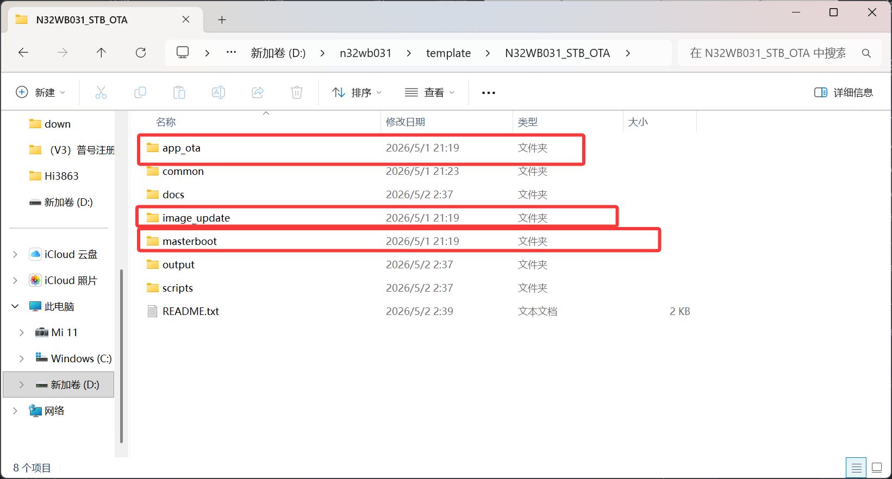

### 8.14 手机端 OTA 工具

很多人会下意识用 nRF Connect 或 LightBlue 做 OTA，但这些工具只适合查看广播和服务，**不等于 OTA 专用升级工具**。

针对国民技术这套 OTA 例程，SDK 自带了安卓升级工具：

`SDK目录/utilities/dfu/NSAndroidUtil/NSAndroidUtilV1.5.apk`

不需要网上乱找，优先用 SDK 自带这份 APK。

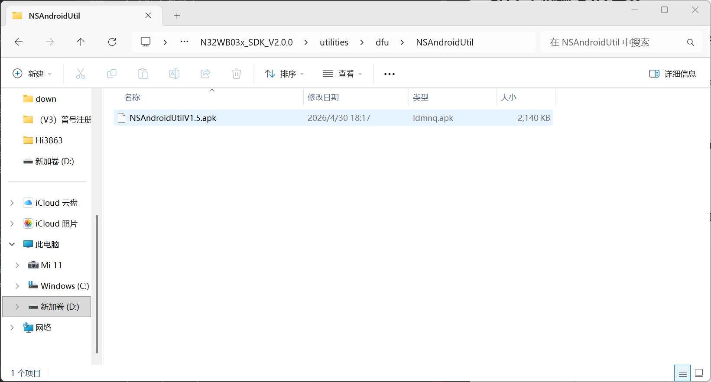

### 8.15 OTA 升级包

手机端升级时要选择 OTA 升级包（`.zip` 格式），而不是单独的 `.bin` 文件。

升级包内部包含：

| 文件 | 作用 |
|------|------|
| APP 固件 .bin | 实际的镜像数据 |
| config.txt | 升级配置参数 |
| dfu_setting.dat | DFU 传输参数 |

> **重要**：手机 App 应导入整个 `.zip` 包，不要解压后选择单独的 `.bin`。

升级包可通过 SDK 自带的 NSUtil 工具生成：

```
NSUtil.exe pack ota ...
```

### 8.16 手机端升级前确认清单

在点击升级之前，先确认以下几件事：

1. **板子当前跑的是 APP1**
   - 串口日志能看到 `application 1 start new ...`
   - 能看到 `APP_BLE_OS_READY`

2. **手机能搜到 OTA 设备**
   - 设备名应为 `N32WB031_OTA_A1`

3. **BLE 连接正常**
   - LED2 点亮（连接状态指示）

如果以上三点不满足，不要急着点升级，先排查基础链路。

### 8.17 手机端 OTA 操作步骤

```mermaid
flowchart TD
    A[安装 NSAndroidUtil APK] --> B[确保板子运行在 APP1]
    B --> C[打开 App，扫描 BLE 设备]
    C --> D[找到 N32WB031_OTA_A1]
    D --> E[连接设备]
    E --> F[选择 OTA 升级包 .zip]
    F --> G[点击开始升级]
    G --> H{等待升级完成}
    H -->|成功| I[设备自动重启]
    H -->|失败| J[检查连接，重试]
    I --> K[验证广播名变化]
```

**详细步骤：**

**第一步：安装 OTA 工具**

将 `NSAndroidUtilV1.5.apk` 安装到安卓手机。

**第二步：确认板子运行在 APP1**

确保设备已正常启动、BLE 广播中。

**第三步：打开 App 扫描设备**

进入扫描界面，搜索 `N32WB031_OTA_A1`。

**第四步：连接设备**

连接成功后，进入文件选择界面。

**第五步：选择升级包**

选择整个 `.zip` 升级包。

**第六步：开始升级**

观察手机端进度条和板子状态变化。升级完成后设备会自动重启。

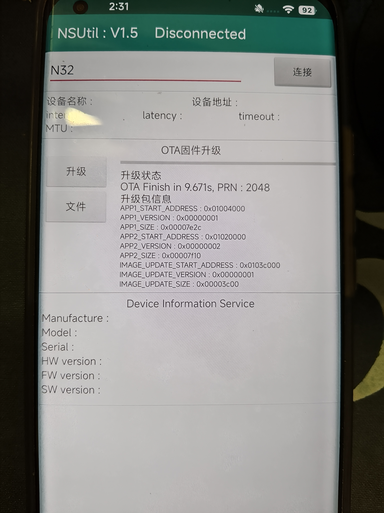
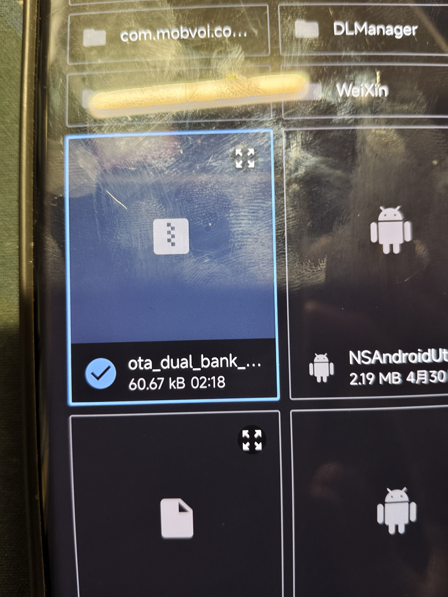


### 8.18 升级成功验证

升级完成后，通过以下三个维度确认是否真正成功：

#### 1. 设备自动重启

升级完成后板子会自动重启，这是最基本的现象。

#### 2. 串口日志变化

升级前（APP1）：
```
application 1 start new ...
```

升级后（APP2）：
```
application 2 start new ...
```

#### 3. 蓝牙广播名变化

- 升级前：`N32WB031_OTA_A1`
- 升级后：`N32WB031_OTA_A2`

广播名变化是最直观的成功标志。

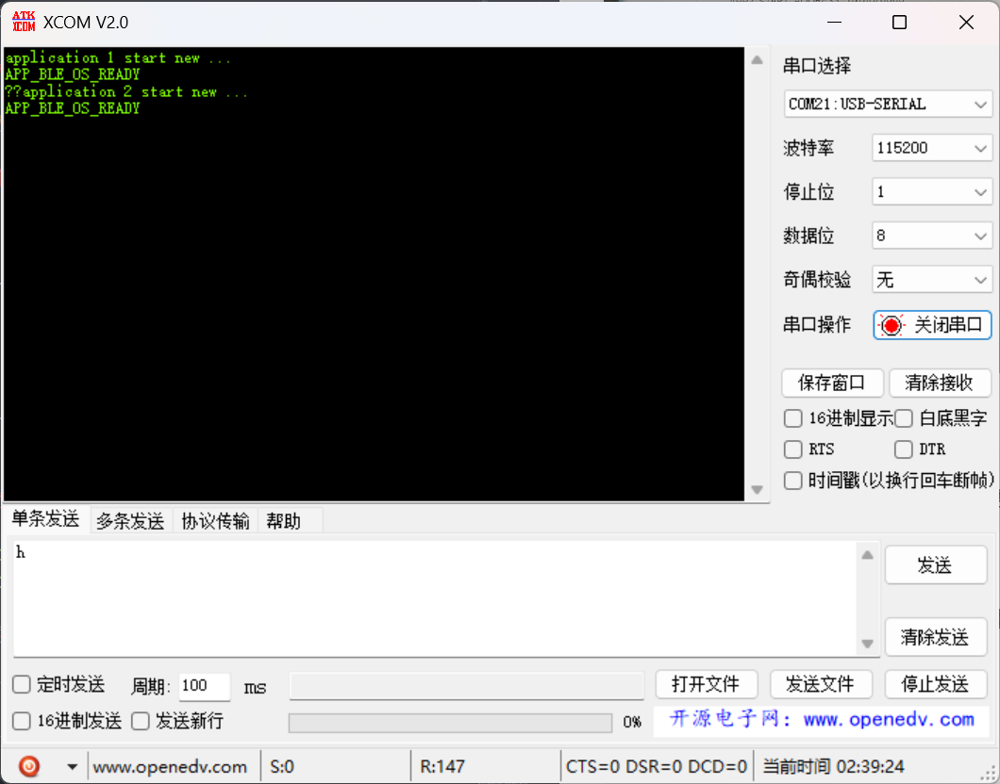


### 8.19 为什么不能直接烧 APP2

如果目标是**验证 OTA 机制**，就不能简单地把 APP2 直接烧进去运行。因为那样只能证明 APP2 本身能跑，却不能证明：

- 手机端 OTA 包传输成功
- 板子正确写入了新镜像
- Bootsetting 被正确更新
- masterboot 下次启动真的切换到了新槽位

**正确的验证方式**：保持板子先跑在 APP1，然后通过手机蓝牙把它升级到 APP2。

### 8.20 官方工具链

SDK 提供了两个配套工具：

| 工具 | 路径 | 功能 |
|------|------|------|
| NSUtil | `utilities/dfu/NSUtil/NSUtil.exe` | 生成 bootsetting.bin、合并镜像、生成 OTA 包 |
| NSpyocd | `utilities/dfu/NSpyocd/NSpyocd.exe` | 擦除芯片、烧录 hex/bin，配合 DAPLink 使用 |

NSpyocd 的核心价值是**用 DAPLink 直接烧 OTA 合并镜像**，适合批量烧录场景。

### 8.21 OTA 工程的 LED 指示

OTA 工程的 LED 使用与其他工程相同的引脚：

| LED | 引脚 | 作用 |
|-----|------|------|
| LED1 | PB0 | 运行指示，启动时快闪 |
| LED2 | PA6 | 连接状态，BLE 连接后点亮 |

启动时的 LED 闪烁模式还能区分当前运行的是哪个分区：

```c
// app_ota/src/main.c

if (CURRENT_APP_START_ADDRESS == NS_APP1_START_ADDRESS)
    dfu_delay_ms(100);   // App1: 快闪
else if (CURRENT_APP_START_ADDRESS == NS_APP2_START_ADDRESS)
    dfu_delay_ms(500);   // App2: 慢闪
```

上电后观察 LED 闪烁频率，即可判断当前运行的是 App1 还是 App2。

### 8.22 共享代码模块

三个工程共享 `common/` 目录下的模块：

| 模块 | 文件 | 功能 |
|------|------|------|
| CRC 校验 | dfu_crc.c/h | 硬件 CRC32 计算 |
| LED 驱动 | dfu_led.c/h | LED 初始化、开关、翻转 |
| 延时函数 | dfu_delay.c/h | 基于 CPU 周期的阻塞延时 |
| 串口驱动 | dfu_usart.c/h | USART1 初始化、收发、轮询 |

这些模块独立于 BLE 协议栈，可以在不依赖 SDK 蓝牙模块的情况下使用。

### 8.23 与前面工程的对比

| 对比项 | 前几章工程 | OTA 工程 |
|--------|-----------|----------|
| Keil 工程数 | 1 个 | 3 个 |
| 固件更新方式 | SWD 烧录 | BLE 无线 / 串口 |
| Flash 分区 | 单区 | A/B 双区 + ImageUpdate |
| 安全校验 | 无 | CRC32 |
| 引导程序 | 无 | masterboot |
| 业务逻辑 | 在唯一固件中 | 分散在 app_ota 和 image_update |

### 8.24 常见问题

**手机搜不到 N32WB031_OTA_A1 设备：**

- 确认三个工程都已正确烧录
- 确认 masterboot 烧录在 Flash 起始地址
- 观察 LED 是否闪烁，判断 app_ota 是否正常运行

**OTA 升级中途失败：**

- 不必担心，A/B 分区方案保证旧固件仍然可用
- 设备会回退到之前的固件继续运行
- 检查手机 App 的 BLE 连接是否稳定

**升级后设备无法启动：**

- 检查新固件的编译目标是否正确（App1 或 App2 地址）
- 通过 SWD 烧录 masterboot + 任一 App 固件恢复
- 使用串口 DFU 模式恢复

**三个工程的烧录顺序错了怎么办：**

- 最安全的顺序是：masterboot → app_ota → image_update
- 如果只烧录了 masterboot 而没有 App 固件，masterboot 会找不到有效分区，停留在等待状态
- 重新按顺序烧录即可

**手机端找不到 OTA 工具：**

- 不用网上找，SDK 自带 `NSAndroidUtilV1.5.apk`

**升级包该选哪个：**

- 选整个 `.zip` 包，不是里面的单独 `.bin`

**升级后还是 application 1：**

- 升级包没有真正写成功
- 或者 bootsetting 没有正确切换激活槽位

**升级成功但蓝牙名字没变：**

- 如果烧的是官方原版 OTA 应用，升级后名字可能不变
- 最可靠的判断依据是串口日志中的 `application 1` / `application 2`

### 8.25 小结

本工程展示了 N32WB031 的完整 OTA 能力：

**核心技术点：**

- A/B 双分区方案，保证升级安全
- masterboot 引导程序，智能跳转
- NS_IUS BLE 服务，无线传输固件
- CRC32 硬件校验，确保固件完整
- 串口 DFU 作为备选升级方式

**工程价值：**

OTA 是 BLE 产品从"能用"到"能发布"的关键一步。掌握 OTA 后，你可以：

- 远程修复已部署设备的 Bug
- 远程添加新功能
- 在不拆机的情况下迭代产品

至此，N32WB031 的基础能力已全部覆盖：GPIO、串口、BLE 透传、OLED 显示、HID 输入设备、空中升级。这些工程可以作为后续产品开发的起点。

**如果你成功了，你应该看到：**

- 手机 App 扫描到 `N32WB031_OTA_A1` 设备
- 选择升级包后进度条走至 100%，App 提示升级成功
- 设备自动重启，蓝牙名变为 `N32WB031_OTA_A2`（A/B 交替）
- 再次升级后名字变回 `A1`，双区轮转正常

**如果失败了，优先怀疑：**

- App 连接后无法升级 → 确认 App 版本为 `NSAndroidUtilV1.5.apk` 或更新版本
- 升级包校验失败 → 检查 `dfu_setting.dat` 中的 CRC 值、确认 .bin 文件未损坏
- 升级中途断连 → 检查蓝牙信号强度、缩短手机与开发板距离
- 升级成功但设备名不变 → 可能烧的是官方原版 OTA 应用，以串口日志中 `application 1/2` 为准
- 升级后无法启动 → 检查 bootsetting 是否正确写入、确认 Image_Update 区数据完整

---

## 附录：芯片无法识别的处理方法

如果 Keil 无法识别芯片，可尝试硬件复位法：

按住开发板上的 RESET 按键不松手，点击 Keil 的下载（或识别）按钮，在点击后的半秒内松开 RESET 按键。

---

## 写在最后

本教程共包含六份独立工程：

| 工程 | 内容 |
|------|------|
| N32WB031_STB_Blank_LED | 最小可运行骨架，GPIO 点灯与灯效 |
| N32WB031_STB_Key_USART | 按键、串口与 LED 动画模式联动 |
| N32WB031_STB_BLE_RDTSS | BLE 透传，手机与串口双向通信 |
| N32WB031_STB_BLE_RDTSS_OLED | BLE 透传 + OLED，手机、串口、屏幕三端联动 |
| N32WB031_STB_HID_SWIPE_OLED | HID 蓝牙拍照遥控器（工程名沿用官方 SWIPE 命名），系统蓝牙配对 + 按键触发相机快门 |
| N32WB031_STB_OTA | BLE 空中升级，A/B 双分区 + masterboot 引导 + CRC 校验 |

六份工程按照 GPIO → 外设组合 → BLE 透传 → BLE + 显示 → BLE HID 输入设备 → BLE OTA 空中升级的顺序递进，难度逐步提升。建议首次接触 N32WB031 的开发者按此顺序逐步实践。

从产品视角看，这六份工程恰好覆盖了一个 BLE 产品生命周期的四个关键闭环：

| 阶段 | 对应工程 | 闭环含义 |
|------|----------|----------|
| 硬件验证 | Blank_LED | 芯片能跑、外设能动 → **硬件最小闭环** |
| 数据链路 | BLE_RDTSS / BLE_RDTSS_OLED | 数据能收能发、能被看到 → **数据链路闭环** |
| 交互形态 | HID_SWIPE_OLED | 用户能输入、系统能响应 → **系统输入闭环** |
| 量产维护 | OTA | 固件能远程更新、Bug 能远程修复 → **后期维护闭环** |

四个闭环都走通，才算真正具备了从"开发板 Demo"走向"可发布产品"的基础能力。

---

## 写到这里

感谢你读到这里。

从第一章的开箱，到第八章的 OTA 空中升级，这八章内容覆盖了一个 BLE 产品从"点亮第一颗灯"到"无线更新固件"的完整链路。写这篇文档的过程，本身也是一次对 N32WB031 从陌生到熟悉的旅程。

如果你跟着这些章节一步步把工程跑通了，那你现在手上应该已经有：

- 一个能闪的 LED
- 一个能发串口数据的按键板
- 一个能和手机双向通信的 BLE 透传设备
- 一个能显示状态的 OLED 终端
- 一个能遥控拍照的蓝牙遥控器
- 一个能无线升级固件的 OTA 系统

这些东西单独看都不复杂，但串在一起，就是一条从裸片到产品的完整路径。

### 国产 BLE SoC 的路还很长

N32WB031 不是一颗完美的芯片。它的 SDK 文档还不够完善，PACK 包格式还有小问题，社区生态和 Nordic、TI 相比还有差距。但它能跑、能用、能把 BLE 产品从零做出来——这本身就是一种价值。

国产芯片正在成长，需要更多人愿意花时间去踩坑、去记录、去分享。如果这篇文档能帮你少走一些弯路，那它就没有白写。

### 接下来你可以做什么

- **改代码**：在现有工程基础上加自己的功能，比如温湿度传感器 + BLE 上报
- **做产品**：把 HID 遥控器或 OTA 方案迁移到自研硬件上
- **写文章**：把你的踩坑经历记录下来，帮到下一个人
- **提 Issue**：发现文档里的错误或不清楚的地方，欢迎在 GitHub 上提

### 最后

代码是写给机器执行的，文档是写给人看的。

希望这篇文档对你有用。祝你在嵌入式这条路上，越走越远。
