# N32WB031 测评合集

> 本文围绕国民技术 N32WB031 BLE SoC 及 N32WB031-STB 评估板，从开箱、环境搭建到 LED 点灯、按键串口、BLE 透传，提供一套完整的开发测评教程。

---

## 第一章：开箱与开发板介绍

在正式编写代码之前，有必要先对开发板的定位、芯片规格和板载资源建立清晰认知。本章对 N32WB031-STB 的硬件基础做一次性梳理。

### 1.1 开发板定位

N32WB031-STB（V1.3）是国民技术面向 N32WB031 系列 BLE SoC 推出的最小系统评估板。其设计目标不是实现复杂的人机交互展示，而是以最短路径完成芯片评估、基础验证和原型开发。硬件资源配置上强调实用性，将供电、调试、下载、串口、按键和指示灯等常用能力集中在小尺寸板卡上，同时将主要 GPIO 引出，便于外接传感器、屏幕、执行器和测试仪表。

该板适合作为 N32WB031 入门平台，主要原因：

- **低门槛**：USB-C 一线式供电、下载、调试和串口通信，无需额外硬件链路
- **快速验证**：开箱即可进入 SDK 示例、蓝牙广播、串口日志、低功耗和外设实验
- **便于迁移**：保留最小系统关键电路结构，适合从评估阶段过渡到自研硬件设计

### 1.2 开发板总览

N32WB031-STB（V1.3）以 N32WB031 超低功耗蓝牙 5.1 SoC 为核心，适用于初学者入门、蓝牙无线性能验证、低功耗参数评估、外设驱动联调及小型原型方案验证。

核心特点：

- 以 BLE 5.1 + 低功耗为核心能力
- 板载资源精简，保留调试和验证所需的关键接口
- 所有关键 GPIO 引出，扩展自由度高
- 适用于官方例程运行、射频测试、休眠唤醒验证和整机功耗评估

开发板正面实物如下，可见 USB-C 接口、主控区域、排针引出、板载按键和指示灯位置：


### 1.3 主控芯片核心规格

| 参数 | 规格 |
|------|------|
| 内核 | 32 位 Arm Cortex-M0，最高主频 64MHz |
| SRAM | 48KB + 16KB，合计 64KB |
| Flash | 256KB / 512KB |
| 无线 | 集成 BLE 5.1 射频收发器 |
| 速率模式 | 1Mbps、2Mbps、125Kbps (S8)、500Kbps (S2) |
| 协议特性 | 多角色、多连接、数据长度扩展、RSSI、AoA/AoD、SIG Mesh |
| 发射功率 | 最高 +6dBm |
| 接收灵敏度 | 最高 -96dBm（@1Mbps） |

N32WB031 的产品定位并非单纯追求主频，而是面向无线低功耗终端场景，在系统功耗、BLE 能力、片上资源和外设组合之间取得平衡。

### 1.4 低功耗与无线特性

对于电池供电类设备（遥控器、标签、传感器、无线开关、便携式配件），低功耗和无线性能直接决定产品可用性。

典型低功耗指标：

| 模式 | 电流 |
|------|------|
| 接收 | 3.8mA |
| 发射（0dBm） | 4.2mA |
| Sleep（48KB RAM 保持） | 1.4uA |
| 掉电模式 | 130nA |

无线能力：

- BLE 5.1
- 长距离模式
- 多连接与主从并发
- RSSI 评估
- 定位相关特性（AoA/AoD）
- Mesh 组网能力

### 1.5 开发板硬件资源

- **供电与接口**：USB-C，同时承担供电、调试和串口通信
- **时钟资源**：32MHz HSE + 32.768kHz LSE
- **基础交互**：板载用户 LED、按键
- **调试与复用**：SWD 调试、串口复用及相关跳线配置
- **IO 扩展**：主要 GPIO 通过排针引出，便于连接外部模块

开发板还保留了电源选择、SWD/串口切换、低速晶振与功能复用、LED 使能等配置，实际使用时需结合板上丝印和硬件使用指南确认。

开发板背面实物如下，可见丝印说明、引脚引出及 PB8/PB9、LSE 相关配置区域：


### 1.6 片上外设能力

N32WB031 的片上外设覆盖了大多数低功耗蓝牙终端设计需求：

- **模拟能力**：10 位 1.33Msps ADC，支持可配置高精度采样路径
- **音频前端**：模拟 MIC 输入、PGA 增益、MIC BIAS
- **按键扫描**：硬件 KEYSCAN
- **红外能力**：硬件 IRC
- **定时器**：高级定时器、通用定时器、基本定时器
- **通信接口**：USART、LPUART、SPI、I2S、I2C
- **系统外设**：RTC、DMA、CRC、WWDG、IWDG

适用项目类型：

- **无线人机交互类**：键盘、遥控器、语音配件
- **低功耗感知类**：传感器节点、电子价签、资产标签

### 1.7 典型应用场景

- 蓝牙无线键盘、遥控器、语音遥控器
- 智能家居无线节点和 Mesh 设备
- 数传模块、电子价签、标签类终端
- 低功耗 IoT 原型验证
- 射频、功耗和认证前评估

### 1.8 开发支持资源

- Keil MDK 开发环境支持
- J-Link / NSLink 调试支持
- 官方 SDK（N32WB03x SDK V2.0.0）
- BLE、透传、低功耗、外设、升级等示例工程
- 数据手册、硬件使用指南、SDK 使用指南、硬件设计指南等文档

N32WB031-STB 的核心优势在于将 BLE 5.1、超低功耗、必要外设和评估链路整合在一块开发板上，适合作为环境搭建、示例运行、功耗测评和无线验证的起点。

### 1.9 芯片架构总览

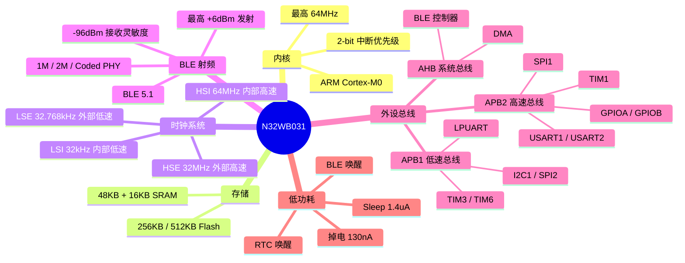

### 1.10 时钟树

N32WB031 的时钟系统是外设配置的基础。理解时钟树有助于后续理解 GPIO、USART、BLE 等外设的初始化逻辑。

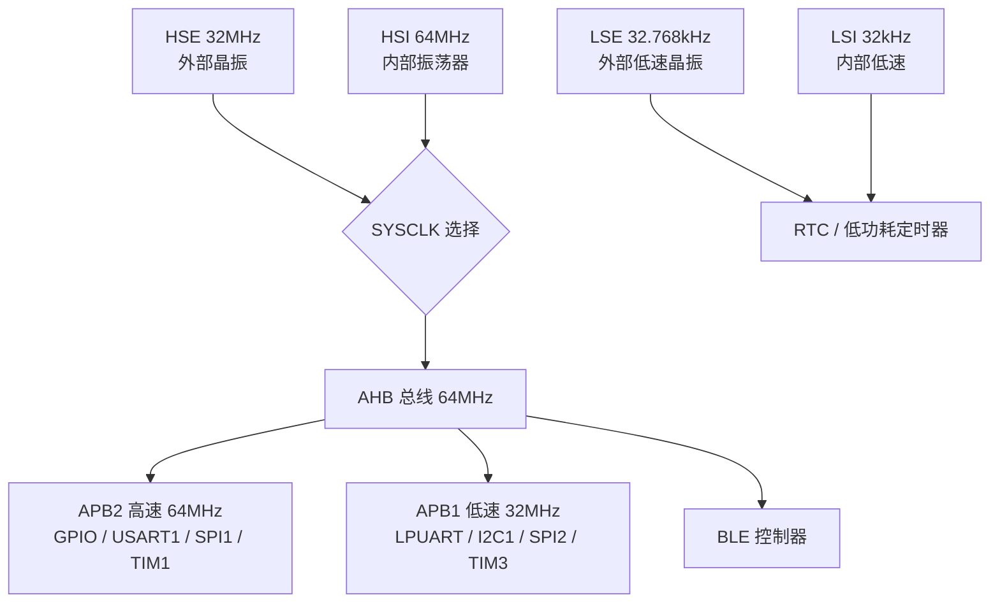

BLE 协议栈通常要求 HSE 作为时钟源，因为射频收发需要精确的频率参考。在 `ns_ble.h` 中可以看到相关配置：

```c
#define HSE_VALUE        (32000000)    // 32 MHz
#define HSI_VALUE        (64000000)    // 64 MHz
#define LSE_VALUE        (32768)       // 32.768 kHz
#define LSI_VALUE        (32000)       // 32 kHz
```

---

## 第二章：开发环境搭建

本章完成 Keil MDK 环境安装、SDK 解压和 PACK 导入。流程本身并不复杂，但官方 PACK 包存在格式规范问题，本章一并给出修复方案。

### 2.1 资源下载

N32WB031 官方产品页：

[N32WB031 - 国民技术官网](https://www.nationstech.com/product/General/cortexm0/N32WBBLE/N32WB031)

在官网"技术资源 -> 固件和软件"页面，可下载以下关键资源：

- **SDK 包**：N32WB031 系列 Firmware 软件开发套件，版本 V2.0.0
- **IDE 环境包**：KEIL-N32WB031，版本 V1.4.0
- **SDK 使用指南**：建议一并下载，便于查阅示例、目录结构和外设/BLE 用法


上图红框部分即为 SDK 包和 KEIL PACK 包。

### 2.2 安装顺序

1. 安装 Keil MDK（建议 v5.28 及以上）
2. 下载 SDK 包并解压到本地目录
3. 下载 KEIL-N32WB031 PACK 包
4. 安装 PACK 包
5. 打开 SDK 中对应示例工程的 `*.uvprojx` 文件开始编译

导入 PACK 时的安装界面：


SDK 解压后的常用工程入口：

```
<N32WB03x_SDK>/projects/n32wb03x_EVAL/
```

其中包含：

- `peripheral/`：GPIO、ADC、I2C、SPI、USART、TIM 等外设例程
- `ble/`：BLE 外设角色示例
- `ble_central/`：BLE 中央角色示例
- `dfu/`：升级相关示例
- `application/`：FreeRTOS 和组合示例

### 2.3 PACK 安装问题与修复

安装 PACK 时如果遇到以下报错：

- `bad pack name`
- `pdsc not found`
- `version does not match`

原因是官方 PACK 包未严格遵守 CMSIS-Pack 规范，并非安装操作有误。


#### 根因分析

1. **外层文件名缺少供应商前缀** → `bad pack name`
   - 规范要求：`<供应商>.<包名>.<版本号>.pack`
   - 官方实际：`N32WB03x_DFP.1.4.0.pack`
   - 正确格式：`Nationstech.N32WB03x_DFP.1.4.0.pack`

2. **包内 pdsc 文件命名不规范** → `pdsc not found`
   - 规范要求：`<供应商>.<包名>.pdsc`
   - 官方实际：`Nationstech.N32WB03x_DFP.1.4.0.pdsc`（多带了版本号）

3. **pdsc 中版本发布顺序错误** → `version does not match`
   - 规范要求：`<releases>` 节点中最新版本排在最前
   - 官方实际：最老版本排在前面，导致工具误判包版本

#### 修复步骤

1. 备份原始文件 `N32WB03x_DFP.1.4.0.pack`
2. 将 `.pack` 文件解压到临时目录
3. 将外层包文件名改为 `Nationstech.N32WB03x_DFP.1.4.0.pack`
4. 将包内 `Nationstech.N32WB03x_DFP.1.4.0.pdsc` 改名为 `Nationstech.N32WB03x_DFP.pdsc`
5. 打开 `.pdsc` 文件，找到 `<releases>` 节点
6. 将最新版本 `1.4.0` 的 `<release>` 移到第一条
7. 保持目录结构不变，重新打包为 `.pack`
8. 通过 Keil Pack Installer 重新导入

#### 修复后预期

安装成功后，在 Keil 的器件/Pack 选择界面中可正常看到 Nationstech 厂商下的 N32WB03x Series 和 N32WB031 设备：


### 2.4 补充说明

- PACK 暂时未安装成功时，仍可直接打开 SDK 中的 uvprojx 工程尝试编译
- PACK 的主要作用是补齐设备支持、模板、启动文件识别和工程集成体验，建议后续修复
- 如官网后续更新了新版本 PACK，优先下载最新版，可能不再需要手动修包

### 2.5 小结

环境搭建的标准流程为：从官网下载 SDK 和 PACK，正常安装即可。本次遇到的问题源于官方 PACK 包的格式不规范，通过手动修正包结构后可正常完成安装。环境就绪后，下一章开始编写第一个工程。

---

## 第三章：第一个工程 — LED 点灯

本章目标：建立一个最小 Keil 工程，编译下载后让 PB0 和 PA6 对应的两个板载 LED 执行启动动画和循环灯效。

工程目录：`N32WB031_STB_Blank_LED`

### 3.1 工程结构

采用"基于官方例程收敛成最小模板"的方式，保留空白工程所需的基本部分：

```
N32WB031_STB_Blank_LED/
├── inc/
│   └── main.h              ← LED 引脚定义、函数声明
├── src/
│   ├── main.c              ← 主函数、GPIO 初始化、灯效逻辑
│   └── n32wb03x_it.c       ← 默认中断处理函数
├── MDK-ARM/
│   ├── N32WB031_STB_Blank_LED.uvprojx   ← Keil 工程文件
│   └── N32WB031_STB_Blank_LED.uvoptx    ← 调试与下载配置
└── readme.txt
```

### 3.2 打开工程

1. 打开 Keil uVision
2. 选择 `Project -> Open Project...`
3. 进入工程目录下的 `MDK-ARM/` 文件夹
4. 打开 `N32WB031_STB_Blank_LED.uvprojx`

环境和 PACK 安装正常的情况下，工程可被 Keil 正常识别：


### 3.3 GPIO 前置知识

在 N32WB031 中，每个 GPIO 引脚的配置涉及三个关键步骤：

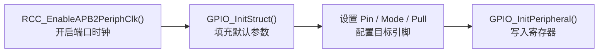

**为什么必须先开时钟？**

N32WB031 的外设挂载在 APB 总线上，时钟默认关闭以节省功耗。不开启时钟就访问 GPIO 寄存器，读写操作会被忽略。

**GPIO_Mode 常用取值：**

| 模式 | 宏定义 | 用途 |
|------|--------|------|
| 推挽输出 | `GPIO_MODE_OUTPUT_PP` | 驱动 LED、控制数字输出 |
| 开漏输出 | `GPIO_MODE_OUTPUT_OD` | I2C、线与逻辑 |
| 复用推挽 | `GPIO_MODE_AF_PP` | USART TX、SPI MOSI |
| 浮空输入 | `GPIO_MODE_INPUT` | 外部信号检测 |
| 上拉输入 | `GPIO_MODE_INPUT` + `GPIO_PULL_UP` | 按键（低电平有效） |

**GPIO_Module 寄存器结构（来自 `n32wb03x.h`）：**

```c
typedef struct
{
    __IO uint32_t PMODE;      // 模式寄存器
    __IO uint32_t POTYPE;     // 输出类型寄存器
    __IO uint32_t PUPD;       // 上下拉寄存器
    __IO uint32_t PID;        // 输入数据寄存器
    __IO uint32_t POD;        // 输出数据寄存器
    __IO uint32_t PBSC;       // 位设置/清除寄存器
    __IO uint32_t PLOCK;      // 锁定寄存器
    __IO uint32_t AFL;        // 复用功能低位
    __IO uint32_t AFH;        // 复用功能高位
} GPIO_Module;
```

SDK 封装了 `GPIO_SetBits()`、`GPIO_ResetBits()`、`GPIO_TogglePin()` 等函数，开发者无需直接操作寄存器。

### 3.4 工程功能概述

该模板在最小化 GPIO 点灯基础上，加入了一套轻量级灯效逻辑，不依赖串口、中断或定时器。


执行流程：

1. 打开 GPIOA 和 GPIOB 时钟
2. 将 PB0 和 PA6 配置为推挽输出
3. 上电后执行启动动画
4. 进入交替"心跳灯"循环

该工程可作为后续扩展的起点，在此骨架上可叠加按键、串口、定时器或 BLE。

### 3.5 引脚定义与主函数

```c
#define LED1_PORT   GPIOB
#define LED1_PIN    GPIO_PIN_0

#define LED2_PORT   GPIOA
#define LED2_PIN    GPIO_PIN_6
```

- PB0 → LED1
- PA6 → LED2

模板默认采用高电平点亮方式。

```c
int main(void)
{
    LedInit(LED1_PORT, LED1_PIN);
    LedInit(LED2_PORT, LED2_PIN);

    LedAllOff();
    StartupAnimation();

    while (1)
    {
        HeartbeatLoop();
    }
}
```

- `LedInit()`：将对应引脚初始化为推挽输出
- `LedAllOff()`：统一熄灯，确保启动状态一致
- `StartupAnimation()`：上电动画
- `HeartbeatLoop()`：主循环中持续运行交替灯效

### 3.6 GPIO 初始化

```c
void LedInit(GPIO_Module* GPIOx, uint16_t Pin)
{
    GPIO_InitType GPIO_InitStructure;

    assert_param(IS_GPIO_ALL_PERIPH(GPIOx));

    if (GPIOx == GPIOA)
    {
        RCC_EnableAPB2PeriphClk(RCC_APB2_PERIPH_GPIOA, ENABLE);
    }
    else if (GPIOx == GPIOB)
    {
        RCC_EnableAPB2PeriphClk(RCC_APB2_PERIPH_GPIOB, ENABLE);
    }
    else
    {
        return;
    }

    if (Pin <= GPIO_PIN_ALL)
    {
        GPIO_InitStruct(&GPIO_InitStructure);
        GPIO_InitStructure.Pin = Pin;
        GPIO_InitStructure.GPIO_Mode = GPIO_MODE_OUTPUT_PP;
        GPIO_InitPeripheral(GPIOx, &GPIO_InitStructure);
    }
}
```

完成两个关键动作：打开对应端口时钟，将目标引脚配置为推挽输出（`GPIO_MODE_OUTPUT_PP`）。

### 3.7 灯效逻辑

灯效由 GPIO 高低电平切换和软件延时实现，不依赖额外外设。

核心辅助函数：

```c
static void Pulse(GPIO_Module* GPIOx, uint16_t Pin, uint32_t onDelay, uint32_t offDelay)
{
    LedOn(GPIOx, Pin);
    Delay(onDelay);
    LedOff(GPIOx, Pin);
    Delay(offDelay);
}
```

**启动动画：**

```c
static void StartupAnimation(void)
{
    uint32_t i;

    for (i = 0; i < 2U; ++i)
    {
        Pulse(LED1_PORT, LED1_PIN, 0x18000U, 0x08000U);
        Pulse(LED2_PORT, LED2_PIN, 0x18000U, 0x08000U);
    }

    for (i = 0; i < 2U; ++i)
    {
        LedOn(LED1_PORT, LED1_PIN);
        LedOn(LED2_PORT, LED2_PIN);
        Delay(0x18000U);
        LedAllOff();
        Delay(0x12000U);
    }
}
```

**主循环（心跳灯）：**

```c
static void HeartbeatLoop(void)
{
    Pulse(LED1_PORT, LED1_PIN, 0x0C000U, 0x06000U);
    Pulse(LED1_PORT, LED1_PIN, 0x0C000U, 0x16000U);
    Pulse(LED2_PORT, LED2_PIN, 0x0C000U, 0x06000U);
    Pulse(LED2_PORT, LED2_PIN, 0x0C000U, 0x2A000U);
}
```

通过调整 `onDelay` 和 `offDelay` 参数即可实现不同灯效模式（流水灯、报警灯、SOS 等）。

### 3.8 编译与下载

1. 在 Keil 中点击 Rebuild
2. 确认编译通过
3. 连接开发板
4. 点击 Download
5. 复位开发板或重新上电


编译失败时优先排查：

- PACK 是否正确安装
- Keil 是否识别到 N32WB031
- 工程相对路径是否被修改

### 3.9 运行现象

程序下载后，开发板行为：

- 上电后执行短暂启动动画
- PB0 和 PA6 交替执行双闪
- 效果比常亮更易于确认程序已正常运行


### 3.10 模板适用性

该工程仅保留新工程最基本的骨架：

- 正确的芯片与 Pack 配置
- 启动文件
- CMSIS 系统文件
- 必要的标准外设驱动
- 用户代码入口 main.c

已具备"能编、能下、能跑"的基本条件，同时未引入串口、定时器或 BLE 协议栈等额外复杂度，适合作为后续学习的起点。

---

## 第四章：按键 + 串口基础外设

本章新建第二个独立工程，同时实现板载按键输入、串口日志输出、按键与串口共同控制 LED 动画模式三项功能。

工程目录：`N32WB031_STB_Key_USART`

### 4.1 交互设计

工程设计为一个小型交互 Demo，而非简单的按键亮灯：

- **KEY1（PB1）**：切换当前 LED 动画模式
- **KEY2（PB2）**：暂停/恢复当前动画，打印状态
- **USART1（PB6/PB7, 115200）**：上电打印命令菜单，支持串口指令控制

串口命令列表：

| 命令 | 功能 |
|------|------|
| `1` | 切换到 heartbeat 模式 |
| `2` | 切换到 pingpong 模式 |
| `3` | 切换到 sync 模式 |
| `m` | 切换到下一个模式 |
| `p` | 暂停 / 恢复动画 |
| `s` | 打印当前状态 |
| `h` | 打印帮助菜单 |

### 4.2 独立工程的原因

未在上一章工程基础上修改，而是新建独立工程：

1. 各章节工程独立，便于按章节学习
2. 每个工程可独立打开、单独编译下载
3. 工程结构更清晰，便于管理

### 4.3 工程结构

```
N32WB031_STB_Key_USART/
├── inc/
│   └── main.h              ← LED/KEY/USART 引脚定义、函数声明
├── src/
│   ├── main.c              ← 串口初始化、按键扫描、状态打印、灯效模式切换
│   └── n32wb03x_it.c       ← 默认中断处理函数
├── MDK-ARM/
│   ├── N32WB031_STB_Key_USART.uvprojx   ← Keil 工程配置
│   └── N32WB031_STB_Key_USART.uvoptx    ← 调试下载配置
└── readme.txt
```


### 4.4 硬件资源与引脚分配

| 资源 | 引脚 | 用途 |
|------|------|------|
| LED1 | PB0 | 显示当前动画效果 |
| LED2 | PA6 | 显示当前动画效果 |
| KEY1 | PB1 | 本地输入 — 切换模式 |
| KEY2 | PB2 | 本地输入 — 暂停/恢复 |
| USART1_TX | PB6 | 串口发送 |
| USART1_RX | PB7 | 串口接收 |


### 4.5 前置知识：轮询架构与消抖

**轮询 vs 中断：**

本工程采用纯轮询架构，不使用任何中断。主循环中持续调用 `ServiceTasks()` 检查串口和按键状态。这种方式逻辑简单、调试方便，适合入门阶段理解外设交互。

**按键消抖原理：**

机械按键按下时，触点会在数毫秒内反复弹跳，产生多次高低电平变化。消抖的核心思路是：检测到低电平后延时一段时间，再次确认仍为低电平才认定为有效按下。

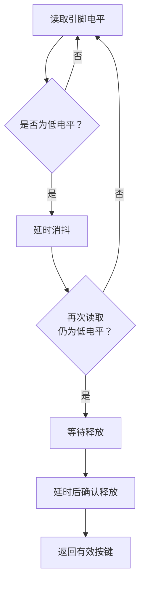

**DelayWithService 模式：**

普通 `Delay()` 在延时期间 CPU 空转，无法响应任何输入。`DelayWithService()` 将长延时拆分为多个 0x2000 周期的短延时片段，每完成一个片段就调用一次 `ServiceTasks()`，确保延时期间仍能响应串口命令和按键操作。

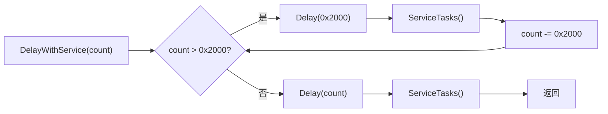

核心代码：

```c
void DelayWithService(uint32_t count)
{
    while (count > 0U)
    {
        uint32_t slice = (count > 0x2000U) ? 0x2000U : count;
        Delay(slice);
        count -= slice;
        ServiceTasks();
    }
}
```

这个模式贯穿整个工程，所有 LED 动画的延时都通过 `DelayWithService()` 实现，保证用户在任意时刻都能通过按键或串口中断当前动画。

**状态机设计：**

工程使用 `DemoMode` 枚举管理三种灯效模式，配合暂停标志构成简单状态机：

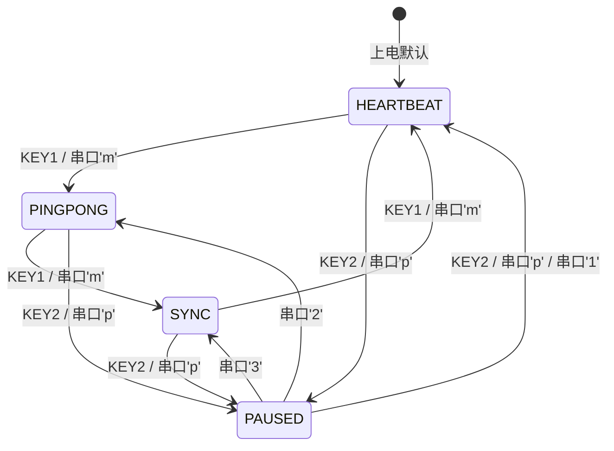

### 4.6 串口初始化

使用 USART1 作为日志串口，波特率 115200，沿用官方 Printf 例程思路：

```c
void UsartInit(void)
{
    GPIO_InitType GPIO_InitStructure;
    USART_InitType USART_InitStructure;

    GPIO_APBxClkCmd(USARTx_GPIO_CLK, ENABLE);
    USART_APBxClkCmd(USARTx_CLK, ENABLE);

    GPIO_InitStruct(&GPIO_InitStructure);

    GPIO_InitStructure.Pin = USARTx_TxPin;
    GPIO_InitStructure.GPIO_Mode = GPIO_MODE_AF_PP;
    GPIO_InitStructure.GPIO_Alternate = USARTx_Tx_GPIO_AF;
    GPIO_InitPeripheral(USARTx_GPIO, &GPIO_InitStructure);

    GPIO_InitStructure.Pin = USARTx_RxPin;
    GPIO_InitStructure.GPIO_Alternate = USARTx_Rx_GPIO_AF;
    GPIO_InitPeripheral(USARTx_GPIO, &GPIO_InitStructure);

    USART_InitStructure.BaudRate = 115200;
    USART_InitStructure.WordLength = USART_WL_8B;
    USART_InitStructure.StopBits = USART_STPB_1;
    USART_InitStructure.Parity = USART_PE_NO;
    USART_InitStructure.HardwareFlowControl = USART_HFCTRL_NONE;
    USART_InitStructure.Mode = USART_MODE_RX | USART_MODE_TX;

    USART_Init(USARTx, &USART_InitStructure);
    USART_Enable(USARTx, ENABLE);
}
```

`printf()` 重定向：

```c
int fputc(int ch, FILE* f)
{
    (void)f;
    USART_SendData(USARTx, (uint8_t)ch);
    while (USART_GetFlagStatus(USARTx, USART_FLAG_TXDE) == RESET)
    {
    }
    return ch;
}
```

### 4.7 按键输入与消抖

采用轮询消抖方案，逻辑清晰，便于理解：

```c
static uint8_t KeyPressed(GPIO_Module* GPIOx, uint16_t Pin)
{
    if (GPIO_ReadInputDataBit(GPIOx, Pin) == RESET)
    {
        Delay(0x5000U);
        if (GPIO_ReadInputDataBit(GPIOx, Pin) == RESET)
        {
            while (GPIO_ReadInputDataBit(GPIOx, Pin) == RESET)
            {
            }
            Delay(0x5000U);
            return 1U;
        }
    }

    return 0U;
}
```

处理流程：检测按下 → 延时消抖 → 等待释放 → 返回单次触发。

### 4.8 主循环与交互逻辑

```c
int main(void)
{
    LedInit(LED1_PORT, LED1_PIN);
    LedInit(LED2_PORT, LED2_PIN);
    KeyInit(KEY1_PORT, KEY1_PIN);
    KeyInit(KEY2_PORT, KEY2_PIN);
    UsartInit();

    LedAllOff();
    PrintBanner();
    PrintHelp();
    PrintStatus();
    StartupAnimation();

    while (1)
    {
        ServiceTasks();
        RunCurrentMode();
    }
}
```

- `PrintBanner()`：打印欢迎信息
- `PrintHelp()`：打印串口命令列表
- `PrintStatus()`：打印当前模式和按键计数
- `ServiceTasks()`：持续处理串口输入和按键输入
- `RunCurrentMode()`：根据当前模式执行对应 LED 动画

串口输入处理：

```c
static void HandleSerialInput(void)
{
    if (USART_GetFlagStatus(USARTx, USART_FLAG_RXDNE) == RESET)
    {
        return;
    }

    switch ((char)USART_ReceiveData(USARTx))
    {
        case '1':
            SetMode(DEMO_MODE_HEARTBEAT, "UART");
            break;
        case '2':
            SetMode(DEMO_MODE_PINGPONG, "UART");
            break;
        case '3':
            SetMode(DEMO_MODE_SYNC, "UART");
            break;
        case 'm':
        case 'M':
            SetMode((DemoMode)((g_mode + 1U) % DEMO_MODE_MAX), "UART");
            break;
        case 'p':
        case 'P':
            TogglePause("UART");
            break;
        case 's':
        case 'S':
            PrintStatus();
            break;
        case 'h':
        case 'H':
        case '?':
            PrintHelp();
            break;
        case '\r':
        case '\n':
            break;
        default:
            printf("[UART] unknown command\r\n");
            PrintHelp();
            break;
    }
}
```

按键输入处理：

```c
static void HandleKeyInput(void)
{
    if (KeyPressed(KEY1_PORT, KEY1_PIN) != 0U)
    {
        g_key1_press_count++;
        SetMode((DemoMode)((g_mode + 1U) % DEMO_MODE_MAX), "KEY1");
    }

    if (KeyPressed(KEY2_PORT, KEY2_PIN) != 0U)
    {
        g_key2_press_count++;
        TogglePause("KEY2");
        PrintStatus();
    }
}
```

### 4.9 三种灯效模式

1. **heartbeat**：两个灯交替双闪，类似"心跳"节奏
2. **pingpong**：PB0 和 PA6 左右交替闪烁
3. **sync**：两个灯同步双闪

按 KEY1 或串口发送 `m` 可切换至下一模式。

### 4.10 串口测试

串口助手参数：

- 波特率：115200
- 数据位：8
- 停止位：1
- 校验位：None

测试步骤：

1. 复位开发板
2. 观察串口欢迎信息和帮助菜单
3. 发送 `1`、`2`、`3`，查看灯效切换
4. 发送 `p`，查看动画暂停
5. 发送 `s`，查看状态打印
6. 发送 `h`，查看帮助菜单重新输出


### 4.11 按键测试

- 按 KEY1（PB1）：切换动画模式
- 按 KEY2（PB2）：暂停/恢复动画，打印状态

按下 KEY1 后串口输出：

```text
[KEY1] mode -> pingpong
```

按下 KEY2 后串口输出：

```text
[KEY2] animation paused
[STATUS] mode=pingpong, paused=YES, key1_count=1, key2_count=1
```


### 4.12 小结

至此已完成两份独立工程：

1. **N32WB031_STB_Blank_LED**：从零建立最小可运行骨架
2. **N32WB031_STB_Key_USART**：按键、串口和状态交互的组合

第一份工程建立工程结构认知，第二份工程掌握基础外设联动。具备这两个基础后，进入 BLE 开发的门槛将显著降低。

---

## 第五章：BLE 透传工程

基础外设验证完成后，下一步进入 BLE 透传。本章基于官方 rdtss 例程整理出一份独立工程，而非从零手写蓝牙协议栈。

工程目录：`N32WB031_STB_BLE_RDTSS`

BLE 透传本身已具有足够复杂度，基于官方已跑通的服务例程进行理解、测试和讲解，是更稳妥的路径。

### 5.1 BLE 透传原理

BLE 透传的核心逻辑可以概括为：

**手机发送的数据不做复杂解析，直接转发至板载串口；串口接收的数据不做复杂封装，直接回传至手机。**

数据流向示意：

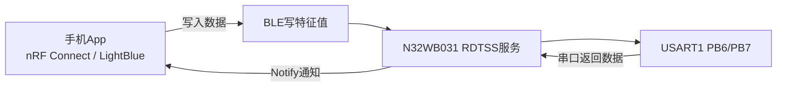

系统角色：

- 手机：无线调试窗口
- 开发板：蓝牙桥接器
- 串口另一端：本地设备或逻辑模块

### 5.2 BLE 透传的价值

1. **直观性**：连接即可测试写入、通知和日志，效果即时可见
2. **可扩展性**：透传链路打通后，可叠加传感器上传、手机控制外设、OLED 显示、OTA 等功能
3. **桥梁作用**：将前期的串口知识与后续蓝牙项目自然衔接

### 5.3 BLE 协议前置知识

在正式进入工程代码之前，有必要先理解 BLE 协议栈的基本分层和核心概念。

**BLE 协议栈分层：**

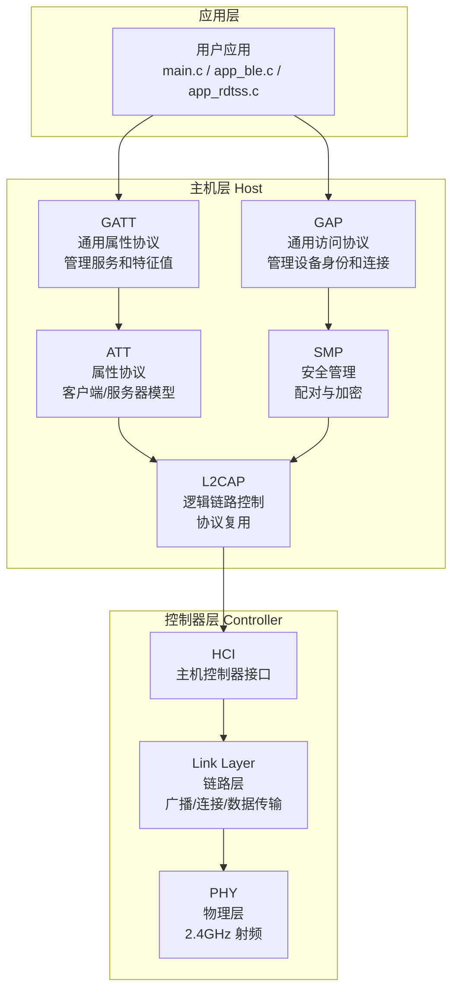

**核心概念：**

| 概念 | 说明 |
|------|------|
| **GAP** | 管理设备身份（名称、地址、角色）、广播和连接流程。本工程中设备角色为 `GAP_ROLE_PERIPHERAL`（从机） |
| **GATT** | 管理数据的组织方式。数据以 Service（服务）→ Characteristic（特征值）的层级结构组织 |
| **Service** | 一组相关特征值的容器。本工程使用自定义 128 位 UUID 的 RDTSS 服务 |
| **Characteristic** | 服务中的单个数据点，支持 Read / Write / Notify 等操作 |
| **Notify** | 服务器主动向客户端推送数据，无需客户端轮询。本工程的串口→手机方向即使用 Notify |
| **Write** | 客户端向服务器写入数据。本工程的手机→串口方向即使用 Write |
| **UUID** | 服务和特征值的唯一标识。标准 UUID 为 128 位，如 `12345678-1234-5678-1234-56789abcdef0` |

**RDTSS 服务结构：**

本工程定义的 RDTSS 服务包含两个特征值：

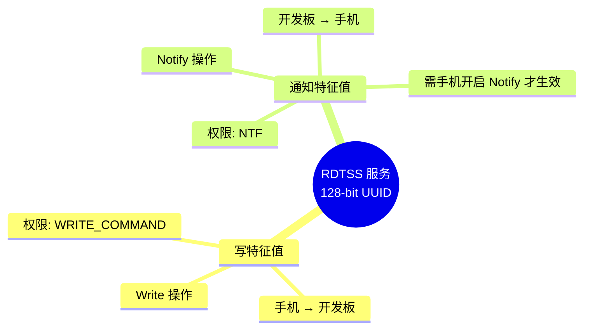

**BLE 初始化流程：**

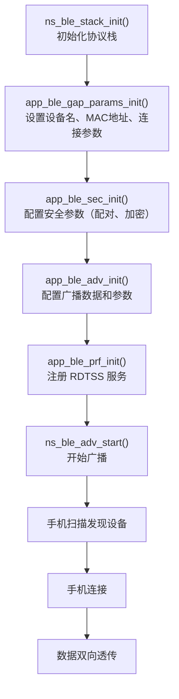

### 5.4 工程功能

该工程完成三项核心任务：

1. 初始化蓝牙协议栈并开始广播
2. 建立自定义 RDTSS 服务
3. BLE 与 USART1 双向打通

工程启动后广播蓝牙名称：**N32WB031_RDTSS**

连接后：

- 手机写入数据 → 转发至 USART1
- USART1 接收数据 → 通过 Notify 回传手机

状态指示：

- LED1（PB0）：上电运行指示
- LED2（PA6）：蓝牙连接状态指示

### 5.5 工程结构

```
N32WB031_STB_BLE_RDTSS/
├── inc/
│   ├── app_user_config.h      ← 蓝牙名称、广播参数
│   ├── app_ble.h              ← BLE 初始化接口
│   ├── app_usart.h            ← 串口桥接接口
│   └── app_profile/
│       └── app_rdtss.h        ← 透传服务接口
├── src/
│   ├── main.c                 ← 主函数、蓝牙栈启动
│   ├── app_ble.c              ← GAP 参数、广播启动、连接/断开回调
│   ├── app_usart.c            ← USART DMA 接收、串口与 BLE 双向转发
│   └── app_profile/
│       └── app_rdtss.c        ← 写特征值处理、Notify 发送
└── MDK-ARM/
    └── N32WB031_STB_BLE_RDTSS.uvprojx
```


### 5.6 蓝牙名称配置

蓝牙名称定义在 `app_user_config.h` 中：

```c
#define CUSTOM_DEVICE_NAME "N32WB031_RDTSS"
```

手机蓝牙调试 App 搜索到的设备名即为此处定义。若需自定义项目，修改此行即可，例如 `My_BLE_UART`、`Sensor_Node_01` 等。

### 5.7 主函数解析

```c
int main(void)
{
    delay_n_10us(200*1000);

    NS_LOG_INIT();
    app_ble_init();

    LedInit(LED1_PORT,LED1_PIN);
    LedInit(LED2_PORT,LED2_PIN);
    LedOn(LED1_PORT,LED1_PIN);

    app_usart_dma_enable(ENABLE);
    usart_tx_dma_send((uint8_t*)DEMO_STRING, sizeof(DEMO_STRING));
    app_usart_dma_enable(DISABLE);

    while (1)
    {
        rwip_schedule();
        ns_sleep();
    }
}
```

执行流程：

1. 上电延时，预留调试器连接时间
2. 初始化日志系统
3. 初始化蓝牙协议栈并开始广播
4. 点亮运行指示灯
5. 初始化串口桥接资源
6. 进入蓝牙协议栈调度循环

该工程的蓝牙逻辑主要由协议栈调度完成，连接、收发和状态切换通过回调函数处理。

### 5.8 广播与连接机制

手机能够发现设备，依赖 `app_ble.c` 中的配置：

1. 设置设备名
2. 设置 GAP 参数
3. 初始化广播数据
4. 调用 `ns_ble_adv_start()` 开始广播

核心初始化函数：

```c
void app_ble_init(void)
{
    struct ns_stack_cfg_t app_handler = {0};
    app_handler.ble_msg_handler  = app_ble_msg_handler;
    app_handler.user_msg_handler = app_user_msg_handler;
    app_handler.lsc_cfg          = BLE_LSC_LSI_32000HZ;
    ns_ble_stack_init(&app_handler);

    app_ble_gap_params_init();
    app_ble_sec_init();
    app_ble_adv_init();
    app_ble_prf_init();
    ns_ble_adv_start();
}
```

GAP 参数配置中，设备名和连接参数是关键：

```c
void app_ble_gap_params_init(void)
{
    struct ns_gap_params_t dev_info = {0};
    uint8_t *p_mac = SystemGetMacAddr();
    if(p_mac != NULL)
    {
        memcpy(dev_info.mac_addr.addr, p_mac, BD_ADDR_LEN);
    }
    else{
        memcpy(dev_info.mac_addr.addr, "\x01\x02\x03\x04\x05\x06", BD_ADDR_LEN);
    }

    dev_info.mac_addr_type = GAPM_STATIC_ADDR;
    dev_info.appearance = 0;
    dev_info.dev_role = GAP_ROLE_PERIPHERAL;

    dev_info.dev_name_len = sizeof(CUSTOM_DEVICE_NAME)-1;
    memcpy(dev_info.dev_name, CUSTOM_DEVICE_NAME, dev_info.dev_name_len);

    dev_info.dev_conn_param.intv_min = MSECS_TO_UNIT(MIN_CONN_INTERVAL, MSECS_UNIT_1_25_MS);
    dev_info.dev_conn_param.intv_max = MSECS_TO_UNIT(MAX_CONN_INTERVAL, MSECS_UNIT_1_25_MS);
    dev_info.dev_conn_param.latency  = SLAVE_LATENCY;
    dev_info.dev_conn_param.time_out = MSECS_TO_UNIT(CONN_SUP_TIMEOUT, MSECS_UNIT_10_MS);
    dev_info.conn_param_update_delay = FIRST_CONN_PARAMS_UPDATE_DELAY;

    ns_ble_gap_init(&dev_info);
}
```

连接和断开回调决定了透传链路的开关：

```c
void app_ble_connected(void)
{
    app_usart_dma_enable(ENABLE);
    LedOn(LED2_PORT, LED2_PIN);
    notify_en = 0;
}

void app_ble_disconnected(void)
{
    ns_ble_adv_start();
    app_usart_dma_enable(DISABLE);
    LedOff(LED2_PORT, LED2_PIN);
    notify_en = 0;
}
```

### 5.9 数据流向：手机 → 串口

在 `app_rdtss.c` 中，手机写入 BLE 特征值的处理函数：

```c
static int rdtss_val_write_ind_handler(ke_msg_id_t const msgid,
                                        struct rdtss_val_write_ind const *ind_value,
                                        ke_task_id_t const dest_id,
                                        ke_task_id_t const src_id)
{
    uint16_t handle = ind_value->handle;
    uint16_t length = ind_value->length;

    switch (handle)
    {
        case RDTSS_IDX_NTF_CFG:
            if(length == 2)
            {
                uint16_t cfg_value = ind_value->value[0] + ind_value->value[1];
                if(cfg_value == PRF_CLI_START_NTF)
                {
                    notify_en = 1;
                }
                else if(cfg_value == PRF_CLI_STOP_NTFIND)
                {
                    notify_en = 0;
                }
            }
            break;
        case RDTSS_IDX_WRITE_VAL:
            app_usart_tx_fifo_enter(ind_value->value, ind_value->length);
            break;
        default:
            break;
    }
    return (KE_MSG_CONSUMED);
}
```

该回调处理两类写入事件：

- `RDTSS_IDX_NTF_CFG`：手机开启或关闭 Notify 时触发，更新 `notify_en` 标志
- `RDTSS_IDX_WRITE_VAL`：手机写入数据时触发，将数据塞入串口发送 FIFO

数据路径：手机写入特征值 → BLE 协议栈回调 → 塞入串口发送 FIFO → USART 发出。

### 5.10 数据流向：串口 → 手机

在 `app_usart.c` 中，串口接收数据的转发逻辑：

```c
void usart_forward_to_ble_loop(void)
{
    ...
    rdtss_send_notify(&usart_rx_fifo_buf[usart_rx_fifo_out], ble_send_len);
    ...
}
```

Notify 发送函数检查 `notify_en` 标志，只有手机开启了 Notify 才会实际发送：

```c
void rdtss_send_notify(uint8_t *data, uint16_t length)
{
    if (notify_en)
    {
        struct rdtss_val_ntf_ind_req *req = KE_MSG_ALLOC_DYN(RDTSS_VAL_NTF_REQ,
                                                              prf_get_task_from_id(TASK_ID_RDTSS),
                                                              TASK_APP,
                                                              rdtss_val_ntf_ind_req,
                                                              length);
        req->conidx = app_env.conidx;
        req->notification = true;
        req->handle = RDTSS_IDX_NTF_VAL;
        req->length = length;
        memcpy(&req->value[0], data, length);
        ke_msg_send(req);
    }
    else
    {
        ble_sending = false;
    }
}
```

数据路径：USART 接收 → 缓冲区 → BLE Notify → 手机。

至此，BLE 透传的双向链路完整建立。

### 5.11 手机端测试

推荐测试工具：

- **蓝牙调试器**（iOS / Android）
- **LightBlue**（iOS）

测试步骤：

1. 下载程序到开发板
2. 上电后打开手机 蓝牙调试器
3. 搜索设备名 `N32WB031_RDTSS`
4. 点击连接
5. 找到可写入特征值
6. 找到可通知特征值，打开 Notify
7. 从手机写入一段文本，确认串口侧收到
8. 从串口发送一段文本，确认手机侧收到通知

最小验证标准：手机写入 → 串口收到，串口发送 → 手机收到。两步均通过即表示透传主链路已打通。


### 5.12 测试观察要点

1. 手机是否能搜到设备名 `N32WB031_RDTSS`
2. 连接后 LED2（PA6）是否点亮
3. 手机写入数据后，串口侧是否收到内容
4. 串口发送数据后，手机通知窗口是否显示返回内容

### 5.13 小结

BLE 透传的核心可以归纳为两条链路：

- 手机 → BLE 写入 → 板子 → 串口
- 串口 → 板子 → BLE Notify → 手机

理解这两条数据路径后，即可在此基础上进行功能扩展，如传感器数据上传、手机控制外设、OLED 显示联动等。

下一章将 BLE 透传与 OLED 屏幕结合，实现手机、串口、屏幕三端联动。

---

## 第六章：BLE 透传 + OLED 联动

BLE 透传跑通之后，最有展示感的升级方向就是加一块 OLED 屏幕。本章在透传工程基础上，增加 0.96 寸 SSD1306 OLED 显示，实现手机、串口、屏幕三端联动。

工程目录：`N32WB031_STB_BLE_RDTSS_OLED`

### 6.1 工程目标

- 开发板广播蓝牙设备名
- 手机连接后可进行 BLE 透传收发
- OLED 同步显示连接状态、手机发来的数据和串口发来的数据

相比纯透传工程，本工程的核心变化是：**让数据流动变得可见**。

### 6.2 运行效果

上电后工程行为：

1. 开发板开始广播蓝牙设备
2. OLED 显示状态为 `ADVERTISING`
3. 手机连接成功后，OLED 状态切换为 `CONNECTED`
4. 手机发来的数据显示在 OLED 的 `BLE:` 行
5. 串口发来的数据显示在 OLED 的 `UART:` 行
6. 手机打开 Notify 后，串口数据还会通过 BLE 回传手机

测试时可同时观察三处反馈：

- 手机蓝牙调试 App
- 开发板状态灯
- OLED 屏幕内容

### 6.3 硬件准备

本工程默认使用 0.96 寸 I2C SSD1306 OLED 模块，常见 4 引脚封装：

- VCC
- GND
- SCL
- SDA

SPI 版本的 OLED 模块不适用本工程。

### 6.4 引脚分配

| 功能 | 引脚 | 说明 |
|------|------|------|
| LED1 | PB0 | 运行状态指示 |
| LED2 | PA6 | BLE 连接状态指示 |
| BLE 透传串口 TX | PB6 | USART1_TX |
| BLE 透传串口 RX | PB7 | USART1_RX |
| OLED SCL | PB8 | 软件 I2C 时钟 |
| OLED SDA | PB9 | 软件 I2C 数据 |

### 6.5 OLED 接线

| OLED 引脚 | 开发板引脚 |
|-----------|-----------|
| VCC | 3.3V |
| GND | GND |
| SCL | PB8 |
| SDA | PB9 |

建议使用 3.3V 供电。虽然部分模块标称支持 5V，但本开发板为 3.3V 逻辑，直接使用 3.3V 更稳定。

### 6.6 蓝牙设备名

蓝牙广播名定义在 `app_user_config.h` 中：

```c
#define CUSTOM_DEVICE_NAME "N32WB031_OLED"
```

手机蓝牙调试 App 搜索到的设备名为 `N32WB031_OLED`。

### 6.7 软件 I2C 的设计决策

原始透传工程中，PB6/PB7 作为 USART1 透传串口，同时该开发板的板载 USB 虚拟串口也连接在这组引脚上。

本工程的处理方式：

- 透传串口保留 USART1 PB6/PB7 不变
- OLED 不使用硬件 I2C1
- OLED 改为软件 I2C，使用 PB8/PB9

这样做的优势：

- 板载 USB 串口可直接用于调试
- 透传逻辑与原始官方例程保持一致
- OLED 独立工作，不与串口资源冲突

### 6.8 前置知识：SSD1306 与软件 I2C

**SSD1306 控制器：**

SSD1306 是一款 128x64 点阵 OLED 驱动芯片，通过 I2C 接口与主控通信。其内部维护一个 8 页 × 128 列的显存缓冲区，每个字节控制 8 个垂直像素点。

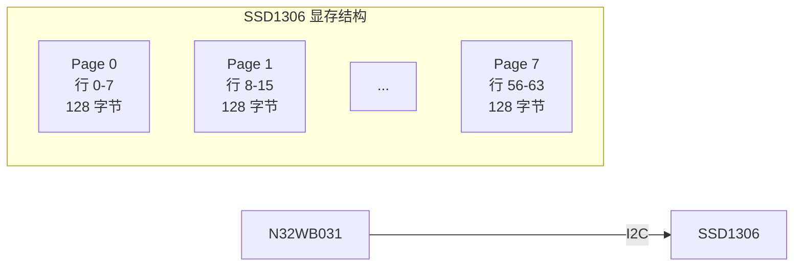

**软件 I2C 时序：**

软件 I2C 通过 GPIO 高低电平模拟标准 I2C 协议。每个字节传输包含 8 个数据位和 1 个应答位。

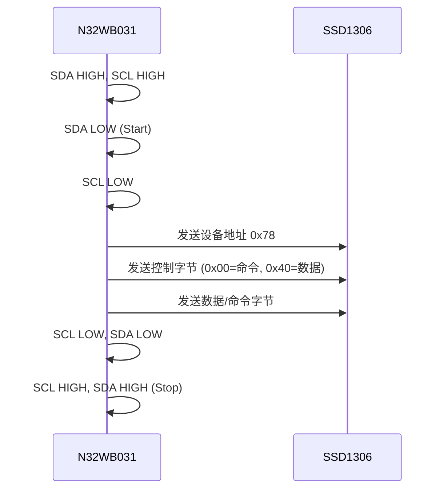

核心 I2C 位操作代码：

```c
static void oled_i2c_write_bit(uint8_t bit)
{
    if (bit != 0U)
        OLED_SDA_HIGH();
    else
        OLED_SDA_LOW();

    oled_i2c_delay();
    OLED_SCL_HIGH();
    oled_i2c_delay();
    OLED_SCL_LOW();
}

static void oled_i2c_write_byte_raw(uint8_t value)
{
    uint8_t i;
    for (i = 0U; i < 8U; i++)
    {
        oled_i2c_write_bit((uint8_t)((value & 0x80U) != 0U));
        value <<= 1;
    }
    // 应答位
    OLED_SDA_HIGH();
    oled_i2c_delay();
    OLED_SCL_HIGH();
    oled_i2c_delay();
    OLED_SCL_LOW();
}
```

**SSD1306 初始化命令序列：**

`oled_init()` 中发送的初始化命令控制 SSD1306 的显示模式、扫描方向、对比度等参数：

```c
void oled_init(void)
{
    oled_gpio_init();
    oled_delay(0x20000U);
    oled_write_cmd(0xAE);  // 关闭显示
    oled_write_cmd(0x20);  // 设置内存寻址模式
    oled_write_cmd(0x10);  // 页寻址模式
    oled_write_cmd(0xB0);  // 设置页起始地址
    oled_write_cmd(0xC8);  // COM 扫描方向：从上到下
    oled_write_cmd(0x00);  // 列低位地址
    oled_write_cmd(0x10);  // 列高位地址
    oled_write_cmd(0x40);  // 设置起始行
    oled_write_cmd(0x81);  // 设置对比度
    oled_write_cmd(0x7F);  // 对比度值 127
    oled_write_cmd(0xA1);  // 段重映射：左右反转
    oled_write_cmd(0xA6);  // 正常显示（非反色）
    oled_write_cmd(0xA8);  // 设置多路复用率
    oled_write_cmd(0x3F);  // 1/64 占空比
    oled_write_cmd(0xA4);  // 全局显示开启
    oled_write_cmd(0xD3);  // 设置显示偏移
    oled_write_cmd(0x00);  // 无偏移
    oled_write_cmd(0xD5);  // 设置显示时钟分频
    oled_write_cmd(0xF0);  // 分频值
    oled_write_cmd(0xD9);  // 设置预充电周期
    oled_write_cmd(0x22);
    oled_write_cmd(0xDA);  // 设置 COM 引脚配置
    oled_write_cmd(0x12);
    oled_write_cmd(0xDB);  // 设置 VCOMH 取消选择电平
    oled_write_cmd(0x20);
    oled_write_cmd(0x8D);  // 电荷泵设置
    oled_write_cmd(0x14);  // 启用电荷泵
    oled_write_cmd(0xAF);  // 打开显示
    oled_clear();
    oled_render_dashboard();
}
```

**OLED 集成架构：**

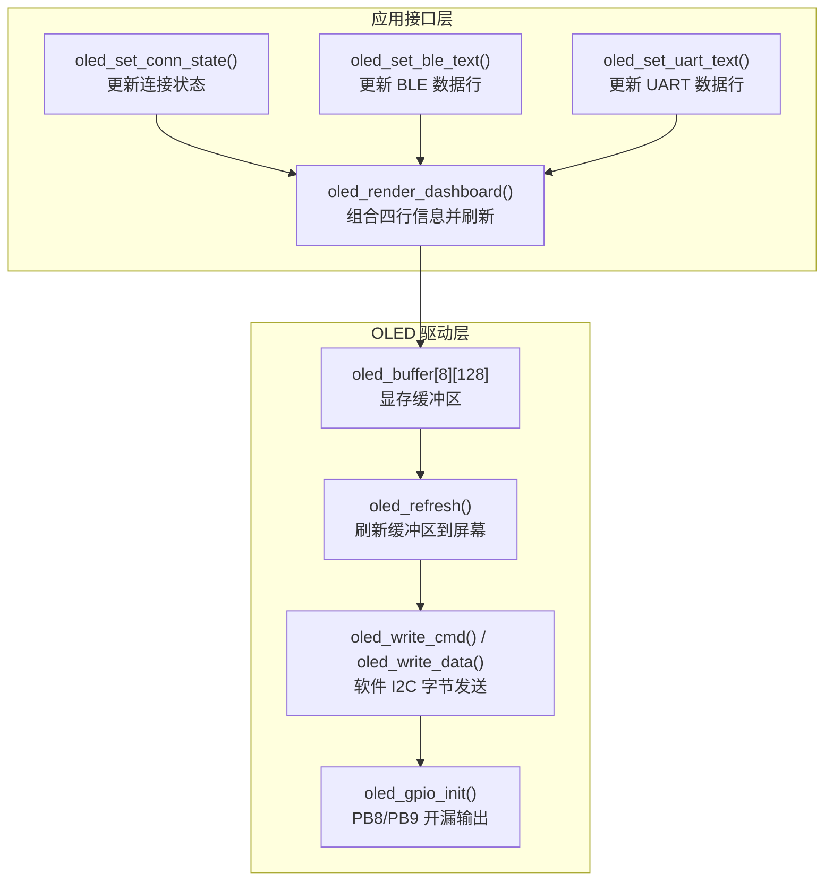

### 6.9 OLED 显示内容

屏幕设计为四行信息：

1. **标题行**：`BLE OLED DEMO`
2. **状态行**：`STATE: ADVERTISING` 或 `STATE: CONNECTED`
3. **BLE 行**：最近一条手机发来的数据
4. **UART 行**：最近一条串口发来的数据

连接后 OLED 显示示例：

```text
BLE OLED DEMO
STATE: CONNECTED
BLE: HELLO
UART: OK123
```

### 6.10 新增文件

为支持 OLED 功能，新增两个文件：

- `inc/app_oled.h`：引脚定义和接口声明
- `src/app_oled.c`：SSD1306 初始化、字符显示、状态刷新

OLED 驱动基于 SSD1306 128x64 标准流程，通信层使用软件 I2C 实现：

1. 初始化 PB8/PB9
2. GPIO 模拟 I2C Start/Stop 时序
3. GPIO 模拟字节发送
4. 发送 SSD1306 初始化命令
5. 维护 8 x 128 显存缓冲区
6. 字符串写入对应行并刷新到屏幕

### 6.11 数据如何显示到 OLED

**手机数据 → OLED：**

在 `app_rdtss.c` 的写回调中，手机发来的数据会同步调用：

```c
oled_set_ble_text(ind_value->value, ind_value->length);
```

手机发来的最新数据会立即显示在 OLED 的 `BLE:` 行。


**串口数据 → OLED：**

在 `app_usart.c` 的接收处理中，串口数据会同步调用：

```c
oled_set_uart_text(p_data, len);
```

串口侧有新数据时，OLED 的 `UART:` 行会更新，同时如果手机已打开 Notify，数据还会通过 BLE 推回手机。

**数据格式化函数：**

`oled_copy_text()` 将原始字节数据转为可显示字符串，自动处理大小写转换和不可显示字符：

```c
static void oled_copy_text(char* dest, const char* prefix, const uint8_t* data, uint16_t len)
{
    uint8_t pos = 0U;
    uint8_t i = 0U;

    while (prefix[pos] != '\0' && pos < 20U)
    {
        dest[pos] = prefix[pos];
        pos++;
    }

    while (i < len && pos < 21U)
    {
        uint8_t ch = data[i++];
        if (ch < 32U || ch > 126U)
            ch = '.';
        if (ch >= 'a' && ch <= 'z')
            ch = (uint8_t)(ch - 'a' + 'A');
        dest[pos++] = (char)ch;
    }

    dest[pos] = '\0';
}
```

调用链：`oled_set_ble_text()` / `oled_set_uart_text()` → `oled_copy_text()` → `oled_render_dashboard()` → `oled_show_status()` → `oled_refresh()`

### 6.12 连接状态显示

在 `app_ble.c` 的连接和断开回调中，OLED 状态会同步刷新：

- 连接成功：`oled_set_conn_state(1)` → OLED 显示 `CONNECTED`
- 断开连接：`oled_set_conn_state(0)` → OLED 显示 `ADVERTISING`

未连接状态：


连接成功状态：


### 6.13 测试步骤

**手机端测试：**

1. 给开发板上电，确认 OLED 亮屏并显示 `BLE OLED DEMO`
2. 打开 nRF Connect，搜索设备 `N32WB031_OLED`
3. 点击连接，打开 Notify
4. 在可写特征值中发送文本（如 `HELLO`）
5. 观察 OLED 的 `BLE:` 行是否显示 `HELLO`

**串口端测试：**

1. 通过板载 USB 虚拟串口或外部串口模块连接 USART1（PB6/PB7）
2. 串口参数：115200 / 8 / 1 / None
3. 发送文本（如 `OK123`）
4. 观察 OLED 的 `UART:` 行是否显示 `OK123`
5. 同时观察手机是否收到 Notify 回传

### 6.14 完整联动效果

工程正常运行时的预期现象：

1. OLED 上电亮屏，初始显示 `STATE: ADVERTISING`
2. 手机搜到 `N32WB031_OLED` 并连接
3. LED2 点亮，OLED 状态切换为 `CONNECTED`
4. 手机发送内容 → OLED `BLE:` 行更新
5. 串口发送内容 → OLED `UART:` 行更新，手机收到 Notify


### 6.15 常见问题

**OLED 不亮：**

- 确认使用 I2C 版本 OLED，而非 SPI 版本
- 检查 VCC / GND / SDA / SCL 接线是否正确
- 确认模块 I2C 地址为 0x3C（8 位写法对应 0x78）

**手机能连接但 OLED 不更新：**

- 确认手机发送到了正确的写特征值
- 发送数据应为纯文本
- 检查 OLED 接线

**手机看不到串口回传：**

- 确认已打开 Notify
- 确认串口连接在 USART1 PB6/PB7
- 串口参数应为 115200 8N1

### 6.16 小结

本工程的核心变化：**在 BLE 透传基础上增加 OLED 显示，让数据流动变得可见。**

该工程可作为后续扩展的中间站：

- 往前承接 BLE 透传
- 往后可升级为 BLE 控制显示、BLE 传感器终端、BLE 文本显示器

---

## 第七章：HID 蓝牙拍照遥控器

BLE 透传和 OLED 显示跑通之后，下一步更有展示感的方向是让开发板伪装成蓝牙输入设备。本章基于官方 HID 例程，实现一个蓝牙拍照遥控器：手机通过系统蓝牙配对后，按下开发板按键即可触发手机相机拍照。

工程目录：`N32WB031_STB_HID_SWIPE_OLED`

### 7.1 HID 前置知识

**什么是 HID？**

HID（Human Interface Device）即人机输入设备，包括键盘、鼠标、游戏手柄、媒体控制按键等。BLE HID 设备的核心特点是：手机或电脑将其视为"输入源"，系统直接接管按键行为，无需自定义 App 解析数据。

与前一章 BLE 透传的关键区别：

| 对比项 | BLE 透传（RDTSS） | BLE HID |
|--------|-------------------|---------|
| 数据流向 | 双向，手机↔串口 | 单向，板子→手机 |
| 手机端 | 需要专用 App（nRF Connect） | 系统蓝牙直接接管 |
| 配对方式 | App 内连接 | 系统蓝牙配对 |
| 数据格式 | 自定义文本 | HID Report 描述符 |
| 典型应用 | 串口透传、传感器上传 | 遥控器、键盘、鼠标 |

**HID 协议栈位置：**

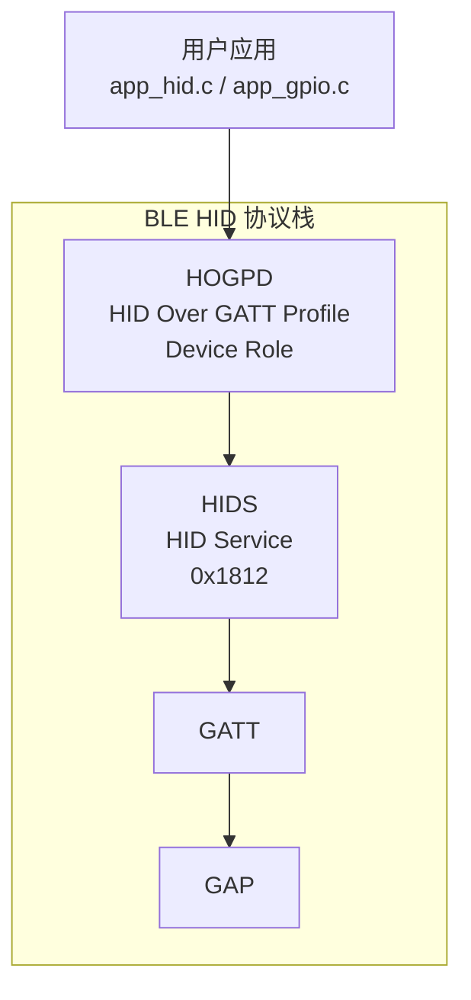

**HID Report Descriptor：**

HID 设备通过 Report Descriptor 向主机描述自身能力。本工程定义了两个 Report：

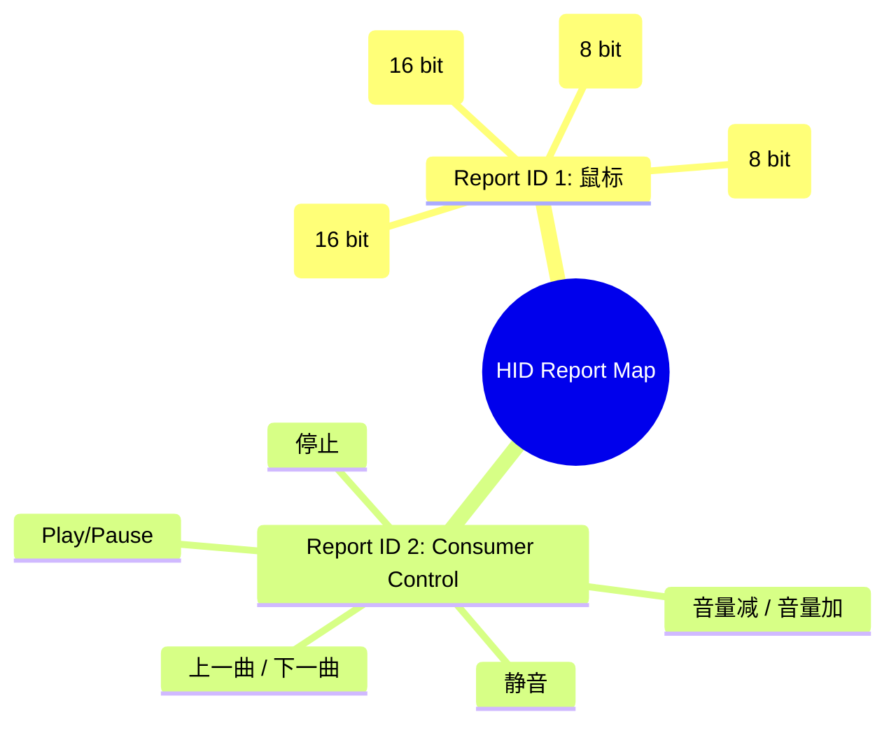

**Consumer Control 与拍照：**

本工程使用 Report ID 2（Consumer Control）发送音量键事件。许多手机相机支持"音量键拍照"功能，因此音量键输入可直接触发快门。

### 7.2 工程功能

该工程完成三项核心任务：

1. 初始化蓝牙协议栈，广播为 HID 设备
2. 通过系统蓝牙配对（密码 `123456`）
3. 按键触发 HID Consumer Report，发送音量键事件

蓝牙广播名：`N32WB031_CAMERA`

按键行为：

- KEY1（PB1）：发送 `VOL+`
- KEY2（PB2）：发送 `VOL-`

如果手机相机设置为"音量下键拍照"，则 KEY2 可作为快门键。

### 7.3 工程结构

```
N32WB031_STB_HID_SWIPE_OLED/
├── inc/
│   ├── app_user_config.h      ← 蓝牙名称、广播参数
│   ├── app_ble.h              ← BLE 初始化接口
│   ├── app_hid.h              ← HID 服务接口
│   ├── app_gpio.h             ← 按键、LED 引脚定义
│   └── app_oled.h             ← OLED 驱动接口
├── src/
│   ├── main.c                 ← 主函数、蓝牙栈启动
│   ├── app_ble.c              ← GAP 参数、连接/断开回调
│   ├── app_gpio.c             ← 按键中断、HID 按键发送
│   ├── app_oled.c             ← OLED 驱动
│   └── app_profile/
│       └── app_hid.c          ← HID Report 定义、发送逻辑
└── MDK-ARM/
    └── N32WB031_STB_HID_SWIPE_OLED.uvprojx
```


### 7.4 硬件资源与引脚分配

| 功能 | 引脚 | 说明 |
|------|------|------|
| LED1 | PB0 | 运行状态指示 |
| LED2 | PA6 | 连接状态指示 |
| KEY1 | PB1 | 发送 VOL+（拍照） |
| KEY2 | PB2 | 发送 VOL-（辅助） |
| OLED SCL | PB8 | 软件 I2C 时钟 |
| OLED SDA | PB9 | 软件 I2C 数据 |

### 7.5 蓝牙设备名与配对

蓝牙广播名定义在 `app_user_config.h` 中：

```c
#define CUSTOM_DEVICE_NAME "N32WB031_CAMERA"
```

配对密码在 `app_ble.c` 中配置：

```c
void app_ble_sec_init(void)
{
    struct ns_sec_init_t sec_init = {0};

    sec_init.rand_pin_enable = false;
    sec_init.pin_code = 123456;

    sec_init.pairing_feat.auth = (SEC_PARAM_BOND | (SEC_PARAM_MITM<<2) | ...);
    sec_init.pairing_feat.iocap = SEC_PARAM_IO_CAPABILITIES;
    ...

    sec_init.bond_enable = BOND_STORE_ENABLE;
    sec_init.bond_max_peer = MAX_BOND_PEER;

    ns_sec_init(&sec_init);
}
```

手机系统蓝牙搜索到 `N32WB031_CAMERA` 后，输入配对密码 `123456` 即可完成配对。


### 7.6 主函数

```c
int main(void)
{
    delay_n_10us(200*1000);

    NS_LOG_INIT();
    oled_init();
    oled_show_status("HID CAMERA DEMO", "STATE: BOOT", "KEY1: SHOT", "KEY2: AUX");

    app_ble_init();

    NS_LOG_INFO(DEMO_STRING);

    app_key_configuration();
    LedInit(LED1_PORT, LED1_PIN);
    LedInit(LED2_PORT, LED2_PIN);
    LedOn(LED1_PORT, LED1_PIN);

    while (1)
    {
        rwip_schedule();
        ns_sleep();
    }
}
```

与前几章工程的区别：本工程使用**中断方式**检测按键，而非轮询。主循环中只有协议栈调度和低功耗休眠。

### 7.7 按键中断配置

与第四章的轮询消抖不同，本工程使用 EXTI 外部中断检测按键：

```c
void app_key_configuration(void)
{
    GPIO_InitType GPIO_InitStructure;
    EXTI_InitType EXTI_InitStructure;
    NVIC_InitType NVIC_InitStructure;

    RCC_EnableAPB2PeriphClk(RCC_APB2_PERIPH_GPIOA | RCC_APB2_PERIPH_GPIOB | RCC_APB2_PERIPH_AFIO, ENABLE);

    // KEY1 (PB1) 上拉输入
    GPIO_InitStruct(&GPIO_InitStructure);
    GPIO_InitStructure.Pin = KEY1_INPUT_PIN;
    GPIO_InitStructure.GPIO_Pull = GPIO_PULL_UP;
    GPIO_InitPeripheral(KEY1_INPUT_PORT, &GPIO_InitStructure);

    // KEY2 (PB2) 上拉输入
    GPIO_InitStruct(&GPIO_InitStructure);
    GPIO_InitStructure.Pin = KEY2_INPUT_PIN;
    GPIO_InitStructure.GPIO_Pull = GPIO_PULL_UP;
    GPIO_InitPeripheral(KEY2_INPUT_PORT, &GPIO_InitStructure);

    // EXTI 配置：下降沿触发
    GPIO_ConfigEXTILine(KEY1_INPUT_PORT_SOURCE, KEY1_INPUT_PIN_SOURCE);
    EXTI_InitStructure.EXTI_Line = KEY1_INPUT_EXTI_LINE;
    EXTI_InitStructure.EXTI_Mode = EXTI_Mode_Interrupt;
    EXTI_InitStructure.EXTI_Trigger = EXTI_Trigger_Falling;
    EXTI_InitStructure.EXTI_LineCmd = ENABLE;
    EXTI_InitPeripheral(&EXTI_InitStructure);

    NVIC_InitStructure.NVIC_IRQChannel = KEY1_INPUT_IRQn;
    NVIC_InitStructure.NVIC_IRQChannelPriority = 3;
    NVIC_InitStructure.NVIC_IRQChannelCmd = ENABLE;
    NVIC_Init(&NVIC_InitStructure);

    // KEY2 同理...
}
```

中断服务函数中使用标志位实现简易消抖：

```c
void EXTI0_1_IRQHandler(void)
{
    if (EXTI_GetITStatus(KEY1_INPUT_EXTI_LINE) != RESET)
    {
        if (key1_irq_actived == 0)
        {
            ke_msg_send_basic(APP_KEY_DETECTED, TASK_APP, TASK_APP);
            key1_irq_actived = 1;
        }
        else if (key1_irq_actived == 1)
        {
            key1_irq_actived = 2;
        }
        EXTI_ClrITPendBit(KEY1_INPUT_EXTI_LINE);
    }
}
```

`key1_irq_actived` 的三态设计（0→1→2）配合定时器回调，实现"中断触发 → 延时确认 → 执行动作"的消抖流程。

### 7.8 HID Consumer Report 发送

按键触发后，通过 `app_hid_send_consumer_key()` 发送音量键事件：

```c
#define HID_KEY_VOL_UP      0x10
#define HID_KEY_VOL_DOWN    0x08

static void app_hid_send_consumer_key(uint8_t key_value)
{
    if (!is_app_hid_ready())
    {
        oled_show_status("HID CAMERA DEMO", "STATE: NOT READY", "ACTION: BLOCKED", "WAIT CONNECT");
        return;
    }

    app_hid_send_consumer_report(&key_value);   // 发送按键按下
    delay_n_10us(1000);                          // 保持 10ms
    key_value = 0x00;
    app_hid_send_consumer_report(&key_value);   // 发送按键释放
}
```

每次按键需要发送两帧：先发送按键值（按下），再发送 0x00（释放）。这与物理按键的行为一致。

`app_hid_send_consumer_report()` 将 Report 通过 HOGPD 协议栈发送至手机：

```c
void app_hid_send_consumer_report(uint8_t* report)
{
    if (app_hid_env.state == APP_HID_READY && app_hid_env.nb_report)
    {
        struct hogpd_report_upd_req *req = KE_MSG_ALLOC_DYN(HOGPD_REPORT_UPD_REQ,
                                                              prf_get_task_from_id(TASK_ID_HOGPD),
                                                              TASK_APP,
                                                              hogpd_report_upd_req,
                                                              APP_HID_CONSUMER_REPORT_LEN);
        req->conidx = app_hid_env.conidx;
        req->report.hid_idx = app_hid_env.conidx;
        req->report.type = HOGPD_REPORT;
        req->report.idx = 1;          // Report ID 2
        req->report.length = APP_HID_CONSUMER_REPORT_LEN;
        memcpy(&req->report.value[0], &report[0], APP_HID_CONSUMER_REPORT_LEN);
        ke_msg_send(req);
        app_hid_env.nb_report--;
    }
}
```

### 7.9 HID Report Descriptor 解析

Report Descriptor 是 HID 设备的核心，它告诉主机"我是什么设备，我能发送什么数据"。本工程的 Descriptor 定义了两个 Report：

```c
static const uint8_t app_hid_mouse_report_map[] =
{
    // Report ID 1: 鼠标
    0x05, 0x01,     // USAGE PAGE (Generic Desktop)
    0x09, 0x02,     // USAGE (Mouse)
    0xA1, 0x01,     // COLLECTION (Application)
    0x85, 0x01,     // REPORT ID (1)
    0x09, 0x01,     //     USAGE (Pointer)
    0xA1, 0x00,     //     COLLECTION (Physical)
    // 按键: 8 bit
    0x05, 0x09,     //         USAGE PAGE (Buttons)
    0x19, 0x01,     //         USAGE MINIMUM (1)
    0x29, 0x08,     //         USAGE MAXIMUM (8)
    0x75, 0x01,     //         REPORT SIZE (1)
    0x95, 0x08,     //         REPORT COUNT (8)
    0x81, 0x02,     //         INPUT (Data, Variable, Absolute)
    // X/Y 轴: 各 16 bit
    0x05, 0x01,     //         USAGE PAGE (Generic Desktop)
    0x75, 0x10,     //         REPORT SIZE (16)
    0x95, 0x02,     //         REPORT COUNT (2)
    0x09, 0x30,     //         USAGE (X)
    0x09, 0x31,     //         USAGE (Y)
    0x81, 0x06,     //         INPUT (Data, Variable, Relative)
    // 滚轮: 8 bit
    0x75, 0x08,     //         REPORT SIZE (8)
    0x95, 0x01,     //         REPORT COUNT (1)
    0x09, 0x38,     //         USAGE (Wheel)
    0x81, 0x06,     //         INPUT (Data, Variable, Relative)
    0xC0, 0xC0,     //     END COLLECTION

    // Report ID 2: Consumer Control（媒体控制）
    0x05, 0x0C,     // Usage Page (Consumer)
    0x09, 0x01,     // Usage (Consumer Control)
    0xA1, 0x01,     // Collection (Application)
    0x85, 0x02,     // Report Id (2)
    0x75, 0x01,     // Report Size (1)
    0x95, 0x08,     // Report Count (8)
    0x09, 0xCD,     // Usage (Play/Pause)
    0x09, 0xB6,     // Usage (Scan Previous Track)
    0x09, 0xB5,     // Usage (Scan Next Track)
    0x09, 0xEA,     // Usage (Volume Down)
    0x09, 0xE9,     // Usage (Volume Up)
    0x09, 0xE2,     // Usage (Mute)
    0x09, 0xCC,     // Usage (Stop eject)
    0x09, 0xB7,     // Usage (Stop)
    0x81, 0x06,     // Input (Data, Value, Relative, Bit Field)
    0xC0,           // End Collection
};
```

Report ID 2 中，每个 bit 对应一个媒体控制按键。`Volume Up` 对应 `0x10`（第 5 位），`Volume Down` 对应 `0x08`（第 4 位）。

### 7.10 连接与状态管理

连接回调中启用 HID Profile 并更新 OLED：

```c
void app_ble_msg_handler(struct ble_msg_t const *p_ble_msg)
{
    switch (p_ble_msg->msg_id)
    {
        case APP_BLE_GAP_CONNECTED:
            app_batt_enable_prf(app_env.conidx);
            app_hid_enable_prf(app_env.conidx);
            app_ble_connected();
            break;
        case APP_BLE_GAP_DISCONNECTED:
            app_ble_disconnected();
            break;
        default:
            break;
    }
}

void app_ble_connected(void)
{
    LedOn(LED2_PORT, LED2_PIN);
    oled_set_conn_state(1);
}

void app_ble_disconnected(void)
{
    ns_ble_adv_start();
    LedOff(LED2_PORT, LED2_PIN);
    oled_set_conn_state(0);
}
```

### 7.11 为什么不能用 nRF Connect 测试拍照

这是一个重要的知识点。nRF Connect 适合调试 BLE 广播、GATT 服务和特征值，但 HID 设备需要通过**系统蓝牙配对**才能被手机接管。

在 nRF Connect 中可以看到：

- 设备名 `N32WB031_CAMERA`
- HID Service（UUID `0x1812`）
- Appearance 为 `Mouse (HID subtype)`

但真正触发拍照，必须：

1. 在系统蓝牙设置中配对
2. 输入密码 `123456`
3. 配对成功后系统接管 HID 输入
4. 打开相机，确认"音量键拍照"已开启

`[截图位 4：nRF Connect 中看到 HID 广播信息]`
`[截图位 5：系统蓝牙连接成功界面]`

### 7.12 OLED 状态显示

OLED 在本工程中用于显示当前状态和最近一次操作：

```c
// 主函数中初始化显示
oled_show_status("HID CAMERA DEMO", "STATE: BOOT", "KEY1: SHOT", "KEY2: AUX");

// 连接成功后更新
oled_set_conn_state(1);  // 显示 "STATE: CONNECTED"

// 按键触发后更新
oled_show_status("HID CAMERA DEMO", "STATE: CONNECTED", "ACTION: SHOT", "KEY: VOL+");
oled_show_status("HID CAMERA DEMO", "STATE: CONNECTED", "ACTION: AUX", "KEY: VOL-");

// HID 未就绪时显示
oled_show_status("HID CAMERA DEMO", "STATE: NOT READY", "ACTION: BLOCKED", "WAIT CONNECT");
```

`[截图位 6：OLED 显示 ADVERTISING]`
`[截图位 7：OLED 显示 CONNECTED]`
`[截图位 8：按键按下后 OLED 显示动作状态]`

### 7.13 完整数据流

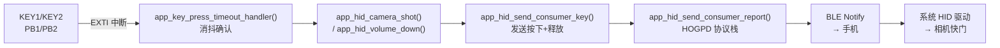

### 7.14 测试步骤

1. 给开发板上电，确认 OLED 显示 `STATE: BOOT`
2. 打开手机系统蓝牙设置
3. 搜索设备 `N32WB031_CAMERA`
4. 点击配对，输入密码 `123456`
5. 配对成功后，确认设备已连接
6. 打开手机相机
7. 在相机设置中确认"音量键功能 = 快门"
8. 按 KEY2（VOL-）测试拍照


### 7.15 常见问题

**手机能搜到设备，但不能拍照：**

- 确认在系统蓝牙中配对，而非仅在 nRF Connect 中查看
- 确认输入了密码 `123456`
- 确认相机中"音量键拍照"已开启

**OLED 显示 CONNECTED，但相机没反应：**

- 板子和手机已连接，HID 事件已发出
- 尝试 KEY1 和 KEY2，看哪个键被相机识别为快门
- 不同手机对 HID 按键映射可能不同

**手机出现聚焦，不拍照：**

- 手机将 HID 输入当作鼠标事件处理
- 这是 HID Report Descriptor 与手机系统交互的兼容性问题
- 可尝试调整 Report Descriptor 或使用纯 Consumer Control 设备

**iPhone 和安卓行为差异：**

不同系统、不同版本对 HID 的兼容性不同。iPhone 对 BLE HID 的配对流程和权限管理与安卓有显著差异，建议分别测试。

### 7.16 小结

本工程的核心价值：**将开发板从"蓝牙调试板"变成一个真正能与手机交互的蓝牙遥控器。**

相比前几章的透传工程，HID 工程更贴近真实产品形态：

- 通过系统蓝牙配对，无需专用 App
- 按键直接触发系统级行为（音量控制、相机快门）
- OLED 可视化状态反馈

该工程可作为后续扩展的基础：蓝牙自拍杆、PPT 翻页器、媒体遥控器等。

---

## 附录：芯片无法识别的处理方法

如果 Keil 无法识别芯片，可尝试硬件复位法：

按住开发板上的 RESET 按键不松手，点击 Keil 的下载（或识别）按钮，在点击后的半秒内松开 RESET 按键。

---

## 写在最后

本教程共包含五份独立工程：

| 工程 | 内容 |
|------|------|
| N32WB031_STB_Blank_LED | 最小可运行骨架，GPIO 点灯与灯效 |
| N32WB031_STB_Key_USART | 按键、串口与 LED 动画模式联动 |
| N32WB031_STB_BLE_RDTSS | BLE 透传，手机与串口双向通信 |
| N32WB031_STB_BLE_RDTSS_OLED | BLE 透传 + OLED，手机、串口、屏幕三端联动 |
| N32WB031_STB_HID_SWIPE_OLED | HID 蓝牙拍照遥控器，系统蓝牙配对 + 按键触发相机快门 |

五份工程按照 GPIO → 外设组合 → BLE 透传 → BLE + 显示 → BLE HID 输入设备的顺序递进，难度逐步提升。建议首次接触 N32WB031 的开发者按此顺序逐步实践。
